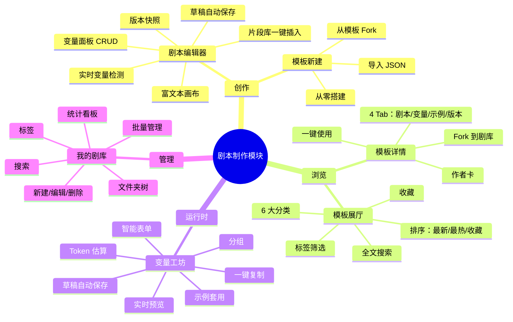

# 01 · 剧本制作模块总览

## 一句话定义

**剧本制作模块**是剧幕 PromptStage 中将"AI 提示词"结构化为"可复用剧目资产"的核心生产力工具集，覆盖**创建 → 编辑 → 填变量 → 复制分发**的完整链路。

## 范围

### 模块内
- 模板数据模型（剧本正文、变量、示例、版本）
- 模板创建与编辑 UI
- 模板浏览与发现（展厅）
- 变量工坊（运行时）
- 模板详情（带版本与示例）
- 我的剧库（个人资产管理）
- 片段库（19 个内置剧本片段）

### 模块外
- 用户鉴权（由 `authService` 提供）
- 云同步（演示用 localStorage mock）
- 第三方 AI 工具对接（用户在工坊外完成）

## 目标用户与场景

| 角色 | 场景 | 模块价值 |
|------|------|----------|
| 短视频编剧 | 每天要写 3-5 条钩子 | 一次写好模板，无限产出变体 |
| 品牌内容策划 | 双 11 备战 50 条笔记 | 模板 + 示例套用，10 分钟出 50 条 |
| 直播运营 | 主播口播 + 互动话术 | 暖场 / 逼单 / 互动 分场景模板 |
| 小说作者 | 开篇钩子卡文 | 反转 / 钩子 / 母题 模板库 |
| AI 工程师 | 内部 prompt 沉淀 | 结构化版本管理 + 团队共享 |

## 关键能力地图

## 关键指标（北极星 + 辅助）

| 指标 | 类型 | 目标 |
|------|------|------|
| 模板从创建到首次使用 | 转化漏斗 | ≤ 3 分钟 |
| 变量工坊填写到复制 | 转化漏斗 | ≤ 90 秒 |
| 模板 Fork 率 | 黏性 | ≥ 15% |
| 7 日内模板被复用次数 | 价值 | ≥ 4 次 |
| 自动保存成功率 | 稳定性 | ≥ 99.5% |

## 三大页面 · 一句话定位

1. **剧本编辑器**：让有想法的人**30 分钟搭好一个可复用剧目**
2. **变量工坊**：让用模板的人**90 秒拿到最终可用提示词**
3. **我的剧库**：让多模板协作的人**一眼找到他上次用的那个**

## 不做什么（明确边界）

- ❌ 不做 AI 生成（我们只做"模板+变量"的工具，生成交给外部 AI）
- ❌ 不做实时协作（v1 单人版，v2 引入 OT/CRDT）
- ❌ 不做权限系统（v1 公开/私有二态，v2 引入团队空间）
- ❌ 不做商业化（v1 免费，v2 引入订阅）
- ❌ 不做移动端原生 App（响应式 Web 即可）

## 关联文档

- 02 · [UI 设计系统](./02-ui-design-system.md)
- 03 · [组件库文档](./03-component-library.md)
- 04 · [架构与数据流](./04-architecture.md)
- 05 · [剧本格式规范](./05-script-format.md)
