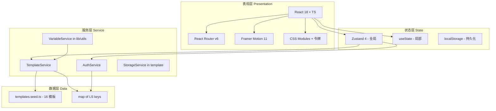
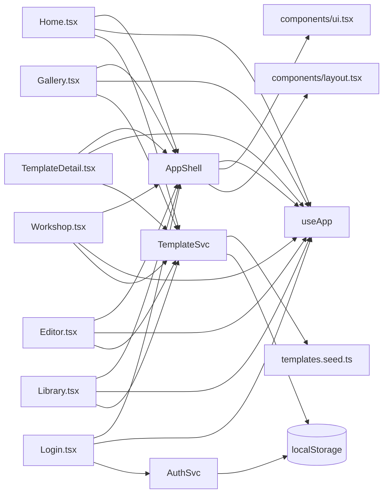

# 04 · 架构与数据流

## 一、整体架构



## 二、分层职责

### 表现层（Components + Pages）

| 关注点 | 实现 |
|--------|------|
| 路由 | React Router v6，BrowserRouter 包裹在 App.tsx |
| 动效 | Framer Motion（入场、卡片、模态） |
| 样式 | Tailwind utility + CSS 变量令牌 |
| 表单 | 受控组件 + useState |

### 状态层

#### 全局状态（Zustand）

```ts
// src/store/useApp.ts
interface AppState {
  user: User | null;
  favorites: Set<string>;
  toasts: Toast[];

  // 动作
  bootstrap(): void;
  login/register/loginDemo/logout()
  toggleFavorite(id)
  pushToast(t) / dismissToast(id)
}
```

**为什么选 Zustand？**
- 比 Redux 轻量，零模板代码
- 完美支持 TypeScript
- 跨组件状态共享（用户菜单、Toast、收藏状态）
- 不需要 persist 中间件（localStorage 由 service 层管理）

#### 局部状态（useState）

- 表单输入值
- 当前 Tab / 当前筛选
- 模态打开/关闭
- 临时编辑值

#### 持久化（localStorage）

| Key | 内容 |
|-----|------|
| `ps_templates_v1` | 用户创建的模板列表 |
| `ps_folders_v1` | 用户创建的文件夹 |
| `ps_favorites_v1` | 收藏的模板 ID 列表 |
| `ps_user_v1` | 当前登录用户 |
| `ps_users_v1` | 所有注册用户（含密码，仅演示） |
| `ps_deleted_v1` | 软删除的种子模板 ID |
| `ps_draft_${tplId}` | 工坊中的填写值（按模板） |
| `ps_editor_${tplId}` | 编辑器中的草稿 |
| `ps_saved_${userId}_${tplId}` | 用户保存到云端的变量值 |

### 服务层（src/services/*）

```ts
// TemplateService - 单例
class TemplateServiceImpl {
  list(filter?): Promise<Template[]>
  get(id): Promise<Template | null>
  create(input, authorId, authorName): Promise<Template>
  update(id, patch, note?): Promise<Template>
  remove(id): Promise<void>
  fork(id, authorId, authorName): Promise<Template>
  addExample(tplId, example): Promise<void>
  listFolders(userId): Promise<Folder[]>
  createFolder(name, userId, parentId?): Promise<Folder>
  toggleFavorite(id): Promise<boolean>
  isFavorited(id): boolean
  syncToCloud(tpl): Promise<void>  // 模拟 400ms
}
```

```ts
// AuthService - 单例
class AuthServiceImpl {
  current(): User | null
  isGuest(): boolean
  login(email, password): Promise<User>
  register(email, password, name): Promise<User>
  loginAsDemo(): Promise<User>  // 自动注册+登录
  logout(): void
}
```

**设计原则**
- 所有方法是 async（即便内部是 sync）— 为未来接入真实后端做准备
- 模拟网络延迟 60-500ms，让用户感知"云端"
- 任何错误 throw Error，由调用方 toast 提示
- 单一职责：每个 service 只管自己的领域

### 工具层（src/lib/utils.ts）

```ts
cn(...inputs)             // Tailwind class 合并
sleep(ms)                 // 模拟网络延迟
uid(prefix)               // 短 ID 生成
formatDate / formatRelative
compactNumber(n)          // 1.2k / 1.5w
makeCoverGradient(seed)   // (已迁移到 CoverArt 组件内部)
extractVariableKeys(text) // 从 body 提取 {{var}} 键
estimateTokens(text)      // 粗略 token 估算
renderTemplate(body, vals)// 渲染：替换 {{var}} 为 values[var]
```

## 三、数据契约（核心 TypeScript 类型）

完整定义见 `src/types.ts`。核心：

```ts
type Category = 'short-video' | 'ad' | 'livestream' | 'novel' | 'storyboard' | 'viral';

interface Template {
  id: string;                 // 't_001' 种子 / 't_xxxx' 用户
  title: string;
  description: string;        // 1 句话
  category: Category;
  tags: string[];
  author: Author;
  cover: string;              // 种子字符串（用于 CoverArt）
  body: string;               // 含 {{变量}} 的 Markdown
  variables: Variable[];
  examples: Example[];        // 套用示例
  versions: Version[];        // 历史快照
  stats: { uses: number; favorites: number };
  isPublic: boolean;
  folderId?: string;
  createdAt: string;          // ISO
  updatedAt: string;
}

interface Variable {
  key: string;                // 'product_name'
  label: string;              // '产品名称'
  type: 'text' | 'textarea' | 'enum' | 'number' | 'slider';
  defaultValue?: string;
  options?: string[];         // enum 专用
  required: boolean;
  hint?: string;
  group?: string;             // 用于工坊分组
}
```

## 四、关键数据流

### 4.1 模板加载（展厅）

```
[Gallery.tsx] 挂载
    ↓ useEffect
TemplateService.list({ category, search, sort, tags })
    ↓
[Service] 合并 SEED + 用户模板 - 已删除
    ↓ 应用筛选 + 排序
    ↓ sleep(60ms) 模拟网络
返回 Template[]
    ↓
[Gallery] setItems
    ↓ 渲染卡片网格
```

### 4.2 创建模板（编辑器）

```
[Editor.tsx] 用户输入
    ↓ useEffect 防抖 800ms
localStorage.setItem('ps_editor_xxx', JSON.stringify(...))
    ↓ setSavedAt
[Toast] "已自动保存"

用户点击"保存"
    ↓ handleSave
TemplateService.create(input, user.id, user.name)
    ↓ sleep(120ms)
    ↓ uid('t') 生成 ID
    ↓ push 到 LS_TEMPLATES
返回 Template
    ↓ nav('/editor/' + t.id)
```

### 4.3 变量工坊（填变量 → 渲染 → 复制）

```
[Workshop.tsx] 挂载 → TemplateService.get(id)
    ↓ 加载示例 1 的 values
    ↓ 加载 LS 草稿（覆盖）
    ↓ 渲染

用户输入 {{key}} 的值
    ↓ setValues
    ↓ useEffect 防抖 600ms
LS.setItem(`ps_draft_${tplId}`, JSON.stringify(values))

右侧预览 useMemo:
rendered = body.replace(/{{key}}/g, v || '{{key}}')
tokens = estimateTokens(rendered)
missingKeys = extractVariableKeys(rendered) (其中 values[k] 为空的)

用户点击"复制"
    ↓ navigator.clipboard.writeText(rendered)
    ↓ CopyButton 视觉反馈
```

### 4.4 收藏切换

```
[任意页面] 用户点击 <Bookmark>
    ↓ useApp().toggleFavorite(id)
    ↓ TemplateService.toggleFavorite(id)
    ↓ LS_FAVORITES add/remove
    ↓ set({ favorites: new Set(...) })
所有 useApp 订阅者重渲染
    ↓ 卡片上的 <Bookmark> 切换 fill 状态
```

## 五、错误处理策略

| 场景 | 处理 |
|------|------|
| 模板 ID 不存在 | `<TemplateDetail>` 显示骨架 + 路由回退 |
| localStorage 配额超限 | `try/catch` 静默失败 + toast 提示 |
| 剪贴板权限被拒 | CopyButton 显示 fallback "请手动复制" |
| 用户未登录访问私有模板 | Editor / Library 显示登录引导卡片 |
| 变量引用未在 body 中 | 编辑器自动从 body 抽取，无需手动同步 |
| 必填变量未填 | 工坊中红色脉冲 + 底部"未填 N 处"提示 |

## 六、性能策略

### 已实现
- `useMemo` 缓存渲染结果、Token 估算、缺失变量检测
- 模板详情按需加载（不再一次性展示全部 16 个）
- 图片占位（CoverArt 是程序化生成，零网络请求）
- 防抖自动保存（800ms 编辑器 / 600ms 工坊）

### 未来 v2
- React.lazy + Suspense 拆分页面
- IndexedDB 替代 localStorage（容量更大）
- Service Worker 离线缓存
- 虚拟列表（当模板 > 200 时）

## 七、安全边界（演示版）

- 密码明文存储在 localStorage（仅演示，生产必须 hash）
- 无 CSRF 保护
- 无 XSS 转义（依赖 React 自动转义）
- 无 API 限流

> 生产化时需全量重写 auth、API、storage 三层。

## 八、模块依赖图



## 关联文档

- 03 · [组件库文档](./03-component-library.md) — 组件如何消费服务层
- 05 · [剧本格式规范](./05-script-format.md) — body 字符串的语法
- 06 · [变量系统设计](./06-variable-system.md) — 变量解析与渲染
