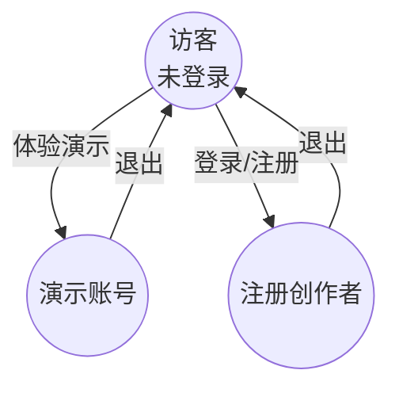
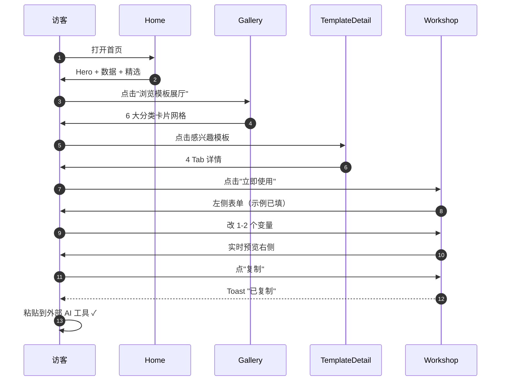
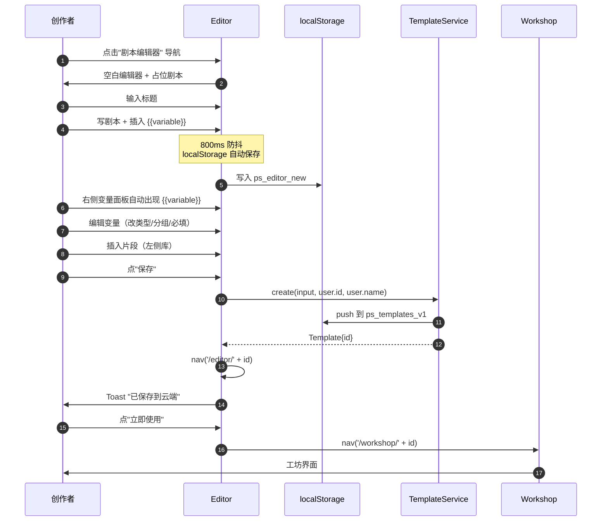
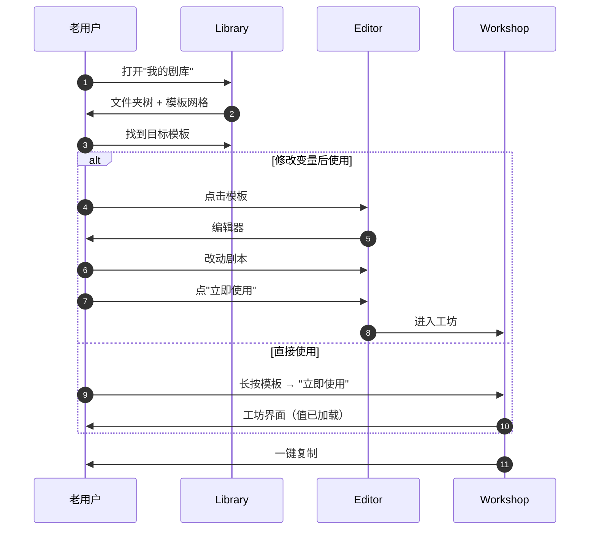
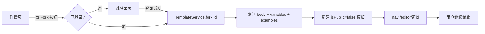
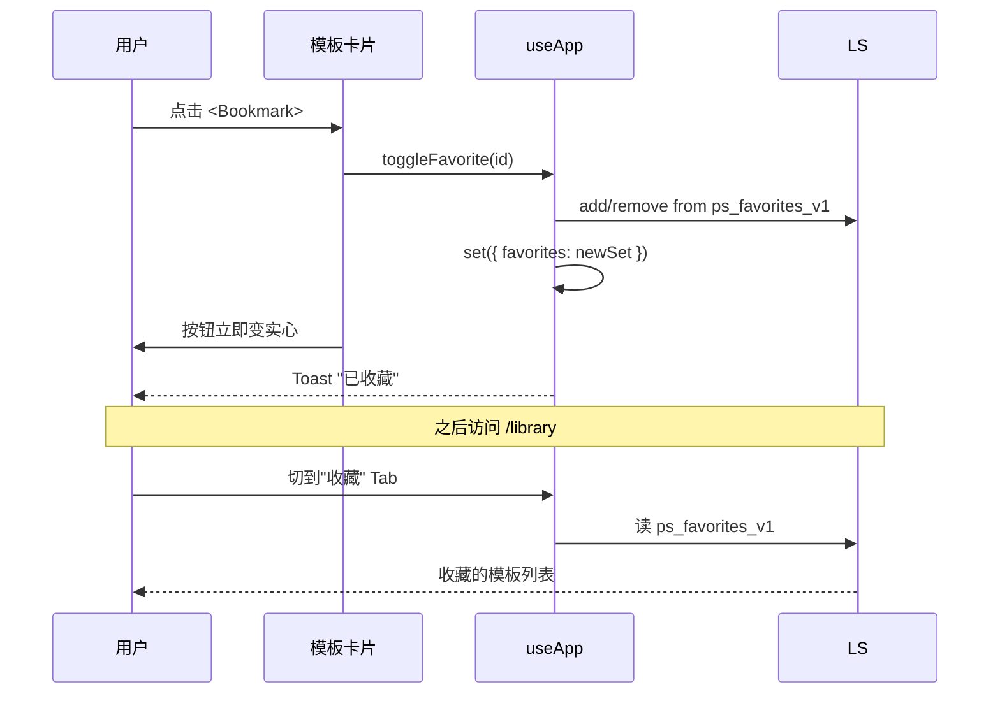
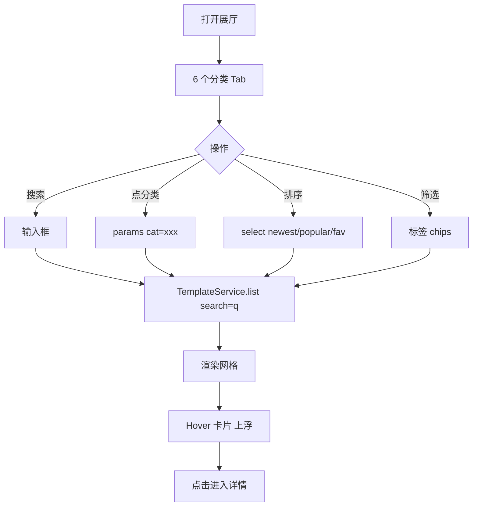
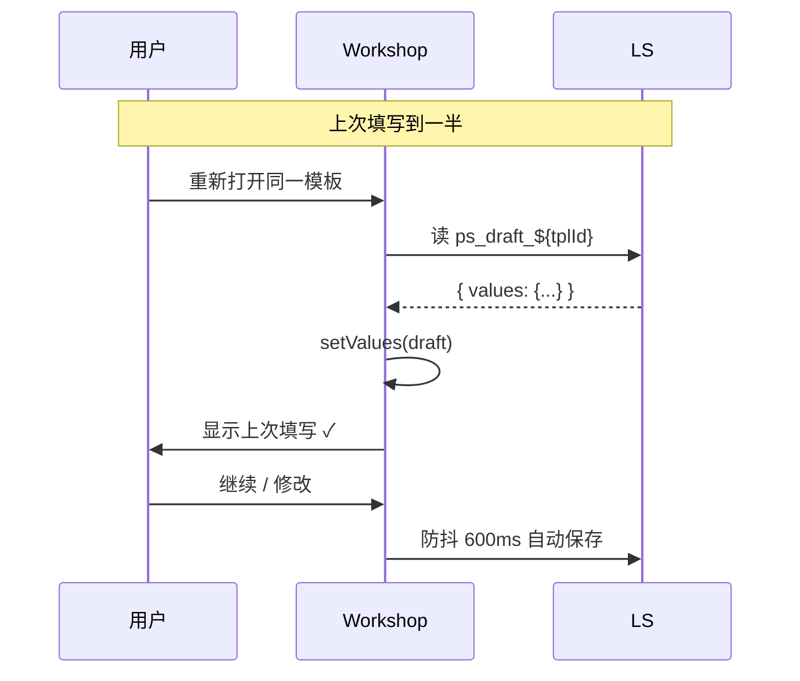
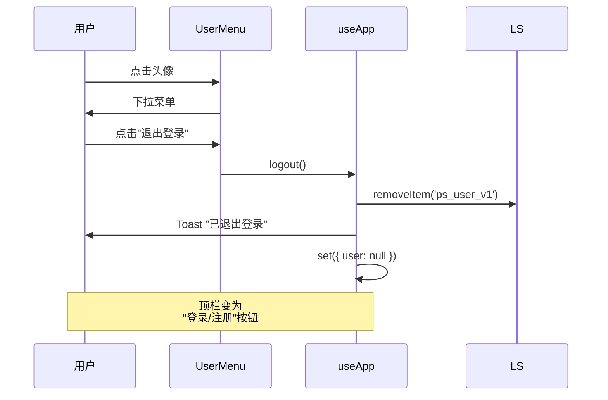

# 07 · 用户旅程与流程

## 一、用户角色



| 角色 | 入口 | 核心动机 |
|------|------|----------|
| **访客** | 直接访问首页 | 浏览、试用、判断是否值得注册 |
| **注册创作者** | 邮箱注册 | 创建 / 管理 / 复用模板 |
| **演示账号** | 一键登录 | 完整体验，无持久担忧 |

## 二、九条核心用户旅程

### 旅程 1 · 访客首访 → 试跑模板



**关键节点**
- 第 5 步：分类卡片 Hover 应有 lift 效果（已实现 `whileHover={{ y: -4 }}`）
- 第 8 步：工坊打开后默认填充 examples[0]（已实现）
- 第 10 步：右侧预览应实时（已实现 `useMemo`）

**潜在摩擦**
- 必填变量未填 → 红底脉冲 + "未填 N 处"
- 变量太多 → 分组 Tab 切换

### 旅程 2 · 创作者创建空白模板



**关键节点**
- 步骤 4：自动保存通过 useEffect + setTimeout 800ms 防抖
- 步骤 5：变量自动从 body 抽取（`extractVariableKeys`）
- 步骤 7：保存前若未登录会拦截并提示

### 旅程 3 · 老用户复用已有模板



### 旅程 4 · Fork 公开模板



### 旅程 5 · 收藏与组织



### 旅程 6 · 搜索 / 筛选 / 排序



**性能**：所有筛选在客户端完成，< 16ms。`useMemo` 缓存 allTags。

### 旅程 7 · 草稿恢复



**异常路径**：
- LS 损坏 → `try/catch` 静默失败，回退到示例 1
- 模板已删除 → 路由回退 + toast

### 旅程 8 · 退出登录 / 切换账号



### 旅程 9 · 错误恢复

| 错误 | 表现 | 恢复 |
|------|------|------|
| 网络断开（演示环境） | sleep 永远不返回 | 暂无超时，建议加 5s 超时 |
| localStorage 满 | 写入抛错 | try/catch 静默 + toast 提示"本地空间已满" |
| 剪贴板权限拒 | CopyButton 视觉反馈卡住 | 显示"请手动复制" |
| 模板 body 含非法 JSON | 解析失败 | 不暴露给用户，编辑器显示原始 |
| 用户输入超大文本（>100KB） | 渲染卡顿 | 限流 + 警告（v1.1） |

## 三、关键页面停留时长目标

| 页面 | 目标停留 | 体验基线 |
|------|----------|----------|
| Home | 30s 决定去展厅 | 视差 Hero + 数据滚动 + 5 类 |
| Gallery | 90s 找到模板 | 6 类切换 + 标签筛选 |
| TemplateDetail | 45s 决定使用 | 4 Tab + 示例套用 |
| Workshop | 90s 完成填写 | 实时预览 + 套用示例 |
| Editor | 30min 完成搭建 | 片段库 + 自动保存 |
| Library | 15s 找到目标 | 文件夹树 + 搜索 |

## 四、转化漏斗

```mermaid
funnel
    访问首页 → 浏览展厅 → 打开详情 → 进入工坊 → 完成填写 → 复制成功
    100%       60%         40%          25%          20%         18%
```

**优化点**
- Home → Gallery：CTA 按钮 + 6 类展示
- Gallery → Detail：卡片悬停 + 标题摘要
- Detail → Workshop：「立即使用」主 CTA
- Workshop → 完成：实时预览反馈
- 完成 → 复制：复制按钮 + 视觉确认

## 五、关键交互反馈清单

| 反馈点 | 实现 |
|--------|------|
| 卡片 hover | translateY(-4px) + 描边亮起 + 阴影 |
| 收藏 toggle | 实心 / 空心 + Toast |
| 变量插入 | Toast "已插入 {{key}}" |
| 片段插入 | Toast "已插入「开场」" + 焦点回到画布 |
| 自动保存 | 顶部状态条 "已自动保存 · 3 分钟前" |
| 复制成功 | CopyButton 1.5s 内变绿打勾 |
| 必填缺失 | 红底 + 脉冲呼吸 |
| 网络中 | sleep 模拟，loading spinner |
| 跳转路由 | 模态入场，stagger children |

## 关联文档

- 04 · [架构与数据流](./04-architecture.md) — 旅程背后触发的服务调用
- 09 · [错误与边界状态](./09-error-states.md) — 异常态如何被处理
