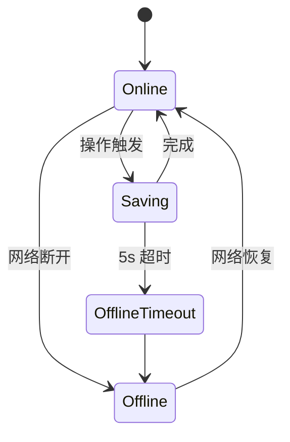

# 09 · 错误与边界状态

> 一个产品对"非正常态"的设计，决定了它的气质。
> 剧幕把错误当作"正在被修复的对话"，而不是"程序员崩溃的痕迹"。

## 一、设计原则

1. **永远告诉用户正在发生什么** — 不要静默失败
2. **永远给用户下一步** — 每个错误后都有按钮 / 链接
3. **永远保留用户的工作** — 自动保存优于失败提示
4. **永远用产品语气** — 不用"发生未知错误"这种机器话

## 二、错误分类

### 2.1 客户端错误（用户可恢复）

| 场景 | 表现 | 恢复路径 |
|------|------|----------|
| 必填变量未填 | 红底 + 顶部徽标「未填 N 处」 | 用户填完后状态自动消失 |
| 模板 body 为空 | 编辑器顶部状态条「已自动保存」但保存被跳过 | 用户输入任意字符即可 |
| 标题未填 | 保存按钮 Toast「请先给模板起个名字」 | 用户补全标题 |
| 标签格式错 | 不强制格式，自由 split | 无需校验 |
| 长文本超长（>500 字符） | textarea 显示字数计数 + 红色超过提示 | 用户自行截断 |

### 2.2 业务错误（用户无权操作）

| 场景 | 表现 | 恢复 |
|------|------|------|
| 未登录访问 Editor | Editor 仍可使用草稿（localStorage） | Toast「请先登录后再保存到云端」 |
| 未登录访问 Library | Library 显示登录引导卡片 | 一键演示 / 登录 / 注册 |
| 模板不存在 | 路由回退到 Home + Toast「找不到这个剧目」 | 用户回首页 |
| Fork 他人私有模板 | 拒绝 + 提示「此模板不可 Fork」 | 复制 + 打开公共详情 |
| 删除他人的模板 | UI 不暴露此操作 | N/A |

### 2.3 系统错误（基础设施）

| 场景 | 表现 | 恢复 |
|------|------|------|
| localStorage 写满 | try/catch 静默 + Toast「本地空间已满，请清理浏览器数据」 | 用户清缓存 |
| localStorage 被禁用（隐私模式） | 服务层 try/catch 全部失败 | Toast 提示 |
| 剪贴板权限被拒 | CopyButton 显示「请手动 Ctrl+C」 | 用户手动复制 |
| 网络断开（v2 真实 API） | 请求超时 5s → Toast「网络好像断开了」 | 重新连接 |
| 并发冲突（v2 协作） | Modal 提示「远端有更新」+ 三选一 | 用户决策 |

## 三、空态（Empty States）

> 空态是产品的"第一面镜子"，决定访客的第一印象。

### 3.1 展厅「筛选无结果」

```tsx
<EmptyState
  title="没有找到匹配的剧目"
  hint="尝试调整搜索词、切换类别或清除标签筛选"
  icon={<Search size={24} />}
  action={<Button onClick={reset}>重置筛选</Button>}
/>
```

### 3.2 我的剧库「空空如也」

```tsx
<EmptyState
  title="空空如也"
  hint="从展厅挑选一个模板，或从零搭建你的第一个剧目"
  icon={<FileText size={24} />}
  action={<Button variant="primary" onClick={() => nav('/editor')}>从零搭建</Button>}
/>
```

### 3.3 我的剧库「未登录」

```tsx
<div className="rounded-[16px] bg-ink-2 border border-ink-4 p-10 text-center">
  <LibraryIcon size={32} className="text-amber-2 mx-auto mb-4" />
  <h2>登录后开启你的剧库</h2>
  <p>云端保存、跨设备同步、收藏管理…都在这里。</p>
  <div className="flex gap-3 justify-center">
    <Button variant="primary">登录 / 注册</Button>
    <Button variant="outline-amber">先用演示账号</Button>
  </div>
</div>
```

### 3.4 收藏为空

```tsx
<EmptyState
  title="还没有收藏"
  hint="逛展厅时点击右上角的星标，把好模板加入你的收藏"
  icon={<Bookmark size={24} />}
/>
```

## 四、加载态

### 4.1 骨架屏

用于 Gallery / Detail / Workshop / Library：

```tsx
<div className="grid grid-cols-4 gap-5">
  {Array.from({ length: 8 }).map((_, i) => (
    <div key={i} className="rounded-[10px] bg-ink-2 border border-ink-4 overflow-hidden">
      <div className="h-44 bg-ink-3 animate-pulse" />
      <div className="p-4 space-y-2">
        <div className="h-3 bg-ink-3 rounded animate-pulse w-1/3" />
        <div className="h-4 bg-ink-3 rounded animate-pulse w-3/4" />
      </div>
    </div>
  ))}
</div>
```

**原则**
- 骨架结构与真实卡片一致
- 用 `bg-ink-3` 暗灰 + `animate-pulse`
- 0.5-1s 内若加载完成就不显示骨架

### 4.2 Spinner

用于 Button 的 loading 态：

```tsx
<span className="inline-block w-3 h-3 border-2 border-current border-t-transparent rounded-full animate-spin" />
```

### 4.3 同步态

保存到云端时：

- 按钮内出现 spinner
- 文案：「保存中…」→ 「保存」

## 五、网络态（v2 规划）



### 5.1 顶部状态条

- 联网 + 同步完成：绿点脉冲「云端已同步」
- 联网 + 同步中：琥珀点「正在同步…」
- 断网：红色静态「已离线，操作将在恢复后同步」

### 5.2 重试策略

- 失败后立即重试 1 次
- 仍失败 → 排队到 IndexedDB
- 用户回到在线 → 重新发送队列

## 六、输入校验

### 6.1 客户端校验时机

| 时机 | 校验 |
|------|------|
| onBlur | 失焦后立即提示 |
| onChange | 字数计数实时显示 |
| onSubmit | 提交时阻塞 |

### 6.2 错误展示

- **不弹 Modal**（打断用户）
- **不覆盖 toast**（被遮盖）
- **就地提示**：在字段下方红字 + 字段红描边

```tsx
<Input
  value={value}
  onChange={...}
  error={!value && required}
  className={cn(!value && required && '!border-vermilion')}
/>
{!value && required && <p className="text-[11px] text-vermilion">产品名不能为空</p>}
```

## 七、Toast 风格指南

### 7.1 4 种类型

| Kind | 颜色 | 用途 |
|------|------|------|
| `success` | 琥珀金 | 操作成功 |
| `info` | 湖青 | 提示 / 中性反馈 |
| `warn` | 浅琥珀 | 警告但未失败 |
| `error` | 砚红 | 失败 |

### 7.2 消息写法

#### ✅ 好的
- "已保存到云端"
- "已套用：免煮螺蛳粉 · 25-30岁女生"
- "请先登录后再保存到云端"
- "已复制到剪贴板"

#### ❌ 差的
- "操作成功"（没说做了什么）
- "Error 500"（用户不懂）
- "失败"（没说为什么）
- "您输入的内容不合法"（没说哪里）

### 7.3 时长

- 默认 2.4s
- error / warn：4s
- 重要：可手动 hover 暂停（v1.1）

## 八、3 类典型错误的演练

### 8.1 演示账号密码错误

```ts
// AuthService.login
if (!found) throw new Error('邮箱或密码不正确');

// Login.tsx
try {
  await login(...);
} catch (err) {
  setError(err instanceof Error ? err.message : '操作失败');
}
// 渲染
{error && (
  <div className="text-[12px] text-vermilion bg-vermilion-soft border border-vermilion/30 rounded-[6px] px-3 py-2">
    {error}
  </div>
)}
```

### 8.2 编辑器保存失败（未登录）

```tsx
const handleSave = async () => {
  if (!user) {
    pushToast({ kind: 'warn', message: '请先登录后再保存到云端' });
    return;
  }
  // ...
};
```

### 8.3 工坊复制失败

```tsx
const handleCopy = async () => {
  try {
    await navigator.clipboard.writeText(text);
    setCopied(true);
  } catch {
    // 降级：用 document.execCommand 或提示手动复制
    pushToast({ kind: 'error', message: '复制失败，请手动选择文本' });
  }
};
```

## 九、错误监控（v2 规划）

- 接 Sentry：JS 异常 + 未捕获 Promise reject
- 自定义事件：保存失败、复制失败、登录失败
- 用户行为漏斗：注册 → 第一个模板 → 第一次复制

## 十、给设计师的 Check List

设计稿交付前过一遍：

- [ ] 加载态有骨架 / spinner
- [ ] 空态有插画 + CTA
- [ ] 错误态有"接下来做什么"
- [ ] 表单错误就地提示
- [ ] Toast 消息是中文、口语化
- [ ] 移动端键盘不遮住错误信息
- [ ] 极端输入（超长、emoji、特殊字符）不破版

## 关联文档

- 03 · [组件库文档](./03-component-library.md) — 反馈组件 API
- 04 · [架构与数据流](./04-architecture.md) — 错误在 service 层的抛出
- 10 · [可访问性指南](./10-accessibility.md) — 错误信息的可读性
