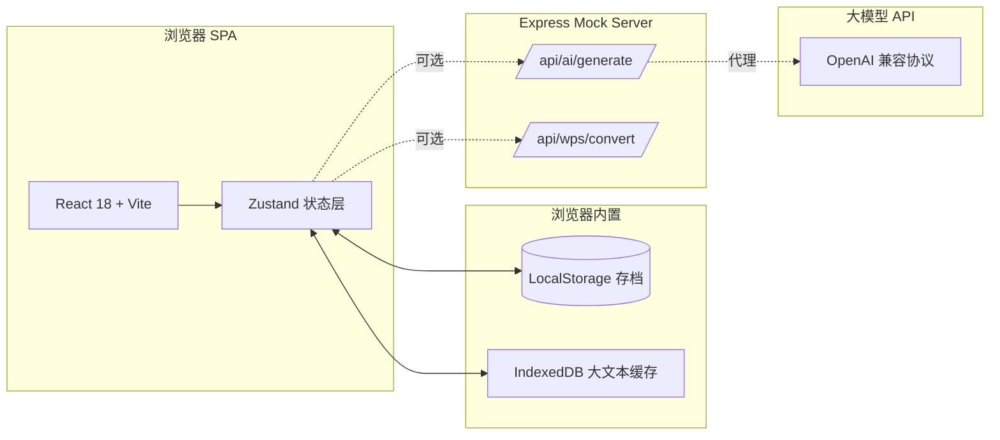
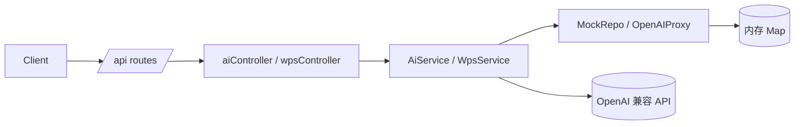

# 分镜表生成器 · 技术架构文档

## 1. 架构设计



整体采用 **纯前端优先 + 可选后端代理** 架构：
- 默认无后端：内置 Mock 规则生成 8 表格，本地运行
- 接入 API Key 后：由 Vite Proxy / 轻量 Express 代理转发到 LLM

## 2. 技术选型

- **前端框架**：React@18 + TypeScript + Vite@5
- **样式方案**：Tailwind CSS@3（深色主题定制）
- **状态管理**：Zustand（轻量、零样板）
- **路由**：react-router-dom@6（单页 + 设置抽屉）
- **图标**：lucide-react
- **Markdown 解析**：marked + DOMPurify（用于导入 .md 渲染与导出）
- **可选后端**：Express@4（仅在用户启用"自定义 API"时挂载）
- **测试**：Vitest + @testing-library/react
- **包管理**：npm（项目默认）
- **代码规范**：ESLint + Prettier（vite-init 自带）

## 3. 路由定义

| 路由 | 用途 |
|------|------|
| `/` | 主工作台（三栏布局：输入 / 8 表格 / AI 对话） |
| `/settings` | 设置抽屉（API Key、模型选择、主题切换） |
| `/docs` | 内置提示词模板与使用说明（模态弹出，非独立路由） |

## 4. API 定义（可选后端，仅在用户启用时使用）

```ts
// POST /api/ai/generate
interface GenerateRequest {
  prompt: string;                 // 自由文本或脚本
  template: 'cameraman' | 'director' | 'editor' | 'vfx';
  tableCount: 8;                  // 固定 8
  ticksPerTable: 16;              // 固定 16
  totalDurationSec: number;       // 默认 25
  apiKey?: string;                // 用户自定义 key 时透传
  model?: string;                 // 默认 gpt-4o-mini
}
interface GenerateResponse {
  tables: StoryboardTable[];
  usage: { promptTokens: number; completionTokens: number };
}
interface StoryboardTable {
  index: number;                  // 1-8
  title: string;                  // 镜头标题
  startSec: number;               // 起始秒
  endSec: number;                 // 结束秒
  ticks: StoryboardTick[];        // 长度 16
}
interface StoryboardTick {
  index: number;                  // 1-16
  sec: number;                    // 该刻度对应秒
  image: string;                  // 画面
  action: string;                 // 动作/运镜
  sound: string;                  // 音效
  note: string;                   // 设计要点
}

// POST /api/wps/convert
interface WpsConvertRequest {
  text: string;
  op: 'simplify' | 'traditional' | 'trim' | 'count' | 'md2txt' | 'txt2md' | 'extractTimecodes';
}
interface WpsConvertResponse {
  result: string;
  meta?: Record<string, number | string>;
}
```

## 5. 服务端架构（仅启用时）



- 控制器层：参数校验、安全过滤
- 服务层：业务逻辑、提示词拼装、规则生成
- 仓储层：默认 Mock（无网络时也能工作），有 Key 时切换为 OpenAI 代理

## 6. 数据模型

### 6.1 数据模型定义

```mermaid
erDiagram
    PROJECT ||--o{ TABLE : contains
    TABLE ||--|{ TICK : has16
    PROJECT ||--o{ CHAT : logs
    CHAT ||--o{ MESSAGE : contains
    PROJECT {
      string id PK
      string title
      number totalDuration
      string apiKey
      string model
      string updatedAt
    }
    TABLE {
      string id PK
      string projectId FK
      number index
      string title
      number startSec
      number endSec
    }
    TICK {
      string id PK
      string tableId FK
      number index
      number sec
      string image
      string action
      string sound
      string note
    }
    CHAT {
      string id PK
      string projectId FK
      string template
    }
    MESSAGE {
      string id PK
      string chatId FK
      string role
      string content
      number ts
    }
```



### 6.2 初始数据 / 默认值

- 默认项目：标题"未命名项目 · 高潮 25s"，总时长 25，8 表 × 16 刻度
- 默认模板：内置 4 套提示词（分镜师 / 摄影指导 / 剪辑师 / 特效师）
- 默认 API 配置：留空 → 走 Mock；填写后切换到 OpenAI 兼容协议

## 7. 目录结构

```
/workspace
├── .trae/documents/
│   ├── PRD.md
│   └── ARCHITECTURE.md
├── api/                       # 可选 Express 后端
│   ├── index.ts
│   ├── routes/
│   ├── controllers/
│   └── services/
├── src/
│   ├── components/            # 通用组件
│   │   ├── StoryboardTable.tsx
│   │   ├── TickRow.tsx
│   │   ├── WpsToolbar.tsx
│   │   └── ChatPanel.tsx
│   ├── pages/
│   │   └── Workbench.tsx
│   ├── hooks/                 # 自定义 hooks
│   │   ├── useLocalPersist.ts
│   │   └── useStreamAI.ts
│   ├── store/                 # Zustand 状态
│   │   └── projectStore.ts
│   ├── utils/                 # 工具函数
│   │   ├── wpsTools.ts
│   │   ├── timecode.ts
│   │   └── markdown.ts
│   ├── templates/             # 提示词模板
│   │   └── prompts.ts
│   ├── App.tsx
│   ├── main.tsx
│   └── index.css
├── index.html
├── package.json
├── tailwind.config.js
├── tsconfig.json
└── vite.config.ts
```

## 8. 关键模块说明

### 8.1 8 表格 × 16 竖线渲染
- 数据驱动：`tables[8].ticks[16]`
- 每行竖线由 CSS `::before` 伪元素 + 等宽 grid 列实现，时间码用等宽字体右对齐
- 单格可点击进入行内编辑（contenteditable），失焦保存到 Zustand
- 顶部覆盖度条 = 已填格数 / 128

### 8.2 WPS 工具集
- 全部在 `utils/wpsTools.ts` 中实现为纯函数：
  - 段落清洗（去除空行/全角空格/连续换行）
  - 字数统计（中英文字符分别计数）
  - 繁简转换（opencc-js，按需懒加载）
  - Markdown↔纯文本
  - 时间码提取（`\d{2}:\d{2}:\d{2}` 正则）
- UI 暴露为 6 个胶囊按钮 + 浮动 Toast 反馈

### 8.3 AI 对话
- 提示词模板存于 `src/templates/prompts.ts`，4 套
- `useStreamAI` hook 兼容 OpenAI 流式（SSE 解析）
- 注入机制：选中表格 → 聊天输入 `/inject #3` → AI 输出直接覆盖该表

### 8.4 持久化
- LocalStorage：项目元信息 + 表格数据，键 `sf:project:v1`
- IndexedDB（可选）：大文本缓存，键 `sf:rawtext:v1`

## 9. 性能与可访问性

- 首次加载 < 200KB（gzipped）
- 8 表格 × 16 刻度 = 128 格，虚拟滚动非必要
- 键盘快捷键：`Tab` 切换格、`Cmd+Enter` 触发 AI、`Cmd+S` 导出
- ARIA：所有可编辑格 `role="textbox"`、对话框 `aria-live="polite"`
