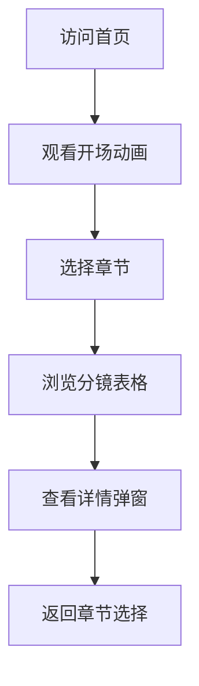

# IMAX影视分镜展示系统 - 产品需求文档

## 1. 产品概述

IMAX影视分镜展示系统是一个展示电影级战斗场景分镜的可视化平台。该项目以中国神话农夫与宇宙巨兽的史诗对决为主题，通过精心设计的视觉界面呈现IMAX级别的镜头语言、特效渲染和音效设计。

### 项目目标
- 为影视制作团队提供直观的分镜展示工具
- 展示6幕式剧情结构（觉醒、战场召唤、天坠、神力爆发、神战、余韵）
- 呈现IMAX视觉风格与水墨画风融合的独特美学

### 目标用户
- 影视制作团队
- 分镜艺术家
- 导演和制片人
- 特效团队

---

## 2. 核心功能

### 2.1 用户角色
| 角色 | 说明 | 核心权限 |
|------|------|----------|
| 访客 | 任何访问者 | 浏览全部分镜内容 |
| 制作者 | 团队成员 | 预览和下载分镜 |

### 2.2 功能模块

#### 2.2.1 首页展示
- 史诗级开场动画，模拟IMAX银幕体验
- 6个章节的视觉导航
- 粒子特效背景，营造宇宙氛围

#### 2.2.2 分镜表格展示
每个章节包含完整的分镜信息：
| 字段 | 说明 |
|------|------|
| 镜号 | 镜头编号 |
| 景别 | 大全景/全景/远景/中景/近景/特写 |
| 运镜 | 镜头运动方式 |
| 画面内容 | 详细场景描述 |
| 特效/渲染 | IMAX、水墨、粒子等渲染要求 |
| 音效 | 背景音乐和音效描述 |

#### 2.2.3 章节导航
- 第一幕：觉醒 (镜头01-03)
- 第二幕：战场召唤 (镜头04-06)
- 第三幕：天坠 (镜头07-09)
- 第四幕：神力爆发 (镜头10-12)
- 第五幕：神战 (镜头13-15)
- 第六幕：余韵 (镜头16-18)

#### 2.2.4 视觉特效展示
- 粒子系统模拟宇宙尘埃
- 水墨风格动画效果
- 空间扭曲和几何崩解特效
- 冲击波涟漪动画

---

## 3. 核心流程

### 3.1 用户浏览流程

### 3.2 分镜展示流程

---

## 4. 用户界面设计

### 4.1 设计风格
**视觉方向**: 宇宙级电影美学 + 中国水墨意境

**色彩方案**:
- 主色调: 深空黑 (#0a0a0f) - 宇宙背景
- 次要色: 水墨灰 (#2a2a35) - 层次感
- 强调色: 金色 (#d4af37) - 威压与神圣
- 点缀色: 火焰橙 (#ff6b35) - 能量爆发
- 辅助色: 星光白 (#e8e8f0) - 文字和图标

**字体选择**:
- 标题: "Noto Serif SC" (宋体风格，古典大气)
- 正文: "Noto Sans SC" (清晰易读)
- 装饰: "Ma Shan Zheng" (书法风格)

**布局风格**:
- 沉浸式全屏设计
- 16:9 画幅比例
- 电影黑边效果
- 流动性的章节切换

### 4.2 页面设计概览

#### 首页
| 模块 | UI元素 | 描述 |
|------|--------|------|
| 背景层 | 粒子动画 | 宇宙尘埃粒子漂浮 |
| 标题区 | 书法字体 | "对决" 大标题 |
| 副标题 | IMAX标识 | 影视PV风格 |
| 导航区 | 六个章节按钮 | 悬浮发光效果 |
| 装饰 | 光晕效果 | 角落金边装饰 |

#### 分镜表格页
| 模块 | UI元素 | 描述 |
|------|--------|------|
| 章节标题 | 大字标题 | 幕的名称 |
| 分镜表格 | 响应式表格 | 6列完整信息 |
| 特效标签 | 彩色标签 | IMAX/水墨/粒子等 |
| 音效描述 | 斜体文字 | 氛围感 |
| 返回按钮 | 圆形按钮 | 顶部导航 |

### 4.3 响应式设计
- **桌面优先**: 1920x1080 最佳体验
- **平板适配**: 1024px 断点，表格横向滚动
- **移动端**: 768px，简化布局，单列展示

### 4.4 3D场景指导
不适用 - 本项目为2D分镜展示

---

## 5. 技术约束

### 5.1 性能要求
- 首屏加载时间 < 3秒
- 表格渲染流畅，60fps
- 动画不掉帧

### 5.2 浏览器兼容
- Chrome 90+
- Firefox 88+
- Safari 14+
- Edge 90+

### 5.3 可访问性
- 键盘导航支持
- 适当的颜色对比度
- 屏幕阅读器友好

---

## 6. 内容数据

### 第一幕：觉醒 (15秒)
| 镜号 | 景别 | 运镜 | 画面内容 | 特效/渲染 | 音效 |
|------|------|------|----------|-----------|------|
| 01 | 大全景 | 地面仰拍→急速拉升 | IMAX渲染，参考IMS粒子模糊，大景深 | 低频嗡鸣，大地震颤 |
| 02 | 远景 | 长焦压缩→横移 | 中国老头（农夫装扮）站回头，衣衫褴褛却步伐奇特 | 3渲2角色融入IC现实环境 | 急促脚步+古老编钟声 |
| 03 | 特写 | 快速变焦 | 老头抬头，眼神从浑浊瞬间变得锐利，嘴角一丝中式幽默的狡黠笑容 | 面部微表情捕捉，瞳孔金光绽放 | 一声清脆的"叮" |

### 第二幕：战场召唤 (15秒)
| 镜号 | 景别 | 运镜 | 画面内容 | 特效/渲染 | 音效 |
|------|------|------|----------|-----------|------|
| 04 | 全景 | 不稳定手持→环绕 | 战场废墟，中式塔虚影，高塔落下 | 画面割裂感，天虹瞬间变色，空间崩解 | 心跳低频 |
| 05 | 中景 | 快速推拉 | 士兵跌倒，抬头看见老头站在前方 | 镜头瞬间模糊→清晰，水墨线条从角色身上迸发 | 声音骤停，只剩风声 |
| 06 | 特写 | 固定 | 老头台词（方言/古音）："炽龙！逮住他" | 水墨巨龙延展，空间扭曲 | 古老咒语回声，多层混响 |

### 第三幕：天坠 (15秒)
| 镜号 | 景别 | 运镜 | 画面内容 | 特效/渲染 | 音效 |
|------|------|------|----------|-----------|------|
| 07 | 大全景 | 天顶俯拍→急速下坠 | 天空撕裂，一颗行星冲破大气层，地面崩塌 | 物理模拟：大气摩擦粒子、冲击波环形扩散 | 次声波压迫，耳膜刺痛感 |
| 08 | 中景 | 稳定跟拍 | 尘埃粒子IC级现实渲染，逆光剪影 | 金属铠甲碰撞声 |
| 09 | 特写 | 慢动作 | 面部细节，异域神秘感 | 英文低沉，带古老口音 |

### 第四幕：神力爆发 (15秒)
| 镜号 | 景别 | 运镜 | 画面内容 | 特效/渲染 | 音效 |
|------|------|------|----------|-----------|------|
| 10 | 中景 | 环绕长镜头 | 老头单手平推，动作如农夫推犁般随意——行星瞬间静止，然后向内坍缩、爆裂、毁灭 | 宇宙神力具象化：空间褶皱、引力透镜、物质崩解为几何碎片 | 绝对静音→爆发性白噪音 |
| 11 | 大全景 | 急速后退 | 冲击波几何倍数扩散，环形气浪摧毁方圆百里 | 空间割裂感：毁灭与安全的边界清晰可见 | 冲击波低频扫荡 |
| 12 | 近景 | 快速切换 | 太空巨兽从裂隙中探出，老头第一次交锋 | 水墨画风格的打击轨迹，瞬间线条勾勒力量走向 | 骨骼碰撞的沉闷巨响 |

### 第五幕：神战 (15秒)
| 镜号 | 景别 | 运镜 | 画面内容 | 特效/渲染 | 音效 |
|------|------|------|----------|-----------|------|
| 13 | 特写→全景 | 镜头瞬间变化 | 老头每一次出拳，冲击波都几何倍扩散，在宇宙中形成涟漪 | 运镜展现力度：镜头跟随拳头轨迹，速度线+动态模糊 | 打击音效层层叠加 |
| 14 | 中景 | 快速横移 | 巨兽被击中，空间本身被撕裂，露出背后的虚空与星辰 | 空间毁灭效果：物理法则崩坏的视觉化 | 玻璃碎裂声放大千倍 |
| 15 | 大全景 | 360度环绕 | 最终一击——老头跃起，全身化为水墨金龙，贯穿巨兽 | 3渲2角色完全释放，中国神话美学爆发 | 龙吟+宇宙寂静 |

### 第六幕：余韵 (15秒)
| 镜号 | 景别 | 运镜 | 画面内容 | 特效/渲染 | 音效 |
|------|------|------|----------|-----------|------|
| 16 | 远景 | 缓慢拉升 | 老头站着，周围太空舰队，老头深呼吸 | 低饱和《沙丘》色调，苍凉史诗感 | 风声，远处星辰低语 |
| 17 | 特写 | 固定 | 老头的表情 - 中式幽默收束，反差感 | 轻快的笛声插入 |
| 18 | 黑屏 | 无运镜 | 编钟最后一声 | 色调严格《沙丘》低饱和 | 余韵消散 |

---

## 7. 项目里程碑

### M1: 基础框架
- React + Vite 项目初始化
- 页面路由配置
- 基础布局组件

### M2: 视觉实现
- CSS动画系统
- 粒子效果
- 水墨风格样式

### M3: 内容整合
- 分镜数据整理
- 表格组件开发
- 章节导航

### M4: 优化完善
- 性能优化
- 响应式适配
- 细节打磨
