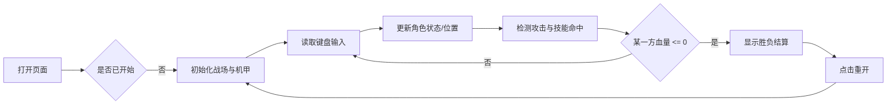

# 像素风机甲对战小游戏 - 产品需求文档

## 1. 产品概述

一款可在浏览器中直接运行的双人格斗小游戏，玩家分别操控两台像素风格机甲在同一屏幕内对战。

- 通过键盘操控机甲移动、跳跃、防御、普攻与释放技能，先将对方血量归零者获胜。
- 采用复古像素美术与霓虹CRT视觉风格，强调爽快连招与技能博弈。

## 2. 核心功能

### 2.1 功能模块

1. **对战主页面**：游戏画布、血条UI、技能冷却UI、胜负结算面板、操作说明。
2. **机甲操控**：移动、跳跃、防御、普通攻击、技能1、技能2、必杀技。
3. **战斗系统**：血量、受击硬直、防御减伤、技能伤害、连招计数、胜负判定。
4. **像素表现**：角色像素精灵、帧动画、打击特效、场景背景、CRT扫描线滤镜。

### 2.2 页面详情

| 页面名称 | 模块名称 | 功能描述 |
|---------|---------|---------|
| 对战主页面 | 游戏画布 | 960x540 像素分辨率，等比缩放适配窗口 |
| 对战主页面 | 血条UI | 顶部左右两侧显示红蓝机甲血量百分比 |
| 对战主页面 | 技能冷却UI | 显示三个技能按键与当前冷却状态 |
| 对战主页面 | 胜负结算面板 | 对战结束后显示胜者，提供重开按钮 |
| 对战主页面 | 操作说明 | 底部展示双方按键说明 |

## 3. 核心流程

玩家进入页面后直接开始对战，无需登录。

## 4. 用户界面设计

### 4.1 设计风格

- **主色调**：深空灰 `#0B0C15` 背景 + 霓虹红 `#FF2A6D`（赤焰机甲）+ 霓虹青 `#05D9E8`（雷霆机甲）。
- **像素感**：所有角色/场景使用 16x16/32x32 像素精灵，禁用抗锯齿渲染。
- **UI元素**：方块血条、像素字体（Press Start 2P）、CRT扫描线与轻微屏幕弯曲效果。
- **动效**：受击闪烁、攻击拖尾、技能光效、连招数字弹起、KO定格震动。

### 4.2 页面设计概述

| 页面名称 | 模块名称 | UI元素 |
|---------|---------|--------|
| 对战主页面 | 画布区域 | 像素场景、机甲精灵、特效粒子 |
| 对战主页面 | 顶部HUD | 红蓝血条、技能图标与冷却遮罩 |
| 对战主页面 | 底部操作说明 | 双方按键映射表 |
| 对战主页面 | 结算弹窗 | 胜者大字、重开按钮 |

### 4.3 响应式

- 桌面优先，画布容器最大宽度 960px，居中显示。
- 窗口缩小时保持 16:9 比例等比缩放。
- 键盘为默认操作方式；后续可扩展触屏虚拟按键。

## 5. 操作说明

| 玩家 | 左移 | 右移 | 跳跃 | 防御 | 普攻 | 技能1 | 技能2 | 必杀技 |
|------|------|------|------|------|------|-------|-------|--------|
| 1P（红） | A | D | W | S | F | G | H | Space |
| 2P（蓝） | ← | → | ↑ | ↓ | L | ; | ' | Enter |

