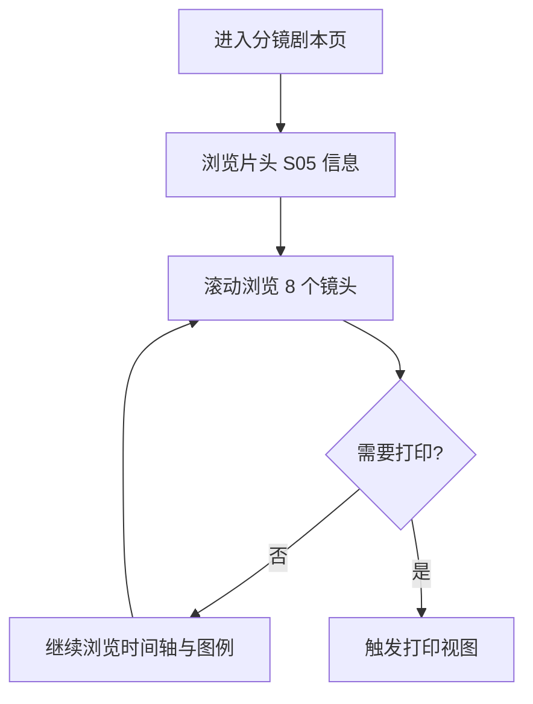

# 分镜剧本 HTML 产品需求文档

## 1. 产品概述
- 面向影视/广告前期制作的分镜剧本展示页面，将 S05 章节的 8 个镜头以电影感、工业风、纪实美学呈现，支持导览、缩放、打印。
- 目标用户：导演、分镜师、制片、客户审片人、摄影指导；用于内部送审、对外沟通与拍摄现场参考。

## 2. 核心功能

### 2.1 用户角色
| 角色 | 使用场景 | 核心权限 |
|------|----------|----------|
| 制作团队 | 桌面端审片 | 浏览全部镜头、查看元数据、切换镜头 |
| 客户/审片人 | 演示场景 | 滚动浏览、印刷导出、查看镜头时长与提示 |
| 摄影师/导演 | 现场执行 | 单镜头特写、打印单页 |

### 2.2 功能模块
1. **顶部片头区**：场次信息、标题、章节徽章、保密标识。
2. **镜头列表流**：按 S05-01 ~ S05-08 顺序排列的镜头卡片。
3. **镜头卡片**：编号、景别、运动、画面描述、时长、声音与对白、用途说明。
4. **时间轴条**：以刻度尺展示总时长与各镜头时长占比。
5. **图例与脚注**：景别缩写（LS/CU/ECU/MS/MLS/FS/POV/EL）对照。
6. **打印模式**：CSS 媒体查询支持 A4/A3 干净排版输出。

### 2.3 页面详情
| 页面 | 模块 | 功能描述 |
|------|------|----------|
| 主页 | 片头 | 显示 S05 章节标题、镜头数、总时长、保密标识 |
| 主页 | 镜头列表 | 8 个镜头垂直堆叠，奇偶错位排版，呈现电影感 |
| 主页 | 时间轴 | 横向刻度尺，按真实时长比例分布镜头 |
| 主页 | 图例 | 景别、运动方式、声音分类的术语说明 |
| 主页 | 打印 | 自动隐藏交互元素，输出 A4 纵向 PDF 友好的版面 |

## 3. 核心流程
用户进入页面 → 顶部片头呈现章节信息 → 向下滚动浏览 8 个镜头卡片 → 通过景别徽章、对白气泡、声音图标快速识别镜头要素 → 必要时切换打印视图。

## 4. 用户界面设计

### 4.1 设计风格
- 主色：深空蓝黑 `#0B0E14`，机务橙 `#FF6A1A`（提示与对白高亮），烟雾白 `#E8E6E1`（主文），HUD 青 `#7AE8FF`（数据标识）。
- 字体：标题用 `Bebas Neue`/`Anton`（工业感无衬线），正文用 `JetBrains Mono`（技术与场记信息），中文用 `Noto Sans SC`。
- 按钮/标识：方角、硬边、轻微外发光、扫描线纹理；不使用圆角糖块风格。
- 布局：12 栏非对称网格，奇偶镜头错位排版，胶片孔与对位线装饰。
- 动效：进入时扫描线从左到右扫过；镜头卡片入场有 stagger 错位淡入与轻微平移；HUD 数据有打字机效果。

### 4.2 页面设计概览
| 页面 | 模块 | UI 元素 |
|------|------|----------|
| 主页 | 片头 | 大字号 S05、镜头 08、总时长 18s、机密印章、胶片孔边框 |
| 主页 | 镜头卡片 | 编号徽章、景别胶囊、镜头运动、画幅比例、声音/对白条 |
| 主页 | 时间轴 | 横向刻度条，每段镜头一个色块，点击锚点跳转 |
| 主页 | 图例 | 8 个景别缩写解释，运动/声音术语说明 |
| 主页 | 打印 | A4 单列、隐藏动效与装饰、保留文字信息 |

### 4.3 响应式
- 桌面优先：1280–1920px 主力展示，1200px 以下切换为单列。
- 移动端：镜头卡片纵向堆叠，景别徽章与对白条保留。

### 4.4 视觉与氛围
- 环境：模拟航空 HUD 与机务报告单的暗色工业风，加入扫描线、噪点、胶片颗粒。
- 相机：固定镜头，水平方向有 0.3° 抖动以模拟机载振动。
- 焦点元素：HUD 数字、对白气泡、雷达红点、保密印章。
- 交互：滚动驱动镜头卡片入场，hover 显示完整对白。
- 后处理：高对比、暗角、轻微色差（蓝橙分离）。
- 资产来源：纯 CSS/SVG 与 unicode 字符，无外部图片依赖；遵循 placeholder 禁用原则，所有装饰皆为代码生成。
