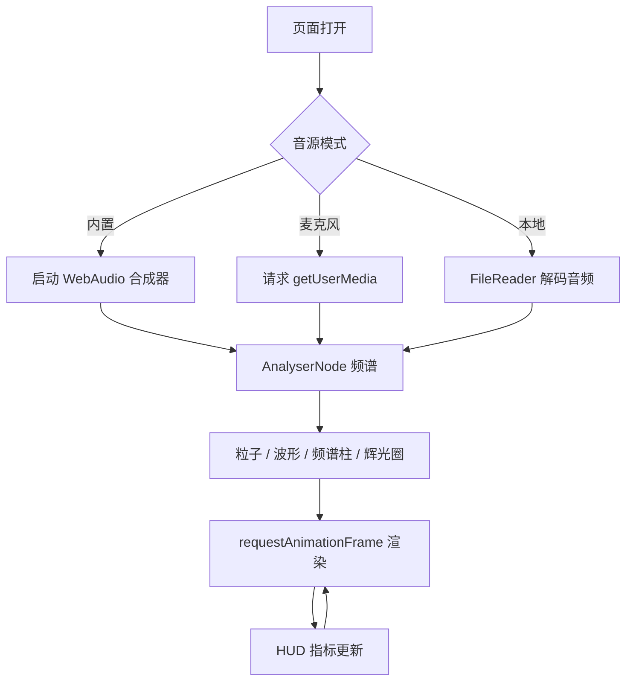

# 音乐粒子场（Pulse Particles）产品需求文档

## 1. 产品概述

「音乐粒子场」是一款运行在浏览器中的 2D 实时音频可视化作品。它将麦克风输入或本地音频转化为由数千粒子组成的"数字化波浪场"，并辅以频谱、波形、辉光等多种现代化数字视觉层，为用户带来沉浸式的声光体验。目标用户为创意工作者、夜间聆听爱好者、VJ 与数字艺术创作者。

## 2. 核心功能

### 2.1 角色说明
本作品为单页可视化工具，无注册体系，区分"访客"与"主控"两种交互姿态：
| 角色 | 进入方式 | 核心权限 |
|------|----------|----------|
| 访客 | 直接打开页面 | 全屏观看，体验"无操作"自动播放模式 |
| 主控 | 载入音频 / 授权麦克风 | 控制源、模式、灵敏度、色彩、强度 |

### 2.2 功能模块
1. **主可视化舞台**：全屏 2D Canvas，承载粒子场、波形带、频谱柱、辉光圈四层数字波视觉。
2. **音源控制台**：内置合成电子舞曲（无音频文件依赖，零等待）、麦克风实时采集、拖拽本地 MP3/WAV 三种音源。
3. **视觉调节面板**：粒子密度、反应灵敏度、色彩主题、波动速度、辉光强度、是否开启波纹涟漪。
4. **状态 HUD**：左上角实时显示 BPM 估计、响度 RMS、节拍脉冲点；右上角显示当前模式、分辨率、帧率。

### 2.3 页面详情
| 页面 | 模块 | 功能说明 |
|------|------|----------|
| 主舞台 | 粒子场 | 600+ 粒子按低/中/高频段分组，受频谱能量驱动产生位移、缩放、轨迹拖尾 |
| 主舞台 | 波形带 | 屏幕中央横向波形线，由 AnalyserNode 时域数据直接驱动 |
| 主舞台 | 频谱柱 | 屏幕底部 64 段频谱柱形阵列，按 A-weighted 风格着色 |
| 主舞台 | 辉光圈 | 中心放射状径向波，随节拍脉冲扩张 |
| 控制台 | 音源切换 | Tab 切换：内置 / 麦克风 / 本地 |
| 控制台 | 视觉预设 | 6 种主题：极光、青蓝、熔岩、极简、霓虹、暗夜 |
| 控制台 | 调节滑块 | 灵敏度、密度、速度、辉光、涟漪开关 |
| HUD | 实时指标 | RMS、BPM、帧率、模式 |

## 3. 核心流程

访客进入 → 自动启动内置音源 → 粒子场根据合成节拍进行可视化 → 主控可切换音源 / 主题 / 调节参数 → 状态实时反馈至 HUD。

## 4. 用户界面设计

### 4.1 设计风格
- **主色**：以深夜蓝黑 `#05060B` 为基底，搭配数字青 `#7DF9FF`、品红 `#FF3CAC`、极光紫 `#9B5DE5` 构成高对比霓虹色阶。
- **按钮风格**：玻璃拟态 + 细描边 + 内部辉光，悬停时出现 1px 颜色外溢。
- **字体**：标题用 `Space Grotesk`（视觉主字）+ `JetBrains Mono`（HUD 数据字），拒绝通用 Inter。
- **布局**：全屏沉浸式舞台，控制台为右下角悬浮胶囊 + 顶部左侧 1px 状态栏。
- **图标**：lucide-react 图标为主，少量 SVG 几何装饰线。

### 4.2 页面设计概览
| 页面 | 模块 | UI 元素 |
|------|------|----------|
| 主舞台 | 粒子场 | 高斯模糊辉光 + 加法混合 + 拖尾衰减；现代数字波"水波"形态 |
| 主舞台 | 波形带 | 1px 描边 + 外发光双层，水平居中并跟随低频呼吸 |
| 主舞台 | 频谱柱 | 顶端 1px 亮点 + 自下而上渐变填充，柱间留 1px 缝隙形成"数据网格"感 |
| 主舞台 | 辉光圈 | 径向 RGBA 渐变，节拍时半径 1.0→1.6 缩放 |
| 控制台 | 音源切换 | 三段式胶囊切换器，活动态有底部 2px 渐变线 |
| 控制台 | 视觉预设 | 6 色圆形色板 + 选中态外环 |
| 控制台 | 调节滑块 | 极简轨道 + 圆形把手，把手带辉光晕 |
| HUD | 实时指标 | 等宽数字 + 微闪烁分隔点 |

### 4.3 响应式
桌面优先（1280px+ 最佳），向下兼容至 768px。控件在窄屏自动折叠为顶部抽屉。

### 4.4 2D 场景指导
- **环境氛围**：暗夜数字场，类似合成波/赛博空间，深色基底 + 高饱和霓虹。
- **视觉图层**（自下而上）：背景网格 → 频谱柱 → 波形带 → 粒子场 → 辉光圈 → 顶部 HUD。
- **粒子行为**：低频粒子向中心聚集 + 大幅位移；中频粒子做圆周运动；高频粒子做高频抖动。
- **交互动画**：无操作时仍保持持续呼吸，鼠标移动会影响粒子偏移场（Perlin noise）。
- **后处理感**：通过 Canvas `globalCompositeOperation = 'lighter'` 与 `shadowBlur` 模拟 bloom。
- **资产来源**：纯代码生成（无外部图片/字体以外的资源），保证首屏零等待。
