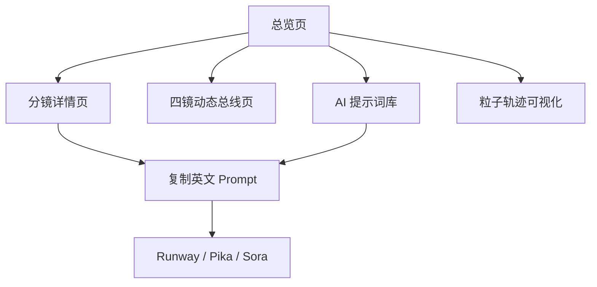

# 产品需求文档 (PRD)

## 1. 产品概述
「铁链惊蛰 · 分镜工坊」是一款面向影视/动画前期制作人员及 AI 视频创作者的分镜可视化工具，将分镜表、动态标注总线、粒子轨迹与 AI 提示词整合为单一交互式界面，支持纵览与逐帧精读两种模式。
- 主要用途：在制作 AI 视频前，快速对照四镜分镜的运镜、动作、粒子、提示词；导出可用于 Runway/Pika/Sora 的英文 prompt。
- 目标用户：分镜师、短视频导演、AI 视频创作者、影视前期团队。

## 2. 核心功能

### 2.1 用户角色
本工具为单用户内容浏览/导出工具，无需登录与角色区分。

### 2.2 功能模块
1. **总览页 (Overview)**：四镜时序条、动态总线图、节奏波形汇总，提供跳转入口。
2. **分镜详情页 (Storyboard Detail)**：单镜分镜表（时间/动态标注/视觉导向/画面内容/特效）、运镜 SVG 示意、AI 提示词卡片（含一键复制）。
3. **四镜动态总线页 (Motion Bus)**：横向时间线（0:00-1:00）+ 各镜主导运动轴/视觉导向/粒子主轨迹的对照视图。
4. **AI 提示词库 (Prompts)**：四个分镜的英文提示词集合，支持单镜复制与全部复制。
5. **粒子轨迹可视化 (Particles)**：基于 Canvas/SVG 渲染的 6 类粒子动画（烟尘、火星、冲击波、血雾、箭矢、灰烬）以供视觉验证。

### 2.3 页面详情
| 页面名称 | 模块名称 | 功能描述 |
|---------|---------|---------|
| 总览页 | 顶部 Hero | 标题"铁链惊蛰 · 黄忌出阵"，副标题标注"四镜 · 60 秒 IMAX 战斗分镜"；背景为金铜色调烟尘升腾 SVG 动画 |
| 总览页 | 时序条 | 横向 0:00-1:00 进度条，按分镜一/二/三/四切分为四段，hover 显示该分镜名与主导运动轴 |
| 总览页 | 节奏波形卡 | 四张节奏卡：双波峰 / 波浪形 / V型反弹 / 螺旋上升，配迷你波形 SVG |
| 分镜详情页 | 分镜表 | 5 列（时间/动态标注/视觉导向/画面内容/特效）多行表，支持单行高亮（hover 同步至时间轴） |
| 分镜详情页 | 运镜图示 | SVG 绘制 6 个运镜示意（前冲、甩镜、长焦拉远、手持乱点、仰冲、贴地横移），用箭头+标签呈现 |
| 分镜详情页 | 提示词卡 | 英文 prompt 卡片，含暗色等宽字体与"复制"按钮，复制后按钮变"已复制"并出现 ✓ |
| 四镜动态总线页 | 横向时间线 | 60 格刻度（每秒一格），叠加四条彩带：动作轴/视觉导向/节奏波形/粒子轨迹 |
| 四镜动态总线页 | 对照表 | 四列对照：分镜名 / 主导运动轴 / 视觉导向模式 / 节奏波形 / 粒子主轨迹 |
| AI 提示词库 | 提示词列表 | 4 张可折叠卡片，每张含分镜标题、关键词 chips、完整 prompt、复制按钮 |
| 粒子轨迹可视化 | 粒子演示区 | 6 个 Canvas 单元，分别渲染螺旋上升烟尘 / 径向火星 / 同心圆冲击波 / 血珠拉丝 / 箭矢残像 / 灰烬飘落 |

## 3. 核心流程
1. 用户进入总览页 → 通过时序条快速定位目标分镜（0:00-0:15 / 0:15-0:30 / 0:30-0:45 / 0:45-1:00）→ 点击进入分镜详情。
2. 在分镜详情页 → 滚动查看分镜表，对照运镜图示理解镜头运动 → 下滑至提示词卡 → 点击复制。
3. 跳转到"四镜动态总线页" → 横向时间线 + 节奏波形卡做整体节奏检查。
4. 进入"粒子轨迹可视化" → 直观验证每个粒子类型是否符合预期，再回去微调 prompt。
5. 进入"AI 提示词库" → 整段或单镜复制英文 prompt → 粘贴到 Runway/Pika/Sora。

## 4. 用户界面设计

### 4.1 设计风格
- 主色调：墨黑 `#0B0B0F` + 战甲青铜 `#B08D57` + 血红 `#C5302B` + 烟尘灰 `#7A7368`。
- 强调色：刀光冷白 `#E6F0FF`、铁链青火星 `#3FB8AF`、惊蛰金光 `#E0A82E`。
- 字体：标题 `Cinzel`（衬线、刀刻感），副标题与中文 `Noto Serif SC`，正文 `Inter`，等宽代码 `JetBrains Mono`。
- 布局风格：左侧固定导航（图标 + 文字），右侧主内容区，卡片化布局；强调对角线分割与不规则切角。
- 图标：极简线性 SVG（刀、链、马、箭、爆炸、火），线宽 1.5px。

### 4.2 页面设计概览
| 页面 | 模块 | UI 元素 |
|------|------|---------|
| 总览页 | Hero | 巨幅 Cinzel 标题，背景金色径向渐变 + 上升烟尘粒子；副标题倾斜 4° |
| 总览页 | 时序条 | 4 段色带，分镜一/二/三/四分别用青铜/血红/墨灰/暗金；hover 弹出小卡 |
| 总览页 | 节奏卡 | 4 张垂直切角卡片，顶部节奏波形 SVG（中线 + 起伏） |
| 分镜详情页 | 分镜表 | 深色斑马纹表格，首列时间高亮青铜色；hover 行显示同色左边框 |
| 分镜详情页 | 运镜图示 | 6 个 120×120 SVG 单元，箭头沿对角/同心圆/螺旋绘制 |
| 分镜详情页 | 提示词卡 | 暗色面板 + JetBrains Mono 字体 + 右上角复制按钮（变 ✓ 后 1.5s 复原） |
| 动态总线页 | 时间线 | 顶部刻度条 + 4 条彩带（动作/导向/节奏/粒子），支持 hover 高亮 |
| 提示词库 | 提示词卡片 | 折叠面板，展开时整段 prompt 显现，配关键词 chip |
| 粒子可视化 | Canvas 单元 | 黑底 + 彩色粒子，标题置于左上角；支持"暂停/重播"按钮 |

### 4.3 响应式
- 桌面优先（1280-1920px），断点 1024 / 768。
- 1024px 以下隐藏左侧导航，改为顶栏汉堡菜单；分镜表改为横向滚动。
- 触摸设备：粒子 Canvas 自动降级帧率（24fps），hover 效果改为 tap 触发。

### 4.4 动效与场景引导
- 页面加载：Cinzel 标题逐字 fade-up（80ms stagger），背景烟尘粒子延迟 200ms 出现。
- 时序条：分镜段用 `clip-path` 切出斜角，hover 时金色辉光沿对角线扫过。
- 复制反馈：按钮宽度不变，仅图标 + 文字切换，并加 0.15s 弹性缩放。
- 粒子循环：每个 Canvas 内部用 `requestAnimationFrame`，帧间隔 ~42ms。
- 全局氛围：在最外层叠加 4% 噪点纹理 + 暗角，营造战火硝烟感。
