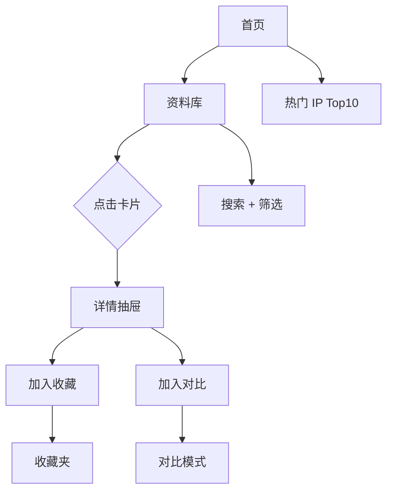

# 游戏IP衍生作品资料库 - 产品需求文档（PRD）

## 1. 产品概述
**次元典藏（IP-Codex）** —— 一座面向泛二次元用户、游戏玩家与 IP 收藏爱好者的可视化资料库，收录 2000+ 项游戏 IP 衍生作品（截至 2026 年 6 月 8 日），以「像素博物馆 / 复古档案」为美学主调，提供检索、筛选、对比、详情与收藏夹等核心能力。
- 主要用途：解决「找一部游戏改编动画 / 一款角色手办 / 一场舞台剧，却不知道有或没有」的检索难题
- 目标用户：游戏玩家、ACG 爱好者、IP 收藏家、二级市场买家、研究者
- 价值：让 2000+ 散落的衍生品信息聚合为可被发现的「IP 生态地图」

## 2. 核心功能

### 2.1 用户角色
| 角色 | 进入方式 | 核心权限 |
|------|----------|----------|
| 访客 | 无需登录 | 浏览 / 检索 / 筛选 / 收藏到本地（localStorage） |
| 收藏家 | 访客 + 收藏夹 | 在收藏夹内打标签、排序、导出 JSON |

> 本期仅做本地收藏（无需后端账户），保持极简。

### 2.2 功能模块
1. **首页 / 探索台**：Hero 视觉、统计看板、热门 IP Top 10、衍生形式雷达
2. **资料库（主浏览页）**：卡片网格、筛选侧栏、搜索框、排序
3. **详情抽屉**：单条作品的多字段详情、所属 IP、同 IP 衍生品推荐
4. **收藏夹**：本地收藏聚合、标签、导出
5. **对比模式**：并排展示 2-3 件作品的字段差异

### 2.3 页面详情
| 页面 | 模块 | 功能描述 |
|------|------|----------|
| 首页 | Hero | 全屏像素 / CRT 扫描线视觉 + 数据大字标语 |
| 首页 | 看板 | 总数、IP 数、形式数、最近 30 天新增 |
| 首页 | 热门 IP | 按衍生品数量排序的 Top 10 |
| 资料库 | 搜索框 | 标题 / IP 名 / 制作方 / 年份模糊搜索 |
| 资料库 | 筛选侧栏 | 衍生形式、首发年份、地区、平台来源 IP、评分、状态 |
| 资料库 | 卡片网格 | 卡片显示封面（渐变占位）、标题、IP、形式徽章、年份 |
| 资料库 | 排序 | 按年份、评分、热门度升降序 |
| 详情抽屉 | 字段 | 标题 / 原名 / 形式 / IP / 制作方 / 导演 / 声优 / 平台 / 发售日 / 状态 / 简介 / 评分 / 标签 / 参考链接 |
| 详情抽屉 | 同 IP 衍生 | 当前 IP 下其他衍生品横滑 |
| 收藏夹 | 列表 | 表格 + 缩略图、批量删除、标签编辑、JSON 导出 |
| 对比模式 | 并排 | 字段并排高亮差异 |

## 3. 核心流程

```
访客进入首页 → 浏览统计 → 点击「进入资料库」
  → 输入关键词 / 勾选筛选条件 → 卡片实时更新
  → 点击卡片 → 右侧抽屉滑出详情
  → 点击「加入收藏」或「加入对比」 → 顶栏气泡显示数量
  → 进入收藏夹 / 对比页 → 二次操作（导出 / 清空）
```



## 4. 用户界面设计

### 4.1 设计风格
- **主色**：`#0b0d12`（深夜黑底）、`#f5e6c8`（羊皮纸米白）、`#ff5b3a`（霓虹橙红）
- **辅色**：`#3ddc97`（街机绿）、`#3aa0ff`（像素蓝）、`#a06cd5`（奇幻紫）
- **字体**：标题 `Press Start 2P`（像素感），副标题 `VT323`，正文 `JetBrains Mono`，中文 `Noto Serif SC`
- **按钮**：3D 按下质感（顶部高光 + 底部阴影 + hover 抬升 2px）
- **布局**：12 栅格；左侧筛选 + 右侧卡片瀑布；详情用右侧抽屉（480-560px）
- **图标**：Lucide React，少量自定义像素 SVG
- **动效**：CRT 扫描线背景、卡片 hover 抬升 + 颜色发光、抽屉滑入、计数递增
- **背景**：复古像素纹理 + 噪声叠加 + 角落扫描线

### 4.2 页面设计概述
| 页面 | 模块 | UI 元素 |
|------|------|----------|
| 首页 | Hero | 大字标语（像素字体）+ CRT 扫描线 + 渐变光环 + CTA |
| 首页 | 看板 | 4 个像素卡片，数字滚动动画 |
| 资料库 | 搜索 | 顶部固定，⌘K 快捷键聚焦 |
| 资料库 | 筛选侧栏 | 分组多选 + Range 滑块 + 标签芯片 |
| 资料库 | 卡片 | 渐变占位封面、徽章、标题、IP、年份、评分 |
| 详情抽屉 | 字段 | 双列布局、字段标签像素风格 |
| 收藏夹 | 表格 | 行高 64px，复选框批量操作 |

### 4.3 响应式
- 桌面优先（1280+）；≥1024 维持两栏；<1024 折叠侧栏为顶部弹层；<640 单列卡片

### 4.4 3D 场景
- 不使用 3D 场景（克制焦点于信息密度）

## 5. 数据范围（必含）
- **衍生形式**（≥ 12 类）：动画番剧 / TV 动画 / 动画电影 / 剧场版 / OVA / OAD / 真人电影 / 真人剧 / 网剧 / 漫画 / 小说 / 设定集 / 原声碟 / 角色歌 / 舞台剧 / 音乐剧 / 广播剧 / 广播节目 / 周边手办 / 黏土人 / figma / 模型 / 抱枕 / 主题餐厅 / 主题咖啡 / 主题乐园 / 线下展览 / 联动咖啡车 / 桌游 / 集换式卡牌 / 电子小说 / 同人杂志 / 同人本 / VTuber / Podcast / 广播剧 CD / 大型联名快闪 / 全球巡展 / 数字艺术展
- **覆盖 IP**（≥ 80 个）：宝可梦、塞尔达传说、马里奥、皮卡丘、最终幻想、勇者斗恶龙、女神异闻录、异度之刃、火焰纹章、生化危机、怪物猎人、合金装备、合金装备、刺客信条、巫师、赛博朋克 2077、黑暗之魂、艾尔登法环、上古卷轴、我的世界、堡垒之夜、英雄联盟、DOTA、王者荣耀、原神、崩坏：星穹铁道、明日方舟、少女前线、碧蓝航线、碧蓝幻想、公主连结、赛马娘、FGO、阴阳师、崩坏 3、第五人格、和平精英、蛋仔派对、光与夜之恋、未定事件簿、恋与制作人、剑与远征、哈利波特魔法觉醒、阴阳师百闻牌、星际争霸、魔兽争霸、炉石传说、暗黑破坏神、守望先锋、Apex 英雄、Valorant、CS、彩虹六号、只狼、鬼泣、猎天使魔女、战神、神秘海域、最后生还者、底特律、最终幻想 7 重生、最终幻想 16、街头霸王、铁拳、生化奇兵、极限国度、看门狗、孤岛惊魂、刺客信条幻景、生化危机 4 重制版、生化危机 8、空洞骑士、丝之歌、死亡细胞、哈迪斯、传送门、半条命、传送门 2、求生之路、地平线、西之绝境、对马岛之魂、漫威蜘蛛侠、对马岛、最终幻想 7 Rebirth、艾尔登法环 黄金树幽影、博德之门 3、星空、赛博朋克 2077 往日之影、暗黑破坏神 4、卧龙、匹诺曹的谎言、浪人崛起、剑星、影之刃零、燕云十六声、暗区突围、射雕、永劫无间、塔瑞斯世界等
- **目标数量**：≥ 2000 条记录

## 6. 非功能性
- 首屏 < 2s（Vite 静态 + 分页 60 条 / 页）
- 搜索/筛选实时反馈（useMemo 索引）
- 全部数据在前端 JS 中（无需后端）
- 移动端可读、单页可滚动不卡顿
