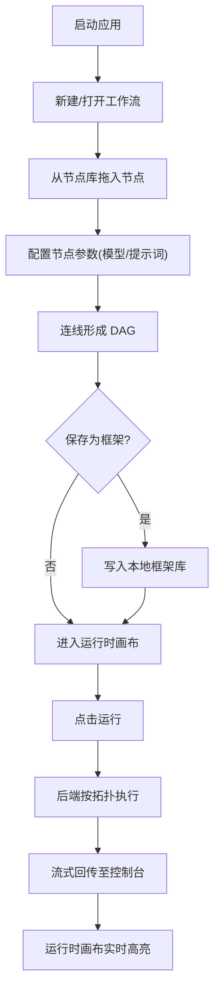

# FlowForge — 工作流画布(大模型选取 * 后端)

## 1. 产品概述

**FlowForge** 是一款基于 Electron 的桌面端工作流画布软件,核心定位是「**大模型编排与多模态流程制造**」:用户通过可视化节点在**双画布**(设计画布 / 运行时画布)上拖拽组合大模型、工具、条件分支等组件,后端内置多厂商大模型路由,实现"选取 → 编排 → 执行 → 调试"的一体化生产链路。

- **主要解决问题**:开发者 / 设计师在多模型时代需要快速搭建 AI 流程,但缺乏统一的桌面编排环境
- **目标用户**:AI 应用开发者、产品/运营探索者、研究人员(对模型可插拔与可视化编排有需求)
- **产品价值**:把"框架(模板)制作 + 大模型选取 + 双画布调试"压进一个桌面工具,让生产链可见、可调试、可复用

## 2. 核心功能

### 2.1 用户角色
| 角色 | 注册方式 | 核心权限 |
|------|----------|----------|
| 创作者 | 桌面端默认 | 编辑画布、保存框架、执行工作流、调用大模型 |
| 访客(只读) | 打开 .ff 文件 | 查看画布、复现运行 |

### 2.2 功能模块
1. **主窗口**:顶部菜单栏 + 左侧节点库 + 中央画布区(双画布) + 右侧属性面板 + 底部执行控制台
2. **设计画布**:自由拖拽、连线、保存为框架模板
3. **运行时画布**:执行同一份工作流,展示数据流、token 消耗、状态色变化
4. **大模型选取面板**:内置厂商(OpenAI / Anthropic / 通义 / 智谱 / Ollama 等)路由选择
5. **框架库**:本地模板管理(我的 / 内置 / 导入)
6. **执行控制台**:流式输出、日志、调试断点

### 2.3 页面细节
| 页面 | 模块 | 功能描述 |
|------|------|----------|
| 主窗口 | 顶部菜单 | 新建 / 打开 / 保存 / 导出 / 运行 / 停止 / 主题切换 |
| 主窗口 | 节点库 | 树形分类:输入、LLM、工具、条件、输出;支持拖拽到画布 |
| 主窗口 | 设计画布 | 节点放置、端口连接、缩略图、网格背景、快捷键 |
| 主窗口 | 运行时画布 | 同步呈现执行态,节点高亮、连线流动效果、实时数据流 |
| 主窗口 | 属性面板 | 选中节点时显示:模型、温度、提示词、最大 token、工具参数 |
| 主窗口 | 执行控制台 | 流式 token、日志级别切换、清空、复制 |
| 框架库 | 列表 | 缩略图、名称、最后编辑时间、复制 / 删除 / 导出 |
| 大模型选取 | 弹窗 | 厂商 + 模型下拉,API Key 状态、延迟测试、健康度 |
| 设置 | 弹窗 | 主题、API Key 管理、代理、性能开关 |

## 3. 核心流程

**创作者主流程**:
1. 启动 → 新建 / 打开工作流 → 拖入节点
2. 在属性面板配置大模型与参数
3. 设计画布连接节点形成 DAG
4. 保存为"框架"模板(可复用)
5. 切换到运行时画布点击「运行」
6. 后端按拓扑顺序执行,流式回传输出
7. 在控制台查看日志与 token 数据

## 4. 用户界面设计

### 4.1 设计风格
- **主题**:深色技术风(主) / 浅色(辅)
- **主色**:`#0B0F14`(底色)、`#11161D`(面板)、`#1B2330`(浮层)
- **强调色**:`#7DF9FF`(青色信号)、`#FF7AC6`(品红热区)、`#A0FFB0`(成功绿)
- **字体**:
  - 显示:`JetBrains Mono` / `IBM Plex Mono` —— 终端感、技术感
  - 正文:`Inter` 备用 → 改用 `Manrope` 增强几何感
  - 节点标题:`Space Grotesk` —— 现代工业感(谨慎使用,仅作点缀)
- **按钮**:直角 6px 圆角 + 1px 描边 + 玻璃感 hover;不滥用 3D 渐变
- **图标**:`lucide-react`,1.5px 描边风格
- **布局**:Figma-like 三栏 + 双画布标签页切换,顶部 48px 工具条,左侧 240px 节点库,右侧 320px 属性面板,底部 200px 可折叠控制台

### 4.2 页面设计概览
| 页面 | 模块 | UI 元素 |
|------|------|----------|
| 主窗口 | 顶部菜单 | 玻璃质感 + 1px 描边 + 等宽字体品牌名 "FLOWFORGE" |
| 主窗口 | 节点库 | 分类树、节点卡片有"端口预览缩略图"、可拖拽 |
| 主窗口 | 设计画布 | 24px 网格点阵、节点带状态指示灯、连线路径贝塞尔 |
| 主窗口 | 运行时画布 | 连线有流光动画、执行过的节点淡绿色描边、失败节点红色脉冲 |
| 属性面板 | 节点配置 | 分组:基础 / 模型 / 高级 / 调试;输入框采用等宽 + 占位提示 |
| 控制台 | 执行日志 | 等宽字体、按节点分组、可折叠、severity 标签 |
| 大模型选取 | 弹窗 | 厂商卡片(logo + 延迟 + 健康度)+ 模型下拉 + 实时 ping |

### 4.3 响应性
- 桌面端优先(最小 1280×720)
- 支持窗口缩放,画布自适应;不针对移动端

### 4.4 视觉与动效
- 页面加载:节点库 stagger 渐入(50ms 步进)
- 拖拽:节点半透明 + 缩略图跟随
- 连线创建:贝塞尔曲线实时绘制
- 执行态:运行时画布的连线有"数据流动光"动画(青色光斑沿路径移动)
- 状态色:运行中(青)、成功(绿)、失败(红)、空闲(灰)
- 背景:暗色 + 极细网格(2% 透明度)+ 顶部 1px 渐变高光线
