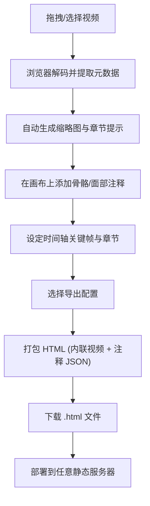

# 骨骼 & 面部绑定视频 HTML 化工具 - PRD

## 1. 产品概述

**RigReel** 是一款面向绑定师 (Rigger)、TA 与教学作者的浏览器端工具：把一段演示骨骼绑定或面部绑定的原始视频，快速封装成可独立部署、可分享的 HTML 页面。

- 解决的核心问题：录屏/教程视频无法在 HTML 中承载交互式标注、对比与时间轴控制，分发与评审成本高。
- 目标用户：游戏 / 影视 / 动画工作室的绑定师、角色 TD、教学内容创作者。
- 价值：视频 + 时间轴 + 注释 + 前后对比的「可交互案例集」，可直接托管到任意静态站点。

## 2. 核心功能

### 2.1 用户角色
本工具为单机 / 单人创作场景，不设注册与权限。

| 角色 | 入口 | 核心权限 |
|------|------|----------|
| 创作者 | 直接打开 | 导入视频、编辑、导出 HTML |

### 2.2 功能模块

1. **主页 (工作台)**：左侧素材库 / 中间时间轴 / 右侧属性检查器；顶部工具栏与导出按钮。
2. **导入与解析**：支持 MP4/WebM/MOV 拖拽导入；自动提取元数据（时长、分辨率、帧率）。
3. **时间轴与关键帧**：可拖动游标 / 关键帧标记；缩放与吸附；快捷键 ←/→ 单帧步进。
4. **注释系统**：
   - 骨骼注释 (Bone Annotation)：在画面上添加带「骨骼图标的 SVG」连接点，引线指向角色部位，附文字说明。
   - 面部绑定注释 (Facial Control)：预设 50+ 表情控制器点位（下颌、左眉外侧、嘴角、瞳孔…），可任意摆放。
5. **对比模式 (Before / After)**：将视频的两个时间段并列同步播放，对比绑定前/后效果。
6. **章节系统 (Chapter)**：把视频拆分为多个章节（如：手臂 IK、面部 ARKit、表情混合），每章独立标题、缩略图、注释集。
7. **主题与品牌**：在导出 HTML 中可定制主色、Logo 文字、字体。
8. **导出 HTML**：一键打包成单文件 HTML（视频以 base64 内联），可部署到任意静态服务器 / GitHub Pages / 对象存储。
9. **示例与最近项目**：内置 1 个示例工程；自动保存到 localStorage。

### 2.3 页面详情

| 页面 | 模块 | 功能描述 |
|------|------|----------|
| 工作台 | 顶栏 | 工程名编辑、撤销/重做、导出、主题切换 |
| 工作台 | 视频检视器 | 居中播放，叠加注释图层；支持画中画 |
| 工作台 | 时间轴 | 章节色块、关键帧、注释节点、缩放、播放头 |
| 工作台 | 资源/章节 | 章节列表、注释列表、关键预设（面部点位） |
| 工作台 | 属性检查器 | 选中注释/章节后的位置、颜色、连接样式 |
| 导出对话框 | 预览 | 实时预览导出后的 HTML，并提供下载按钮 |
| 导出对话框 | 配置 | 主题色、字体、是否内联视频、版权水印 |

## 3. 核心流程

## 4. 用户界面设计

### 4.1 设计风格

- **整体调性**：技术 / 暗色主题 + 霓虹强调色，灵感来自 Blender、ZBrush、Substance 等 DCC 工具的「工作室」气质。
- **主色**：
  - 背景 `#0B0D10` (近黑)
  - 面板 `#14171C`
  - 边框 `#252A33`
  - 强调色 `#7CFFB2` (薄荷绿，绑定骨骼的传统符号色)
  - 辅助强调 `#FF5DA2` (面部控制点)
  - 文字 `#E6E9EF` / 次级 `#8B93A7`
- **字体**：
  - 标题 / Logo：`Space Grotesk` 或 `JetBrains Mono` (技术感)
  - 正文：`Inter` 或系统无衬线
- **按钮**：1px 边框、4px 圆角，hover 时边框变薄荷绿；导出按钮采用填色。
- **布局**：顶部 48px 工具栏 / 左侧 280px 资源栏 / 中间自适应画布 / 右侧 320px 检查器 / 底部 220px 时间轴。
- **图标**：lucide-react，线性、统一 1.5px 描边。
- **装饰**：背景用极淡的网格 + 顶部角落的扫描线纹理；面板边缘有 1px 内阴影。

### 4.2 页面设计

| 页面 | 模块 | UI 元素 |
|------|------|----------|
| 工作台 | 顶栏 | 半透明深色 + 毛玻璃，Logo「RigReel」+ 工程名 inline 编辑 + 工具按钮 |
| 工作台 | 视频区 | 黑底，注释图层透明叠加，hover 出现 8px 控制点 |
| 工作台 | 时间轴 | 24px 帧标尺，章节色块 36px，关键帧菱形 8px；当前播放头垂直细线 |
| 工作台 | 资源栏 | 列表 + 缩略图 + 章节时长；可拖拽 |
| 导出对话框 | 预览 | 模拟最终 HTML 的样子；底部 CTA「下载」 |
| 导出对话框 | 配置 | 单列表单，主题色 swatch、字体下拉、版权输入 |

### 4.3 响应式

- 桌面优先 (1280px+) 优化；
- 平板 (≥ 1024px) 自动收起左右栏为抽屉；
- 手机仅提供查看已导出 HTML 的体验，编辑器功能不可用，给出提示。

### 4.4 3D / 视觉细节

- 视频背景使用「边缘渐变到黑」的径向遮罩，使注释更突出；
- 播放头行进时，时间轴上出现一条 2px 薄荷绿发光带；
- 注释节点 hover 时有 200ms 弹簧缩放；
- 整体页面首次加载做「画布淡入 + 时间轴从左到右绘制」的 600ms 入场动画。

## 5. 非功能要求

- 视频 ≤ 200 MB 时直接 base64 内联；> 200 MB 时降级为「视频文件 + HTML」打包（下载为 zip）。
- 导出 HTML 在 Chrome / Edge / Safari 14+ 上 60 fps 滚动与播放。
- 浏览器内编辑不依赖网络，纯前端实现。
