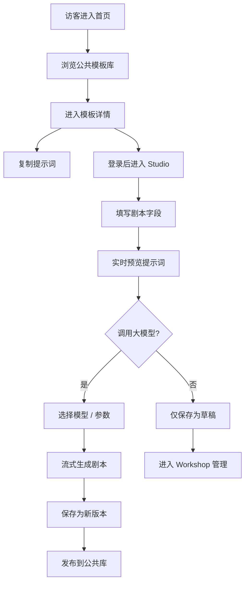

# PRD：萤幕（Lumière）— 云端 AI 剧本提示词模板器

## 1. 产品概述

萤幕（Lumière）是一款面向编剧、内容创作者与 AI 工程师的云端提示词模板协作工具，专注于「剧本 / 短视频脚本 / 互动叙事」场景，将角色、世界观、场景节奏与镜头语言等结构化字段抽离为可复用的提示词模板。

- **核心价值**：把"想到哪写到哪"的散装提示词升级为版本化、可拆解、可协作、可一键调用大模型的工程化资产。
- **目标用户**：剧本创作者、短视频脚本团队、AIGC 工程师、互动叙事产品经理。
- **市场定位**：区别于通用 Prompt 管理工具（如 PromptBase、PromptLayer），萤幕聚焦"剧本 / 叙事"垂直领域，提供剧本结构字段（人物小传、节拍、冲突、台词、镜头指示）作为一等公民。

## 2. 核心功能

### 2.1 用户角色

| 角色 | 注册方式 | 核心权限 |
|------|----------|----------|
| 访客（Guest） | 无需注册 | 浏览公共模板库、试用模板、复制提示词 |
| 创作者（Creator） | 邮箱注册 / 第三方登录 | 创建 / 编辑 / 收藏 / 版本管理自己的模板，发布到公共库 |
| 协作者（Collaborator） | 被邀请加入工作区 | 编辑被授权的模板，使用云端变量与团队素材 |
| 管理员（Admin） | 系统分配 | 审核公共模板、标记精选、管理分类标签 |

### 2.2 功能模块

1. **首页（Discover）**：英雄区、垂直分类、精选剧本模板、热门标签云、搜索入口。
2. **模板编辑器（Studio）**：剧本字段化表单（左：剧本结构字段，中：实时提示词预览，右：大模型调用面板）。
3. **模板详情页（Script View）**：剧本结构阅读视图、提示词原文、使用统计、一键复制 / 调用。
4. **个人工作台（Workshop）**：我的模板、收藏、版本历史、协作工作区。
5. **公共模板库（Library）**：按体裁（电影 / 短剧 / 短视频 / 互动游戏）筛选、按节拍模型排序。

### 2.3 页面详情

| 页面名称 | 模块名称 | 功能描述 |
|----------|----------|----------|
| 首页 | 英雄区 | 大字号动态标语，滚动字幕风，背景为胶片颗粒与逐帧切换的场记板 |
| 首页 | 模板分类导航 | 横向滚动胶囊标签：剧情 / 喜剧 / 科幻 / 恐怖 / 互动等 |
| 首页 | 精选模板瀑布 | 卡片样式：海报式封面、节拍模型标签、作者水印 |
| Studio | 剧本字段面板 | 标题、Logline、人物小传、节拍表、冲突、台词、镜头指示、风格参考 |
| Studio | 提示词预览 | 实时拼接、变量高亮、Token 估算、导出按钮（Markdown / JSON） |
| Studio | 大模型调用 | 选择模型、温度、Top-P，一键调用并流式输出剧本 |
| Script View | 剧本阅读视图 | 衬线字体 + 居中栏宽 + 行号 + 节拍高亮 |
| Workshop | 模板列表 | 表格 / 卡片切换，按更新时间 / 使用次数排序 |
| Library | 公共模板库 | 高级筛选（体裁、节拍模型、字数、变量数） |
| 全局 | 顶部命令面板 | `⌘K` 唤起，搜索模板 / 字段 / 标签 |

## 3. 核心流程

访客从首页进入 → 浏览公共模板 → 进入模板详情 → 复制提示词到自己的 LLM 工具；
创作者登录 → 进入 Studio → 填写剧本字段 → 实时预览提示词 → 选择大模型 → 调用生成 → 一键保存为新版本 → 发布到公共库。

## 4. 用户界面设计

### 4.1 设计风格

- **主色**：`#0B0B0E`（深夜黑场）+ `#E8E1D4`（牛皮纸米白）+ `#D4A857`（场记板琥珀）+ `#C8102E`（胶片红印章）。
- **辅助色**：`#3A3A40` 灰阶，透明度梯度构建层次。
- **按钮**：直角硬边 + 1px 描边 + 胶片孔圆点装饰；主操作为实心琥珀色，次操作为幽灵按钮。
- **字体**：
  - 标题：`Playfair Display`（衬线、戏剧感）
  - 正文：`Lora`（可读衬线）
  - 字段标签与代码：`JetBrains Mono`（打字机感）
- **布局**：栅格 + 不对称，剧本结构字段采用「场记板分镜」卡片化设计；主内容居中，工具栏侧边悬浮。
- **图标 / 装饰**：胶片孔、场记板、卷轴、菲林齿孔作为分隔符；标题前用 ❲SCENE 01❳ 之类的场记编号。
- **动效**：进场以"逐帧拉幕"方式揭示（每 80ms 显示一行）；按钮 hover 时胶片孔扩散；模板切换使用镜头光圈收缩。

### 4.2 页面设计概述

| 页面名称 | 模块名称 | UI 元素 |
|----------|----------|---------|
| 首页 | 英雄区 | 全屏 100vh、Playfair 96px 标题、琥珀色下划线动画、背景胶片颗粒 |
| 首页 | 精选模板瀑布 | 卡片封面 4:5 比例、悬停时光圈放大、节拍标签贴在卡片右上角 |
| Studio | 剧本字段面板 | 三栏布局，左栏 320px 字段卡，胶片孔作为滚动指示器 |
| Studio | 提示词预览 | 等宽字体，变量用琥珀色高亮，Token 计数器右下角 |
| Studio | 大模型调用 | 顶部模型选择芯片，参数滑块带刻度，按钮"开拍" |
| Script View | 剧本阅读视图 | 居中 720px 阅读栏，行号在左、节拍高亮、卷尾有"再来一镜"按钮 |
| Workshop | 模板列表 | 表格头部为胶片条，行为剧本条目样式，状态用色卡表示 |

### 4.3 响应式

桌面优先（≥1280px），中等屏幕（768-1279px）折叠三栏为两栏，<768px 时字段面板转为折叠手风琴；触控优化保证 44px 最小可点击区域。

### 4.4 3D 场景指引

首页英雄区背景使用极轻量 WebGL 胶片滚动条动画（3D 圆筒自转），Three.js + R3F 实现，HDRI 关闭、纯程序化材质、菲林齿孔纹理；相机缓慢推近；性能预算 ≤ 8ms / 帧；空闲 5s 后停止旋转以省电。
