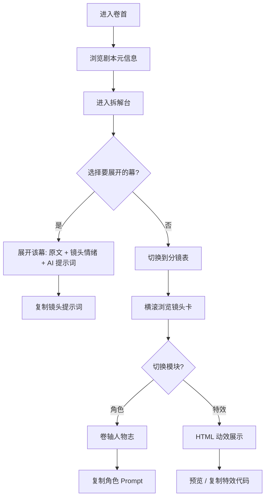

# 燕云长卷 · 宋代北伐剧作工作台

## 1. 产品概述

「燕云长卷」是一款面向历史解说短视频、纪录片、AI 短剧团队的「剧本-分镜-人物-特效」一体化工作台。本期以北宋太宗赵光义两次北伐的解说脚本为蓝本，将一篇 2400 字的旁白脚本拆解为可挑选、可展开、可一键导出 AI 提示词的分镜方案与人物 / 特效资产库。

- 主要使用者：历史题材短视频编导、AI 视频生成 Prompt 工程师、文旅 / 纪录片写作者
- 解决痛点：长篇历史旁白如何高效拆分为镜头语言；如何为每个镜头生成可直接喂给文生图 / 文生视频模型的提示词；如何沉淀角色形象与战场特效资产
- 目标价值：把一篇纯文本解说，变成可挑选的剧本、可展开的分镜表、可复用的角色与特效库

## 2. 核心功能

### 2.1 用户角色

| 角色 | 进入方式 | 核心权限 |
|------|----------|----------|
| 访客（无需登录） | 直接进入工作台 | 浏览剧本、展开分镜、查看人物与特效、复制提示词 |

### 2.2 功能模块

1. **首页 / 卷首页**：长卷式开场，引出主题、剧本元信息（时长、字数、节奏），并提供全局切换。
2. **剧本拆解台（拆解剧本）**：以「幕」为粒度展示原文，可点击任一幕进入「剧本展开」，看到原文旁白、镜头情绪、重点史料与对应 AI 提示词。
3. **分镜表**：横版滚动分镜卡片，每张卡片包含镜号、景别、运镜、原文摘要、画面描述（中文）、AI 提示词（英文 / 可复制）、配乐情绪、配音时长。
4. **角色设计**：以「卷轴人物志」样式陈列 8 位关键人物（赵光义、耶律休哥、萧燕燕、潘美、杨业、曹彬、韩德让、王侁），每人提供外貌、服饰、兵器、关键镜头、英文 Prompt。
5. **特殊效果展示**：以画中画 + HTML 动效展示高粱河「驴车漂移」、岐沟关溃败、陈家谷伏击、澶渊之盟等关键场景的纯 CSS / SVG 动效，作为「引用效果」的可复用模板。
6. **剧本与分镜切换侧栏**：右侧浮窗可快速跳转到任一幕、任一人物、任一特效。

### 2.3 页面明细

| 页面 | 模块 | 功能描述 |
|------|------|----------|
| 卷首 · Hero | 标题 / 副标 / 剧本元信息卡 | 展示「高粱河车神与雍熙悲歌」主题与朗读参数 |
| 剧本拆解台 | 幕列表 + 展开面板 | 5 幕（引子 / 高粱河 / 七年 / 雍熙 / 落幕）可展开 |
| 分镜表 | 镜头卡片横滚 | 至少 18 个镜头，覆盖两场北伐 |
| 角色设计 | 人物卷轴 | 8 位角色可悬停展开 |
| 特殊效果 | 动效画中画 | 4 个标志性 HTML 动效 |
| 跳转侧栏 | 锚点导航 | 幕 / 镜头 / 人物 / 特效四类锚点 |

## 3. 核心流程

## 4. 用户界面设计

### 4.1 设计风格

- 主题：「绢本长卷 + 烽烟朱印」。以宣纸米白为底，墨黑为字，朱砂红与战旗金为主辅色，远山青为点缀。
- 字体：标题用「Noto Serif SC」或「ZCOOL XiaoWei」类古风衬线；正文用「Noto Serif SC」；英文 Prompt 用「JetBrains Mono」营造档案感。
- 按钮：朱印方章造型（圆角 2px、细描边、悬停微抬），主按钮为朱砂色，次按钮为墨色描边。
- 布局：上下纵向「长卷」结构，横向内含卡片；人物与特效模块使用网格 + 画中画。整体留白宽，节奏舒展。
- 图标：使用 `lucide-react` 中的线性图标（毛笔、卷轴、战旗、火焰、战马等），配以少量手绘 SVG 印章。

### 4.2 页面设计概要

| 页面 | 模块 | UI 元素 |
|------|------|---------|
| 卷首 | Hero | 巨幅标题竖排、副标、剧本元信息卡（字数 / 时长 / 节奏） |
| 拆解台 | 幕卡 | 每幕一张卷轴卡片，含「幕名 · 时间 · 关键词 · 字数」 |
| 拆解台 | 展开面板 | 原文段落 + 镜头情绪条 + AI 提示词（可复制） |
| 分镜表 | 镜头卡 | 镜号 / 景别 / 运镜 / 画面描述 / Prompt / 时长 / 配乐情绪 |
| 角色设计 | 人物卷轴 | 8 张人物卡，正面竖排名，背面展开 Prompt |
| 特效 | 动效画中画 | 4 个画中画动效（驴车漂移 / 岐沟关溃败 / 陈家谷伏击 / 澶渊之盟） |
| 侧栏 | 锚点 | 幕 / 镜头 / 人物 / 特效 4 个 Tab |

### 4.3 响应式

桌面优先（1280–1920），向下兼容 1024 宽度。窄屏下分镜表改为纵向排列，特效画中画保持 16:9。

### 4.4 动效与氛围

- 顶部装饰：飘动的「烽烟」粒子（CSS 动画）。
- 标题入场：逐字竖排落入，配印章落定动画。
- 幕卡悬停：边缘出现朱红描边与光晕。
- 分镜卡：进入视口时由下至上淡入并轻微旋转 -1°→0°。
- 角色卡：悬停时正面翻转到背面（Y 轴 180°）。
- 特效画中画：滚动到视口时启动循环动画。
- 整体背景：宣纸纹理 + 远山水墨叠层（SVG 噪点 + 渐变蒙版）。
