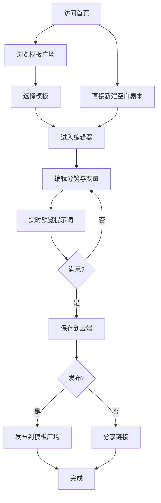

# 云服务AI剧本提示词模板器 - 产品需求文档

## 1. 产品概述

**PromptStage（幕境）** 是一款面向影视/短视频创作者的云端 AI 剧本提示词工程平台，帮助编剧、导演、短视频博主把零散灵感沉淀为可复用、可分享、可参数化的「提示词脚本」，一键投递到任意大模型即可生成高质量剧本。

- 解决痛点：AI 写剧本时提示词零散、变量丢失、团队无法协同、风格难统一
- 目标用户：短视频编导、影视编剧、广告创意、自媒体内容团队
- 核心价值：把提示词当作「剧本」来管理——结构化、可分镜、可版本化

## 2. 核心功能

### 2.1 用户角色
| 角色 | 注册方式 | 核心权限 |
|------|----------|----------|
| 访客 | 无需注册 | 浏览模板广场、试用编辑器（本地保存） |
| 注册用户 | 邮箱/手机 | 云端保存剧本、发布模板、收藏、分享 |
| 团队成员 | 邀请加入 | 协同编辑、版本历史、评论 |

### 2.2 功能模块
1. **首页 / 模板广场**：精选模板分类、热门剧本、搜索
2. **编辑器（核心）**：剧本结构化编辑、变量注入、分镜节点、提示词预览
3. **我的剧本库**：云端剧本管理、文件夹、版本、标签
4. **模板详情页**：模板预览、使用、复制、二创
5. **设置中心**：AI 模型配置、API Key、主题、字体偏好

### 2.3 页面详细说明
| 页面 | 模块 | 功能描述 |
|------|------|----------|
| 首页 | 顶部导航 | Logo、主导航、登录入口、CTA 按钮 |
| 首页 | Hero 区 | 大标题 + 副标题 + 动态打字机示例 + 双 CTA |
| 首页 | 模板分类 | 影视/短视频/广告/广播剧/游戏剧情 五大类入口 |
| 首页 | 精选模板 | 卡片网格，含使用量、评分、作者 |
| 首页 | 创作流程图 | 三步骤：选模板 → 填变量 → 投递 AI |
| 编辑器 | 左侧剧本树 | 场景/角色/对白/分镜节点，可拖拽排序 |
| 编辑器 | 中部编辑区 | Markdown 编辑、变量 `{{}}` 实时高亮 |
| 编辑器 | 右侧预览面板 | 实时渲染最终提示词、字数、token 估算 |
| 编辑器 | 顶部工具栏 | 保存、版本、分享、导出、投递 AI |
| 我的剧本库 | 筛选栏 | 按类型/标签/时间筛选 |
| 我的剧本库 | 列表视图 | 卡片/列表双模式，批量操作 |
| 模板详情 | 模板封面 | 标题、作者、评分、简介 |
| 模板详情 | 模板预览 | 只读视图展示变量、示例输出 |
| 模板详情 | 操作区 | 立即使用、收藏、举报、评论 |
| 设置 | AI 模型 | 选择模型、填 API Key、测试连接 |
| 设置 | 偏好 | 主题、字体、编辑器字号、自动保存间隔 |

## 3. 核心流程

### 3.1 自然语言描述
1. 用户进入首页浏览模板 → 选择模板点击「立即使用」
2. 进入编辑器，加载模板结构 → 在变量输入区填入自定义内容
3. 右侧预览实时生成最终提示词 → 一键复制或投递到所选 AI 模型
4. 满意后保存到云端 → 可分享给团队或发布到模板广场

### 3.2 流程图

## 4. 用户界面设计

### 4.1 设计风格
- **主题色**：深邃黑 `#0A0A0B` 主背景 + 暖金 `#D4A574` 主点缀 + 米白 `#F5F0E8` 正文
- **辅助色**：勃艮第红 `#8B3A3A`（警示）、墨绿 `#3A5F4A`（成功）
- **字体方案**：
  - 标题：Playfair Display（衬线，戏剧感）
  - 正文：Inter（清晰易读）
  - 代码/提示词：JetBrains Mono（等宽，结构化）
- **按钮风格**：无圆角直角 + 细描边 + 微动效（hover 时描边变金色）
- **布局风格**：非对称栅格、左侧剧本树为固定窄列、中部编辑器宽屏、右侧面板可折叠
- **图标风格**：lucide-react 线性图标，1.5px 描边
- **质感**：全局叠加 5% 噪点纹理 + 极淡的胶片暗角

### 4.2 页面设计概览
| 页面 | 模块 | UI 元素 |
|------|------|----------|
| 首页 | Hero | 12 列布局占 8 列标题区 + 4 列动态示例，背景胶片噪点 |
| 首页 | 分类导航 | 5 个等宽卡片，悬停时升起并显示光晕 |
| 编辑器 | 剧本树 | 垂直时间线样式，每节点前有场景序号徽章 |
| 编辑器 | 变量输入 | 模态化抽屉，从右侧滑出，背景磨砂玻璃 |
| 模板详情 | 封面 | 全宽电影海报比例 2.35:1，标题叠加在底部 |
| 全局 | 顶部栏 | 极薄 56px，下方 1px 金色细线 |

### 4.3 响应式
- 桌面优先（1280px+）：三栏布局完整呈现
- 平板（768-1280px）：右侧面板折叠为浮窗
- 移动（< 768px）：单列堆叠，剧本树转为顶部下拉

### 4.4 视觉氛围
- 整站保持「导演剪辑室」氛围：暗色基底、暖色聚光灯、衬线大字
- 关键交互（保存、生成）有 0.4s 的胶片闪烁效果
- 编辑器中变量 `{{}}` 渲染为带背景高亮的「活字」效果
