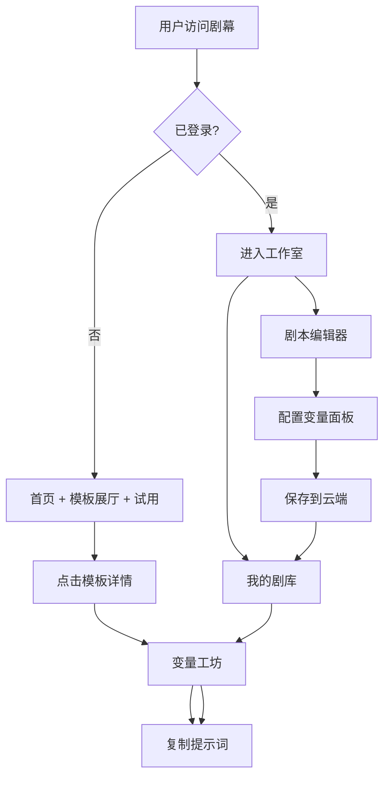

# 剧幕 · PromptStage 产品需求文档

## 1. 产品概述

「剧幕 PromptStage」是一款面向内容创作者、编剧、广告策划与短视频团队的云端 AI 剧本提示词模板器。它把碎片化的提示词经验沉淀为可复用、可变量化、可协作的结构化剧本模板，让团队一次搭建、随时调用。

- **目标用户**：短视频编剧、品牌内容策划、剧本作者、AI 工程师、培训讲师、自由撰稿人
- **核心价值**：把"我每次都要重新写一遍的提示词"变成"一次搭建，永久调用的模板资产"
- **产品定位**：云端剧本提示词工作台，介于 Notion 模板库与 LangChain Prompt 之间的中文创作工具

## 2. 核心功能

### 2.1 用户角色

| 角色 | 注册方式 | 核心权限 |
|------|----------|----------|
| 访客 | 无需注册 | 浏览公开模板展厅、试用模板、复制提示词 |
| 注册创作者 | 邮箱注册 / 第三方登录 | 创建/编辑/删除自有模板、云端保存、版本管理、变量复用 |
| 团队协作者 | 邀请加入 | 共享空间内模板协作、评论、版本对比 |

### 2.2 功能模块

1. **首页 / 工作室入口**：品牌叙事、核心数据、热门模板推荐、快速入口
2. **模板展厅**：分类筛选、搜索、模板卡片、收藏、复制
3. **剧本编辑器**：富文本/分镜编辑、变量插槽、片段库、版本快照
4. **变量工坊**：动态表单、实时预览、一键注入、一键复制提示词
5. **我的剧库**：私有模板网格、文件夹、标签、搜索、批量管理
6. **模板详情**：完整剧本预览、变量说明、使用示例、版本历史
7. **云端同步**：本地草稿自动保存、登录后同步、跨设备访问

### 2.3 页面细节

| 页面 | 模块 | 功能描述 |
|------|------|----------|
| 首页 | Hero 区块 | 巨型标题 + 副标题 + 入口按钮 + 滚动展示模板 |
| 首页 | 数据看板 | 模板数、调用次数、热门分类、创作者分布 |
| 首页 | 精选剧本 | 横向滚动卡片，点击进入详情 |
| 模板展厅 | 顶部分类标签 | 短视频/广告/口播/直播/小说/分镜，5 大类 |
| 模板展厅 | 模板卡片网格 | 缩略、标题、变量数、收藏数、使用次数 |
| 模板展厅 | 高级筛选 | 标签、变量数区间、风格、排序 |
| 剧本编辑器 | 顶部工具栏 | 保存/预览/版本/分享/变量管理 |
| 剧本编辑器 | 左侧片段库 | 角色/场景/冲突/反转 等可拖入的剧本片段 |
| 剧本编辑器 | 中央剧本画布 | 富文本编辑，{{变量}}插槽高亮、悬浮提示 |
| 剧本编辑器 | 右侧变量面板 | 变量列表、默认值、必填校验、类型 |
| 变量工坊 | 左侧变量表单 | 智能分组、文本/多行/枚举/滑块/媒体 |
| 变量工坊 | 右侧实时预览 | 渲染后的完整提示词，Token 数估算、复制按钮 |
| 我的剧库 | 顶部统计 | 模板总数、本月新增、收藏夹、回收站 |
| 我的剧库 | 文件夹树 | 拖拽管理、嵌套、收藏快捷入口 |
| 我的剧库 | 模板网格 | 自定义卡片、批量选择、批量操作 |
| 模板详情 | 头部信息 | 标题、作者、分类、收藏、使用、分享 |
| 模板详情 | 剧本预览 | 不可编辑展示，变量插槽高亮 |
| 模板详情 | 使用示例 | 多个填写好的样例，点击套用 |
| 模板详情 | 版本时间线 | 历史版本对比、回滚 |

## 3. 核心流程

**新用户首次使用**：访问首页 → 浏览模板展厅 → 点击模板 → 查看详情 → 进入变量工坊 → 填写变量 → 复制最终提示词 → 体验完成

**创作者创建模板**：登录 → 进入剧本编辑器 → 选择新建空白或基于模板 → 编写剧本并插入 `{{变量}}` → 配置变量面板 → 保存到云端 → 在我的剧库管理

**老用户复用模板**：登录 → 在我的剧库中找到目标模板 → 打开 → 修改变量 → 一键复制 → 在外部 AI 工具中使用

## 4. 用户界面设计

### 4.1 设计风格

- **主色调**：「墨黑 #0B0B0F」背景 + 「琥珀金 #E8B14A」强调 + 「纸白 #F4EFE6」文字
- **辅助色**：「砚红 #C0392B」警示/删除、「湖青 #2A6F6F」次级操作
- **按钮风格**：直角略带圆角（4px），实色 + 描边双态，按下时下沉 1px
- **字体方案**：
  - 标题字体：`Fraunces`（编辑感衬线，具印刷品质感）
  - 正文字体：`Geist`（干净无衬线，现代但不冷漠）
  - 变量/代码：`JetBrains Mono`（`{{变量}}` 高亮识别度高）
- **布局风格**：左右分栏 + 大留白，卡片之间使用发丝线分隔
- **图标/装饰**：细线条 1.5px 自绘图标 + 装饰性电影胶片/剧本格栅元素
- **氛围元素**：背景叠加极淡噪点纹理、关键区块底部加胶片孔装饰、变量插槽使用「聚光灯」高亮
- **动效**：首屏入场采用 staggered fade + 轻微 upward（间隔 60ms），模板卡片 hover 时图片放大 1.04 + 边框描边亮起

### 4.2 页面设计概览

| 页面 | 模块 | UI 元素 |
|------|------|----------|
| 首页 | Hero 区块 | 巨幅衬线标题 + 渐显副标题 + 发光琥珀金按钮 + 滚动胶片背景 |
| 首页 | 数据看板 | 等宽数字 + 单位标注 + 数字滚动入场 |
| 首页 | 精选剧本 | 横向滚动卡片 + 卡片叠加标题/分类/变量数 |
| 模板展厅 | 顶部分类标签 | 大写无衬线 + 下划线激活态 + 数量徽标 |
| 模板展厅 | 模板卡片 | 16:10 缩略 + 标题（衬线）+ 变量徽标 + 作者行 |
| 剧本编辑器 | 顶部工具栏 | 紧凑功能按钮 + 当前编辑状态指示点 |
| 剧本编辑器 | 中央画布 | 行高 1.8 + 变量胶囊高亮（琥珀底黑字） |
| 剧本编辑器 | 右侧变量面板 | 卡片堆叠 + 拖拽排序 + 类型徽标 |
| 变量工坊 | 左侧变量表单 | 大输入框 + 字数计数 + 智能补全建议 |
| 变量工坊 | 右侧实时预览 | 等宽字体 + 复制按钮悬浮 + Token 计数 |
| 我的剧库 | 文件夹树 | 缩进 + 悬浮出现操作 + 当前选中加琥珀竖条 |
| 我的剧库 | 模板网格 | 同模板展厅卡片 + 多选态（琥珀边） |
| 模板详情 | 头部信息 | 大标题（衬线）+ 标签云 + 操作按钮组 |
| 模板详情 | 剧本预览 | 不可编辑 + 变量插槽以琥珀色高亮 |
| 模板详情 | 使用示例 | 折叠面板 + 套用按钮 |

### 4.3 响应式

- **桌面优先**：1440px 设计稿，1280px 起步可正常显示
- **平板适配**：≥768px 时编辑器改为上下布局，右侧变量面板改为底部抽屉
- **移动适配**：<768px 时所有多栏布局改为单栏 + 顶部 Tab + 浮动操作按钮；变量工坊切换为分步表单

### 4.4 3D 场景指引

本项目**不**包含 3D 场景，以编辑设计风格为主。但可在首页 Hero 加入轻量 CSS 透视胶片滚动作为视觉点缀。
