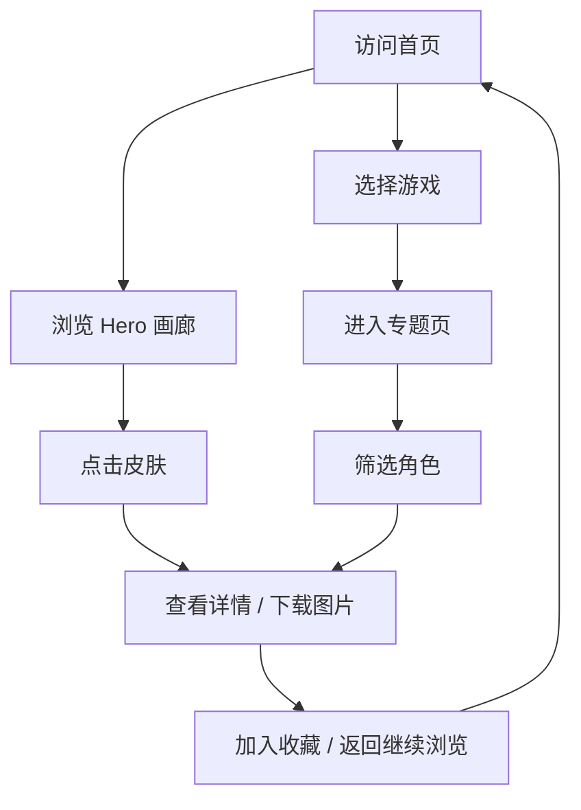

# 产品需求文档（PRD）

## 1. 产品概述
「游戏宇宙图鉴」是一个面向二次创作者与游戏爱好者的现代化可视化平台，汇聚王者荣耀等流行游戏的角色与皮肤素材，提供分类浏览、检索与下载入口，便于用户快速获取可用于二创的设定图。

- 主要用途：展示游戏角色（含皮肤）的高质量设定图，按游戏与类型分类
- 解决问题：分散在多个站点/社群的素材难以集中查找
- 目标用户：游戏玩家、二次元/二创画师、内容创作者

## 2. 核心功能

### 2.1 用户角色
本项目为浏览型站点，无需登录，所有功能对访客开放。

| 角色 | 访问方式 | 核心权限 |
|------|----------|----------|
| 访客 | 直接访问 | 浏览、检索、查看详情、复制下载链接 |

### 2.2 功能模块
1. **首页（Hero 画廊）**：顶部滚动展示王者荣耀精选角色与皮肤，沉浸式视觉
2. **游戏专题页**：按游戏切换角色列表（王者荣耀、原神、英雄联盟、CS2、我的世界、永劫无间等）
3. **分类筛选**：按职业（坦克/战士/刺客/法师/射手/辅助）、按地区、按稀有度筛选
4. **角色详情卡**：查看皮肤列表、设定故事、获取图片
5. **全局搜索**：跨游戏/角色名搜索
6. **收藏墙**：本地 localStorage 收藏感兴趣的角色

### 2.3 页面详情
| 页面名称 | 模块名称 | 功能描述 |
|----------|----------|----------|
| 首页 | Hero 画廊 | 全宽沉浸式展示王者荣耀推荐皮肤，含自动轮播与指示器 |
| 首页 | 热门游戏入口 | 卡片式展示 8+ 款流行游戏，点击进入专题 |
| 首页 | 分类速览 | 展示职业/类型/地区分类入口 |
| 专题页 | 角色网格 | 网格化展示角色卡片，含皮肤切换 |
| 专题页 | 筛选侧栏 | 多维度筛选条件 |
| 详情模态 | 角色详情 | 弹出式大图查看、皮肤列表、设定描述 |
| 全局 | 搜索栏 | 顶部固定，实时模糊匹配 |

## 3. 核心流程

## 4. 用户界面设计

### 4.1 设计风格
- **主色**：深邃星河（`#0a0e27` 紫黑底）+ 霓虹青蓝（`#00d4ff`）+ 鎏金（`#ffd700`）
- **辅助色**：樱粉 `#ff6b9d`、翡翠 `#00ffa3`
- **按钮**：毛玻璃 + 渐变描边，悬浮发光
- **字体**：
  - 中文：`Noto Serif SC`（标题）、`Noto Sans SC`（正文）
  - 英文：`Cinzel`（装饰标题）、`Inter`（UI）
- **布局**：12 栅格 + 不对称卡片、悬浮层、视差滚动
- **图标风格**：线性 + 霓虹描边（lucide-react）

### 4.2 页面设计概述
| 页面名称 | 模块名称 | UI 元素 |
|----------|----------|----------|
| 首页 | Hero 画廊 | 全屏背景渐变 + 浮动粒子 + 大字标题 + 滚动指示器 |
| 首页 | 游戏入口 | 6 列网格，悬浮放大 + 光晕 |
| 专题页 | 角色网格 | 4 列响应式，卡片悬浮翻转展示皮肤 |
| 详情模态 | 皮肤切换 | Tab 切换 + 进度条加载 |

### 4.3 响应式
桌面优先（1280+），向下兼容 768 平板与 375 移动端。

### 4.4 3D / 动效引导
- 鼠标移动视差（CSS transform + perspective）
- 滚动驱动的渐入渐出
- Hero 区域粒子背景（CSS 动画，无 canvas 依赖）
- 卡片悬浮：3D 倾斜 + 阴影位移

## 5. 数据说明
- 王者荣耀角色数据为社区公开资料整理（姓名、职业、阵营、皮肤名），用于展示 UI 与交互
- 图片素材：本项目生成 SVG/CSS 渐变占位图，并使用 trae text_to_image 接口生成风格化封面；用户可在详情页中"获取原图"按钮跳转到官方资料站
- 后续可对接王者荣耀/原神官方素材 API（受版权约束需注意合规）
