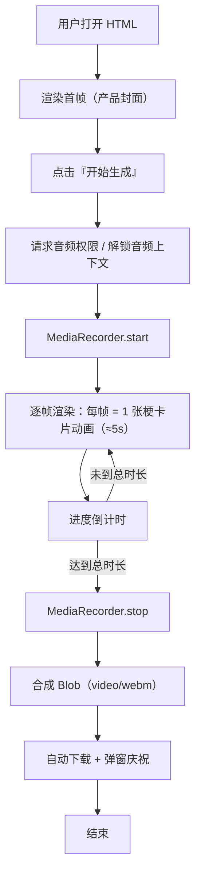

# PRD：2025 热梗大爆炸 · 40 分钟自动出片 HTML

## 1. 产品概述
- 一个单文件 HTML 应用，打开后自动生成并下载一段 40 分钟（2400 秒）的"2025 热门网络梗图鉴"长视频。
- 内置 400+ 张自动化模板（中文热梗 / 国际梗 / AI 抽象 / 视觉趋势 / 官方榜单 / 情绪标签 / 痛包二次元 / 机器人破圈 / 标语金句），通过 Canvas + MediaRecorder 在浏览器内本地渲染导出 WebM/MP4。
- 目标用户：内容创作者、二创作者、社媒运营、做"年终盘点向"短视频的任何人；零依赖、零上传、零安装即可用。

## 2. 核心功能

### 2.1 用户角色
无角色区分，本工具为单用户使用。

### 2.2 功能模块
1. **主页（唯一页）**：控制台 + 实时预览 + 一键录制按钮 + 进度条 + 梗库数量统计。
2. **梗库数据层**：内置 7 大分类、共 420+ 条条目，每条包含主标题、副标题、标签、风格、配色、BGM 强度等。
3. **渲染引擎**：Canvas 2D，按时间轴逐帧绘制，可输出 1920×1080 @ 30fps。
4. **录制与下载**：MediaRecorder API，录制完成自动下载 WebM。
5. **可调参数**：视频时长（10/20/40/60/120 分钟）、分辨率（720p/108p）、BGM 音量、语速、是否水印。

### 2.3 页面细节
| 页面 | 模块 | 功能描述 |
|------|------|----------|
| 主页 | 顶部标题区 | 巨型 Bungee/Stranger 字效标题、动态噪点、鼠标跟随光斑 |
| 主页 | 控制面板 | 卡片式：时长、分辨率、BGM、速度、是否含水印、立即生成 |
| 主页 | 实时预览 | 16:9 Canvas 即时显示当前帧，模拟最终视频效果 |
| 主页 | 梗库统计 | 数字滚动：中文梗 156 / 国际梗 89 / AI 抽象 64 / ... |
| 主页 | 进度浮层 | 录制开始后全屏遮罩 + 大字倒计时 + 当前梗卡片 |
| 主页 | 下载提示 | 录制完成后弹出 Blob 下载 |

## 3. 核心流程
用户打开 HTML → 阅读产品说明 → 选择时长/分辨率 → 点击"开始生成 40 分钟视频" → 浏览器拉起 MediaRecorder → 引擎按时间轴渲染每一帧并写入流 → 倒计时结束 → 合成 Blob → 自动触发下载 WebM 文件。

## 4. 用户界面设计

### 4.1 设计风格
- **主色**：电光蓝 `#00E0FF` × 酸性黄 `#F5FF00` × 热粉 `#FF2E93` × 墨黑 `#0A0A12`
- **辅色**：毒绿 `#39FF14`、紫雾 `#7B2EFF`、骨白 `#F4F1EA`
- **字体**：标题用 `Bungee` / `Big Shoulders Display`（Google Fonts）；副标用 `Space Grotesk`；中文字体用 `Noto Sans SC` 900/700；等宽数字用 `JetBrains Mono`。
- **按钮**：3D 浮起 + 投影 + 鼠标悬停抬升 4px + 按下下沉；带斜向条纹高光。
- **布局**：左控制台 / 中预览 / 右数据；全屏采用 grid + 不对称堆叠、卡片斜向排列、随机旋转 -3°~+3°。
- **动效**：标题逐字弹跳入场（stagger 80ms）、卡片翻牌入场、噪点持续游走、光标光斑跟随、章节切换时屏幕"碎裂"过渡。
- **图标/装饰**：直接采用 emoji + SVG 噪点 + 故障色散（chromatic aberration）。

### 4.2 页面设计概览
| 页面 | 模块 | UI 元素 |
|------|------|----------|
| 主页 | 标题 | 巨型 Bungee、字间距 0.05em、彩虹渐变文字描边、底下加一道荧光下划线 |
| 主页 | 控制面板 | 玻璃拟态卡片（backdrop-blur）+ 1px 霓虹边 + 内部项目使用 toggle / slider / select |
| 主页 | 预览 | 16:9 黑色舞台，Canvas 居中，外框为 8px 黄黑警戒条纹胶带 |
| 主页 | 数据条 | 7 个统计块，斜切 8°，鼠标悬停时数字跳变并溅出色块 |
| 主页 | 进度遮罩 | 全屏 `position:fixed`，巨字"还剩 24:13"，背景为旋转的同心情圆 + 进度环 |
| 主页 | 收尾 | 巨型"完结撒花"emoji 雨 + 一键"再生成"按钮 |

### 4.3 响应式
- 桌面优先（≥1280px 完整三栏）；
- ≥768px 自动折叠为单列、预览占满首屏；
- 移动端保留完整功能但提示"建议桌面端获得最佳录制效果"。

### 4.4 3D 场景
无 3D。视觉冲击通过 2D 故障美学 + Canvas 动画 + 大量 emoji 粒子 + 胶带/海报叠层完成。
