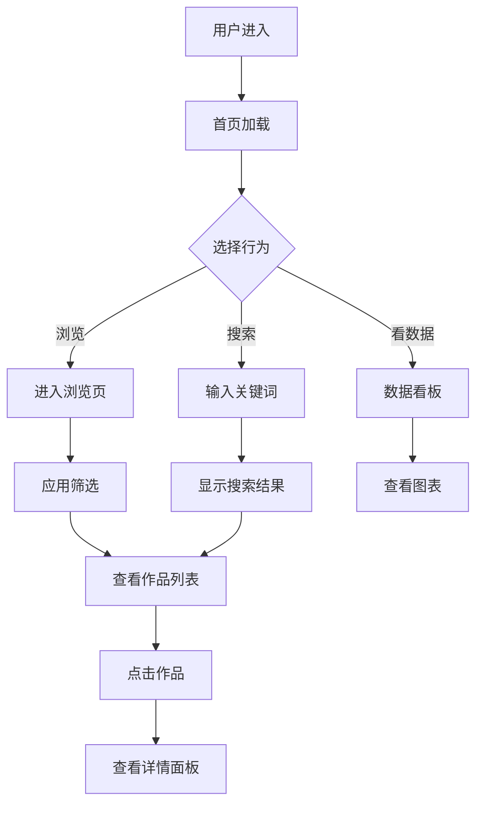

# 游戏IP衍生作品资料库 — 产品需求文档

## 1. 产品概述
一个面向 ACG 爱好者、游戏玩家和 IP 研究者的 **游戏 IP 衍生作品浏览平台**，聚合 2000+ 款基于游戏 IP 改编/衍生的动画、漫画、电影、电视剧、小说、舞台剧、手办、商品、漫画单行本等条目，提供现代化的多维检索与可视化浏览体验。

- 解决问题：游戏 IP 衍生作品散落在各平台，难以系统化检索
- 目标用户：ACG 爱好者、游戏玩家、IP 产业链从业者、研究者、媒体编辑
- 价值：建立全球首个开源、现代化的游戏 IP 衍生作品资料库

## 2. 核心功能

### 2.1 数据规模
- 总条目数：**≥ 2000 款**
- 数据维度：原 IP、衍生类型、平台/载体、发行年份、地区、热度评分、标签、简介

### 2.2 功能模块
1. **首页 / 总览页**：英雄区、统计仪表盘、热门 IP 卡片墙、分类入口
2. **浏览页**：卡片网格、列表视图、虚拟滚动
3. **搜索与筛选**：多维筛选（IP、类型、年份、地区、标签）、实时搜索
4. **详情面板**：点击条目弹出侧边详情卡片
5. **数据看板**：图表化展示 IP 衍生数量趋势、地区分布、类型占比
6. **主题切换**：深色 / 浅色双主题

### 2.3 页面与模块
| 页面 | 模块 | 功能描述 |
|------|------|----------|
| 首页 | Hero 区 | 大标题、动态数据条、滚动 2000+ 计数器 |
| 首页 | 统计仪表盘 | IP 数量、衍生作品数、覆盖国家、年份跨度等卡片 |
| 首页 | 热门 IP 横向滚动 | 展示 Top 12 衍生最丰富的游戏 IP 卡片 |
| 浏览页 | 多维筛选条 | IP、类型、年份、地区、标签筛选 |
| 浏览页 | 网格 / 列表切换 | 卡片视图、表格视图，虚拟滚动 |
| 浏览页 | 详情侧栏 | 显示封面、简介、元数据、相关作品 |
| 数据看板 | 图表区 | 折线图、饼图、柱状图 |
| 全局 | 顶栏 | Logo、搜索、主题切换 |

## 3. 核心流程

## 4. 用户界面设计

### 4.1 设计风格
- **风格定位**：**Cyber / Synthwave 暗黑 + 霓虹** —— 契合游戏 IP 的科技感与 ACG 圈层审美
- **主色**：`#0a0a0f`（近黑底色）、`#fafafa`（近白文本）
- **强调色**：
  - 霓虹粉 `#ff2d95`
  - 电光青 `#00f0ff`
  - 紫罗兰 `#9d4edd`
  - 警示黄 `#ffd60a`
- **字体**：
  - 标题：`Orbitron` / `Bebas Neue`（等宽未来感）
  - 正文：`Inter` / `JetBrains Mono`
  - 中文：`Noto Sans SC`
- **按钮样式**：霓虹辉光 + 1px 边框 + hover 时扩散光晕
- **布局**：12 列响应式网格、卡片间距 24px、左右大留白
- **图标**：lucide-react
- **动效**：入场 stagger 渐显、滚动数字、霓虹闪烁、hover 缩放与光晕

### 4.2 页面设计概览
| 页面 | 模块 | UI 元素 |
|------|------|----------|
| 首页 | Hero | 全屏渐变背景 + 网格底纹 + 大标题 + 滚动计数器 |
| 首页 | 统计 | 4 卡片仪表盘 + 渐变描边 |
| 首页 | 热门 IP | 横向滚动卡片 + 渐变封面 + 数字徽标 |
| 浏览页 | 筛选条 | 玻璃态 (glassmorphism) 多列下拉 |
| 浏览页 | 列表 | 虚拟滚动卡片网格 / 表格，封面 + 标题 + 元数据 |
| 浏览页 | 详情 | 右侧抽屉，毛玻璃背景 + 封面 + 标签云 |
| 数据看板 | 图表 | ECharts / 自绘 SVG 图表 |

### 4.3 响应式
- 桌面优先（1440px+）
- 平板（768px）：2 列网格、侧栏改为底部抽屉
- 移动（375px+）：单列、汉堡菜单

### 4.4 视觉细节
- 背景：径向渐变 + 网格 + 噪点纹理
- 装饰：扫描线、青色光斑、霓虹色块
- 微动效：hover 时卡片倾斜 2°、霓虹光晕扩散
- 入场：Hero 标题逐字渐显、卡片 stagger 上浮
