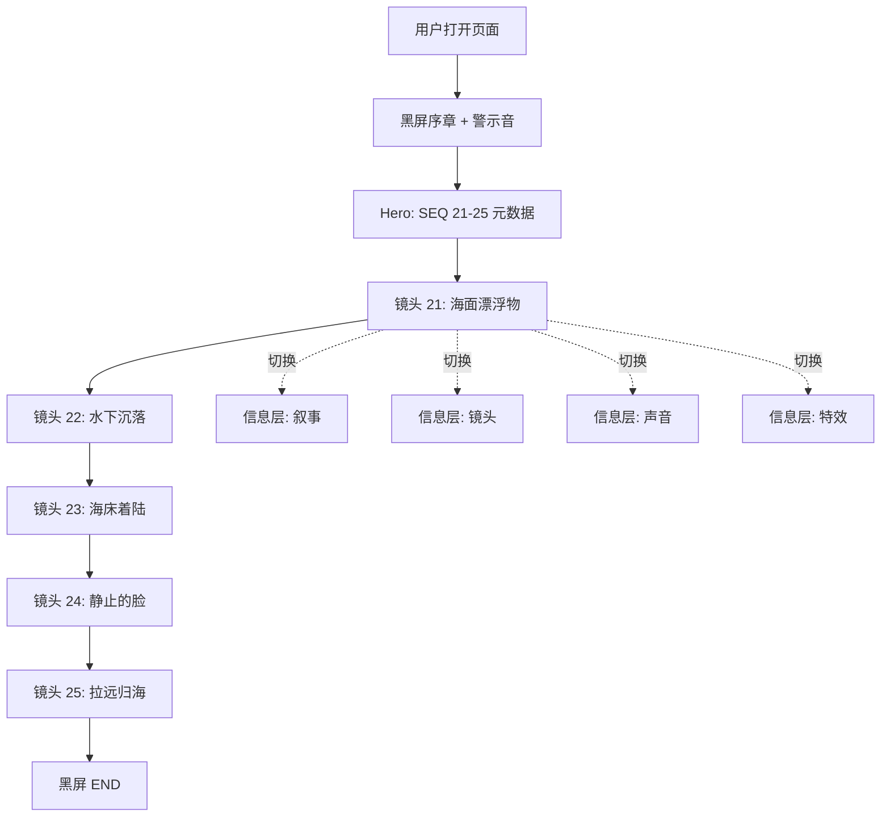

# 分镜架构可视化 — 产品需求文档

## 1. 产品概述
为电影《赤霄》分镜 21-25（3:00-3:15）打造一个**电影化的、可交互的架构图**，将 15 秒的五镜头序列拆解为可被视读的叙事、镜头、声音、特效四维信息层。
- 目标用户：导演、摄影指导、剪辑师、视效总监、剧本医生、影评人
- 核心价值：把高密度的分镜文本转化为可"被肉眼扫描、被情绪感知"的视觉作品，作为团队评审、投决会、宣发物料的展示载体

## 2. 核心功能

### 2.1 用户角色
| 角色 | 进入方式 | 核心权限 |
|------|----------|----------|
| 观众（评审） | 直接打开链接 | 浏览全部信息层、切换镜头、播放时间轴 |
| 演示者 | 投影模式 | 顺序播放、聚光某个镜头、回放 |

### 2.2 功能模块
1. **首页 = 单一长页（Single-Page Cinematic Scroll）**：垂直滚动即代表"摄影机垂直穿越 3800 米"的过程
2. **时间轴与五镜头卡片**：横向时间轴 0:00 → 3:15，五张可悬停放大的镜头卡
3. **四维信息层切换**：叙事 / 镜头 / 声音 / 特效 — 切换不影响主结构
4. **摄影机路径**：左侧固定一条垂直深度标尺，相机当前位置以光点指示

### 2.3 页面细节
| 区块 | 模块 | 功能描述 |
|------|------|----------|
| 顶部 HUD | 项目元数据 | 显示片名、序列号、起止时间码 |
| Hero 序章 | 黑屏 + 警示音 | "PRODUCTION STORYBOARD / SEQ 21-25" |
| 主舞台 | 5 个全屏镜头分段 | 滚动驱动 + 鼠标驱动两种切换 |
| 信息层切换器 | 4 个标签按钮 | 叙事 / 镜头 / 声音 / 特效 |
| 深度标尺 | 左侧固定 | 0m 海面 → -8m → -3800m → +100m |
| 底部时间轴 | 横向 scrub bar | 0:00 - 3:15，可点击跳转 |
| 黑屏收尾 | 静默 + 字段信息 | "END OF SEQUENCE" |

## 3. 核心流程
用户进入页面 → 看到黑色序章（2 秒）→ 自动滚入第 1 个镜头 → 用户可自由滚动浏览五镜头 → 通过切换器在四个信息层之间穿梭 → 通过底部时间轴快速跳转 → 抵达海面俯视 + 夕阳收尾 → 黑屏显示字段信息。

## 4. 用户界面设计

### 4.1 设计风格
- **基调**：深黑、电影监视器、海底冷蓝、夕阳余烬
- **主色**：
  - 背景 `#050810`（深海黑）
  - 主色 `#1A4D6B`（深潜蓝）
  - 强调色 `#E63946`（机甲橙红/血色）
  - 末段光 `#F4A261`（夕阳暖光）
  - 文字 `#E8E8E8` / `#7A8B99`
- **字体**：
  - 显示字 `Bebas Neue`（电影标题 / 大数字）
  - 正文 `JetBrains Mono`（时间码、技术参数）
  - 中文标题 `Noto Serif SC`（沉稳叙述）
- **按钮样式**：极细 1px 边框方角按钮，hover 时填入 8% 透明色
- **布局**：垂直滚动长页 + 固定侧栏（深度标尺）+ 固定底部（时间轴）
- **图标/符号**：自绘 SVG 几何符号（罗盘、深度计、声波图、相机）

### 4.2 页面设计概述
| 区块 | 模块 | UI 元素 |
|------|------|---------|
| Hero 序章 | 黑屏 | 居中无衬线大字 + 等宽时间码 + 提示向下滚动 |
| 镜头卡 | 主舞台 | 5 段 100vh 全屏段落，每段含 4 个信息子卡 |
| 信息层切换器 | 固定右侧 | 4 个垂直排列的标签按钮 |
| 深度标尺 | 固定左侧 | 垂直线 + 节点圆点 + 深度数字 |
| 时间轴 | 固定底部 | 横向进度条 + 5 个时间码锚点 |
| 收尾 | 黑屏 | 1px 边框框住的字段表（导演、摄影、特效） |

### 4.3 响应性
- Desktop-first（1920×1080 / 2560×1080 超宽）
- 平板：保留所有功能，深度标尺与切换器改为可折叠
- 移动端：信息层切换器变为底部抽屉，深度标尺简化为顶部进度条

### 4.4 3D 场景指引（适用时）
本项目为**信息可视化 + 镜头语言二维化呈现**，不强制使用 3D。
- 摄影机路径动画：使用 CSS transform + SVG path 实现垂直穿越视觉
- 深度指示：使用渐变色 + 透明度模拟"从海面光到深海黑"的光线变化
- 焦散光斑：CSS box-shadow 多层叠加 + 缓动动画
- 烟尘扩散：径向渐变 + scale/opacity 缓动
