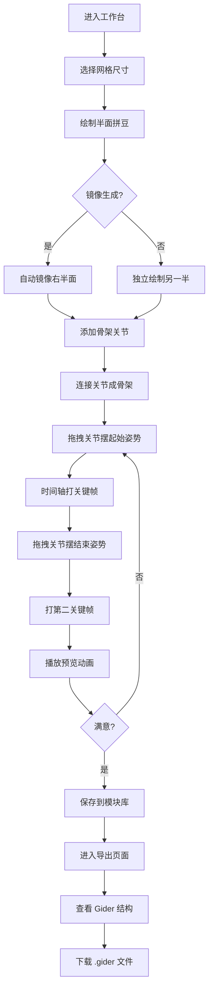

# 拼豆动画工坊 Gider Bead Studio — 产品需求文档 (PRD)

## 1. 产品概述

一款面向拼豆（Perler Bead）爱好者与像素动画创作者的 Web 工坊应用。用户可以将拼豆造型拆解为「半面自主模块」，通过骨架绑定制作可拖拽拉动的逐帧动画，并以自定义 `.gider` 格式导出。所有作品本地持久化存储于浏览器 IndexedDB，无需后端服务。

- **目标用户**：拼豆手工爱好者、像素艺术创作者、独立动画师
- **核心价值**：把实体拼豆工艺数字化，提供模块化拼装 + 骨架驱动 + 关键帧动画的一体化创作流程

## 2. 核心功能

### 2.1 用户角色

| 角色 | 注册方式 | 核心权限 |
|------|----------|----------|
| 本地创作者 | 无需注册，首次访问自动生成匿名工作区 | 创建/编辑/导出全部作品 |

### 2.2 功能模块

1. **工作台页面（Studio）**：拼豆网格画布、骨架绑定、关键帧时间轴、实时预览
2. **模块库页面（Library）**：半面模块管理、模块拼合、模板套用
3. **导出预览页面（Export）**：`.gider` 文件结构展开、蒙版展开图、动画回放预览

### 2.3 页面详情

| 页面名称 | 模块名称 | 功能描述 |
|----------|----------|----------|
| 工作台 Studio | 拼豆网格画布 | 32×32 / 48×48 / 64×64 网格，点击/拖拽铺豆，调色板取色，橡皮擦，填充工具 |
| 工作台 Studio | 半面镜像 | 一键将左半面镜像生成右半面，或独立编辑两半后拼合 |
| 工作台 Studio | 骨架绑定 | 在画布上添加骨骼节点（关节），节点之间连线形成骨架，节点可拖拽拉动 |
| 工作台 Studio | 关键帧时间轴 | 拖动关节摆姿势 → 记录关键帧 → 自动插值生成中间帧 → 循环播放 |
| 工作台 Studio | 蒙版展开 | 将骨架影响区域展开为 2D 蒙版图，可视化每个关节影响的拼豆范围 |
| 模块库 Library | 半面模块卡片 | 缩略图网格展示已保存的半面模块，支持搜索/标签筛选 |
| 模块库 Library | 模块拼合 | 选择两个半面模块拼合成完整造型，可水平/垂直翻转 |
| 模块库 Library | 模板套用 | 内置 6 套预设半面模板（猫脸、机器人、花朵、星星、心形、骷髅） |
| 导出预览 Export | Gider 结构树 | 以树形结构展示 `.gider` 文件的 JSON 字段：meta / modules / skeleton / keyframes / palette |
| 导出预览 Export | 蒙版展开图 | 将骨架蒙版以热力图形式展开显示，标注关节影响权重 |
| 导出预览 Export | 动画回放 | 全屏循环播放导出的动画，可调速 0.25× / 0.5× / 1× / 2× |

## 3. 核心流程

用户进入工作台 → 选择网格尺寸 → 在左半面铺豆绘制 → 镜像生成右半面（或独立绘制）→ 添加骨架关节并连线 → 拖拽关节摆出起始姿势 → 在时间轴打关键帧 → 拖拽关节到结束姿势 → 打第二关键帧 → 点击播放预览动画 → 满意后保存到模块库 → 进入导出页面查看 `.gider` 结构并下载文件。



## 4. 用户界面设计

### 4.1 设计风格

- **主色调**：深炭灰底色 `#1a1a1f` + 拼豆霓虹强调色（珊瑚红 `#ff5e5b`、薄荷绿 `#39e991`、电光黄 `#ffd23f`、天蓝 `#3bceac`）
- **辅助色**：米白 `#f4f1de` 用于文字，深紫 `#2d2d44` 用于面板
- **按钮风格**：圆角 8px、3D 凸起效果（box-shadow 模拟拼豆立体感）、按下时下沉动画
- **字体**：标题用 `Press Start 2P`（像素风显示字体），正文用 `JetBrains Mono`（等宽体），中文用 `Noto Sans SC`
- **布局风格**：三栏布局（左工具栏 / 中画布 / 右属性面板），顶部导航栏，底部时间轴
- **图标风格**：像素风 16×16 图标，呼应拼豆网格美学
- **整体氛围**：复古游戏机 + 现代工坊的混搭，背景带细密网格纹理 + 噪点叠加

### 4.2 页面设计概览

| 页面名称 | 模块名称 | UI 元素 |
|----------|----------|----------|
| 工作台 Studio | 顶部导航 | Logo、页面切换 Tab、保存按钮、撤销/重做 |
| 工作台 Studio | 左工具栏 | 画笔/橡皮/填充/吸管/骨架/选择 工具切换，调色板 24 色 |
| 工作台 Studio | 中央画布 | 拼豆网格、骨架关节圆点（可拖拽）、关节连线、半面分隔线 |
| 工作台 Studio | 右属性面板 | 当前工具属性、选中关节属性、图层列表 |
| 工作台 Studio | 底部时间轴 | 关键帧轨道、播放控制、帧率选择、洋葱皮开关 |
| 模块库 Library | 顶部搜索栏 | 搜索框、标签筛选、排序方式 |
| 模块库 Library | 模块卡片网格 | 4 列卡片，缩略图 + 名称 + 标签 + 操作按钮 |
| 模块库 Library | 拼合面板 | 左右两个半面预览 + 中间拼合结果 |
| 导出预览 Export | Gider 结构树 | 可折叠树形 JSON 预览，语法高亮 |
| 导出预览 Export | 蒙版热力图 | 彩色权重图 + 关节标注 |
| 导出预览 Export | 回放播放器 | 大尺寸画布 + 播放控制条 + 下载按钮 |

### 4.3 响应式

- 桌面优先（1280px+ 完整三栏布局）
- 平板（768-1280px）右属性面板折叠为抽屉
- 移动端（<768px）工具栏变为底部 Tab，画布占满，时间轴上滑展开
- 触摸优化：关节拖拽热区扩大到 24×24px，支持双指缩放画布

### 4.4 3D 场景指引（不适用）

本项目为 2D 拼豆网格动画，不涉及 3D 场景。

## 5. .gider 文件格式规范

自定义 `.gider` 文件为 JSON 格式，结构如下：

```json
{
  "meta": {
    "format": "gider",
    "version": "1.0",
    "name": "作品名称",
    "author": "匿名创作者",
    "createdAt": "2026-06-21T00:00:00Z",
    "gridSize": 32
  },
  "palette": ["#1a1a1f", "#ff5e5b", "#39e991", "..."],
  "modules": [
    {
      "id": "half-left",
      "side": "left",
      "beads": [{"x": 0, "y": 0, "color": 1}, "..."]
    }
  ],
  "skeleton": {
    "joints": [{"id": "j1", "x": 8, "y": 16, "parent": null}, "..."],
    "bones": [{"from": "j1", "to": "j2", "influence": 0.8}, "..."]
  },
  "keyframes": [
    {"frame": 0, "poses": [{"joint": "j1", "x": 8, "y": 16}, "..."]},
    {"frame": 12, "poses": ["..."]}
  ],
  "animation": {"fps": 12, "loop": true, "length": 24}
}
```
