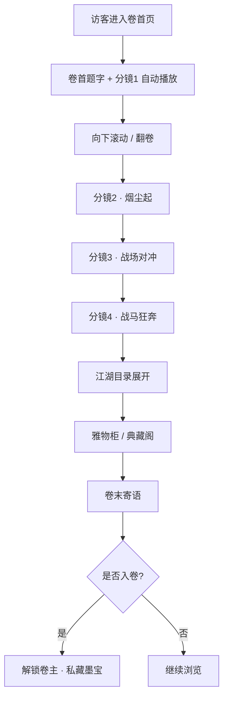

# HRNMLJ · 卷首 · 古卷商城 产品需求文档（PRD）

## 1. 产品概述
HRNMLJ 是一处以**「墨卷为屏、江湖为幕」**为意境的功能化商城 · 卷首页。整张卷首页以四段电影感长镜头（每段 15s）为时间轴，将"文房雅物 × 江湖典籍"两大商品线呈现在一幅徐徐展开的宋元长卷之上，访客如翻书、似观影、亦如仗剑入江湖。

- **核心目的**：用"卷—幕—卷"的电影分镜语言，把一个静态商城首页升格为可沉浸的电影开篇。
- **目标用户**：对东方美学、武侠/古风文化、收藏雅物有兴趣的访客。
- **市场价值**：以「内容化商城」差异化于传统货架电商；为后续接入商品详情、交易、会员江湖体系提供入口样板。

## 2. 核心特性

### 2.1 用户角色
本次交付以**单页卷首**为重心，弱化注册/角色区分，但内嵌江湖身份切换的"卷主"概念。

| 角色 | 触发方式 | 核心权限 |
|------|----------|----------|
| 客官（默认） | 默认进入 | 浏览长卷、查看商品卡、加入卷中收藏 |
| 卷主 | 顶部卷轴点击「入卷」 | 解锁"私藏墨宝"区，可标记心仪物件 |

### 2.2 功能模块
1. **卷首 · 4 段分镜长卷**（核心）：以滚动 + 自动播放双驱动，控制 4 个电影感分镜。
2. **江湖目录 · 商品罗列**：卷中行至中段展开商品横列。
3. **典藏阁 · 江湖典籍**：以"经、史、谱、帖"为分类的典籍陈列。
4. **雅物柜 · 文房四宝**：笔墨纸砚/茶器/香道/雅玩。
5. **互动卷末 · 卷主寄语**：明信片式落款，呼出收藏动作。
6. **侧栏卷轴 · 章节导航**：固定于右侧的卷轴，4 段分镜 + 4 个目录锚点。

### 2.3 页面细节
| 页面 | 模块 | 功能描述 |
|------|------|----------|
| 卷首页 | 卷首 Hero | 4 段 15s 电影感视频背景 + 卷首题字 + 滚动指示 |
| 卷首页 | 江湖目录 | 横向滑动分类，6 大类（文房 / 典籍 / 茶器 / 香道 / 雅玩 / 乐器） |
| 卷首页 | 雅物柜 | 4 列商品网格，商品含图、名、价、卷藏按钮 |
| 卷首页 | 典藏阁 | 折页式典籍展示，可翻页 |
| 卷首页 | 卷末寄语 | 明信片落款、铃印、收藏 CTA |
| 卷首页 | 侧栏卷轴 | 固定右侧，章节锚点 + 进度条 |

## 3. 核心流程
- 访客进入 → 看到"卷首"题字 + 第 1 段分镜自动播放 → 提示"向下卷展"（滚动）→ 分镜 1 → 2 → 3 → 4 随滚动切换/续播 → 卷中段展开"江湖目录" → 卷末段展开"雅物柜 + 典藏阁" → 卷尾"卷主寄语" → 点击"入卷"切到卷主身份，可标记私藏。

## 4. 用户界面设计

### 4.1 设计风格
- **主色**：墨黑 `#0E0B08`、绢白 `#F2E9D8`、朱砂 `#A22B1F`、冷金 `#C9A14A`、远山青 `#3D5A5A`。
- **辅色**：枯松烟 `#1B1A18`、暗鎏金 `#7A5A22`、砚池蓝 `#1B2A3A`。
- **质感**：粗麻宣纸纹理 + 墨韵晕染 + 烫金印章。
- **按钮**：朱砂方印 / 卷轴形态（圆角 2px / 边框烫金 / 内填墨色）。
- **字体**：
  - 标题（题字）— `"Ma Shan Zheng"`, `"ZCOOL XiaoWei"`, `"Noto Serif SC"`, serif，类毛笔题字。
  - 正文 — `"Noto Serif SC"`, `"Source Han Serif"`, serif。
  - 印章/数字 — `"Cinzel"`, `"Noto Serif SC"`, serif。
- **布局**：纵向长卷（卷轴） + 横向章节（折页）；右侧固定卷轴导航；卡片化分区。
- **图标/装饰**：印章 SVG、卷轴、远山飞鸟、毛笔笔触、墨点。

### 4.2 页面设计概览
| 页面 | 模块 | UI 元素 |
|------|------|----------|
| 卷首 | 题字首屏 | 居中题字 "卷一 · 江湖" + 卷首引言 + 滚动指示；底为分镜 1 视频层 + 朱砂噪点 |
| 分镜 | 4 段长镜头 | 视频背景 + 顶部章节号 + 章节标题（毛笔入场动效） + 角落"章"印章 |
| 目录 | 江湖目录 | 6 个分类，水平排列，朱砂下划线悬停指示 |
| 雅物 | 雅物柜 | 4 列商品，类宣纸卡片，左上角小印章写"墨/砚/笔/纸/茶/香"，右下"卷藏"按钮 |
| 典籍 | 典藏阁 | 中央"翻页"按钮，左右翻页书脊；信息层叠显示 |
| 卷末 | 卷主寄语 | 右下落款印章 + 手写体寄语 + "入卷"朱砂主按钮 |

### 4.3 响应式
- **Desktop 优先**：1440px 设计基准，最大 1920px 适配。
- **断点**：≥1280 主布局；1024–1279 调整卷末布局；<1024 转为单列纵向滚动（保留分镜视频，弱化并排）。
- 触摸：在 768 以下启用"滑动切章"手势 + 触屏版"翻页"按钮放大。

### 4.4 视频/分镜场景指引（4 段 15s）
1. **卷一 · 孤烟直**（远景）：沙漠孤烟，长焦压缩，长卷缓缓展开。
2. **卷二 · 烟尘起**（战马动态）：持刀骑士策马入画，烟尘爆开（被踢翻的牌子碎裂，铁链拖拽）。
3. **卷三 · 刀光乱**（动作特写）：持扑刀斩击，箭矢穿身，慢动作黑色液体飞溅。
4. **卷四 · 万马奔腾**（大远景）：战场宏观，唢呐起，铁蹄声冲击，俯视拉远至地平线。

> 视频由 CSS/SVG/Canvas 制作的 cinematic loop + 噪点 + 字幕条模拟，**所有视频纹理与镜头感通过代码生成**，不依赖外部资源。
