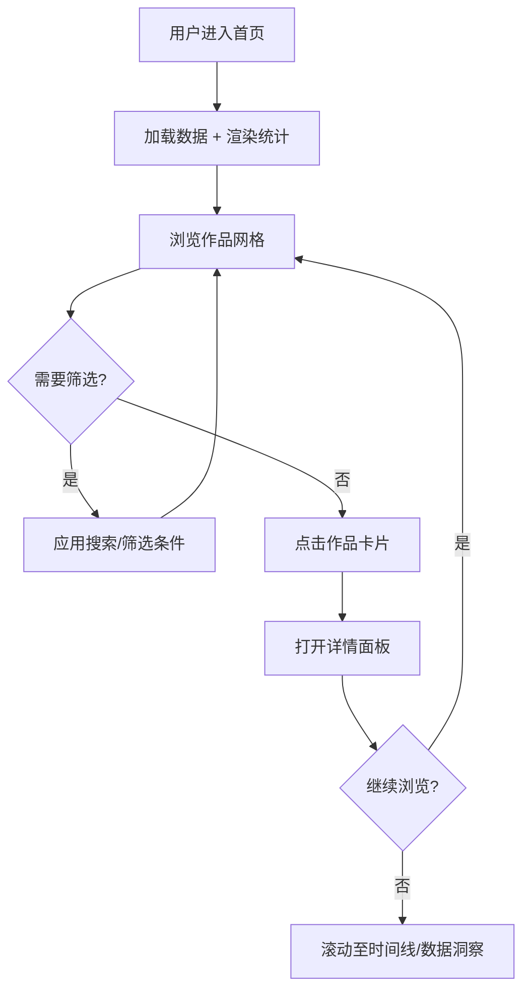

# 游戏IP衍生作品资料库 - 产品需求文档

## 1. 产品概述

构建一个面向ACG爱好者与游戏玩家的"游戏IP衍生作品资料库"单页浏览站，提供**截至2026年6月8日的全球知名游戏IP衍生作品**索引与浏览体验，覆盖动画、漫画、电影、剧集、小说、舞台剧、音乐、周边、桌游、手游、设定集等十余种衍生形态，数据量不少于 **2000 条**。

- 主要解决问题：在分散的维基、数据库、电商之间反复跳转，缺少一处可"纵览全貌+快速筛选+纵深查看"的游戏IP宇宙地图。
- 目标用户：游戏玩家、二次元爱好者、IP运营/编辑从业者、考据爱好者、内容创作者。
- 产品价值：以"作品—形态—原作—时间"为骨架的可视化资料库，呈现游戏IP的横向衍生广度与纵向演化时间线。

## 2. 核心功能

### 2.1 用户角色

无需登录与权限分层，本产品为只读浏览型。

### 2.2 功能模块

1. **首页（资料库）**：顶部导航栏、Hero 概览、统计指标、筛选器、作品网格、虚拟滚动、详情面板。
2. **详情面板**：浮层展示某条衍生作品的元数据（作品名、原IP、类型、上线/发售时间、平台、简介、相关作品）。
3. **时间线视图**：按时间分布的作品柱状/密度图。
4. **数据洞察**：类型分布、平台分布、原作 Top10 等可视化卡。

### 2.3 页面详情

| 页面名称 | 模块名称 | 功能描述 |
| --- | --- | --- |
| 首页 | 顶部导航 | Logo、主导航锚点、主题切换、搜索框 |
| 首页 | Hero 概览 | 大字标语 + 数据总量 + 入库时间 |
| 首页 | 统计指标 | 总作品数、覆盖IP数、类型数、最新更新时间 |
| 首页 | 筛选器 | 关键字搜索、IP原作、衍生类型、年份、平台、地区 |
| 首页 | 作品网格 | 卡片列表，hover 浮起，进入时滚动入场动画 |
| 首页 | 详情面板 | 右侧抽屉式/弹窗，展示作品元信息 |
| 首页 | 时间线 | 按年份展示作品密度 |
| 首页 | 数据洞察 | 类型/平台/原作 Top 分布卡 |

## 3. 核心流程

## 4. 用户界面设计

### 4.1 设计风格

- **整体调性**：深色"档案馆/赛博图书馆"风格，融合几何栅格与微噪点质感，呈现严肃与考据氛围。
- **主色**：
  - 背景：`#0B0B0F`（近黑） / `#11131A`（卡片底）
  - 主文：`#E6E8EE`
  - 辅文：`#8A93A6`
  - 强调 A：`#C7FF3E`（酸性荧光绿）
  - 强调 B：`#7A5BFF`（电光紫）
  - 强调 C：`#FF6B5B`（熔岩橙）
- **字体**：
  - 标题：`Space Grotesk` / `Archivo`（无衬线、几何感）
  - 正文：`Inter Tight` / `Manrope`
  - 数字与等宽：`JetBrains Mono`
- **布局**：12 列响应式栅格，卡片 + 不规则交错 + 顶栏 + 右侧抽屉。
- **动效**：卡片入场 stagger fade-up、详情面板从右滑入、顶部数字滚动计数、hover 微动效。

### 4.2 页面设计概述

| 页面名称 | 模块名称 | UI 元素 |
| --- | --- | --- |
| 首页 | 顶部导航 | 半透明深色背景 + 荧光绿 Logo + 锚点 + 搜索 + 主题切换 |
| 首页 | Hero 概览 | 巨字标题 "Game IP, Reimagined" + 副标 + 时间戳 + 噪点背景 |
| 首页 | 统计指标 | 4 个等宽卡片，数字 mono 字体，发光描边 |
| 首页 | 筛选器 | 多选下拉 + 关键字输入 + 标签芯片 |
| 首页 | 作品网格 | 不规则卡片（不同高度），类型色条，hover 浮起 |
| 首页 | 详情面板 | 右侧滑入，宽 480px，类目 + 元信息 + 简介 + 相关作品 |
| 首页 | 时间线 | 横轴年份密度条 |
| 首页 | 数据洞察 | 类型饼图 / 平台柱图 / 原作 Top 列表 |

### 4.3 响应式

- 桌面优先：≥1280px 网格 4 列；≥1024px 3 列；≥768px 2 列；<768px 单列。
- 移动端：详情面板变全屏抽屉；筛选器折叠为底部抽屉。

### 4.4 不使用 3D 场景

本产品为纯数据浏览型，不引入 3D 场景或 WebGL 渲染。

## 5. 数据要求

- **数量**：≥ 2000 条衍生作品记录。
- **时间范围**：覆盖 1980 年代—2026 年 6 月 8 日。
- **覆盖IP**：≥ 80 个全球知名游戏 IP。
- **类型维度（≥ 12 类）**：动画、漫画、电影、电视剧、舞台剧、小说、设定集、原声碟、周边商品、桌游/卡牌、手游/页游、手办/模型、广播剧、主题展览。
- **字段**：id、title（作品名）、ip（原作）、type（类型）、year（年份）、date（精确日期）、region（地区）、platform（平台/介质）、description（简介）、related（相关作品）。
