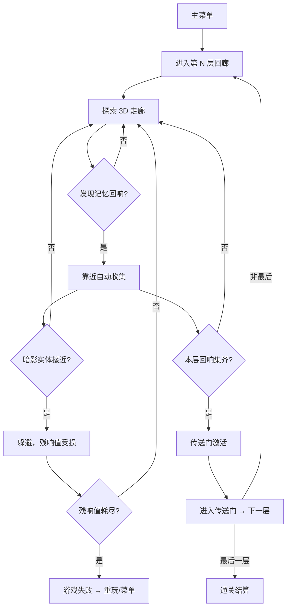

## 1. 产品概述

「残响 · VOIDWALKER」是一款以「像素 2 渲 3」美学为核心的网页端第一人称虚空探索独立游戏。玩家化身为穿梭于崩塌现实间的「虚空行者」，在低分辨率渲染的 3D 虚空回廊中行走，收集散落的「记忆回响」，开启通往下一层的传送门，同时躲避追逐你的「暗影实体」。

- 核心目标：用浏览器即可体验一段约 10–15 分钟、氛围浓郁、机制完整的虚空漫游，呈现独立游戏级的「2D 像素精灵 + 3D 透视空间」质感
- 目标用户：独立游戏爱好者、像素艺术与氛围向游戏玩家（Annie Stream / Void Stranger / Devil Daggers 风格受众）
- 市场价值：验证「低分辨率 3D + 像素化后处理 + billboard 精灵」在 Web 端的可玩性，为后续扩展关卡 / 叙事提供基础

## 2. 核心功能

### 2.1 用户角色
| 角色 | 注册方式 | 核心权限 |
|------|---------|---------|
| 玩家 | 无需注册（本地存档） | 游玩、查看进度、调整画面与控制选项 |

### 2.2 功能模块
1. **主菜单界面**：游戏标题、开始游戏、继续游戏、设置、操作说明
2. **游戏世界**：第一人称 3D 虚空回廊、记忆回响、暗影实体、传送门
3. **HUD 叠层**：残响值（生命）、回响收集进度、关卡提示、十字准星
4. **设置面板**：分辨率档位、鼠标灵敏度、音效开关

### 2.3 页面详情
| 页面名称 | 模块名称 | 功能描述 |
|---------|---------|---------|
| 主菜单 | 标题与导航 | 像素风 LOGO 动画、菜单按钮、背景虚空粒子 |
| 游戏世界 | 第一人称视角 | WASD 移动、鼠标转向、指针锁定，低分辨率 3D 渲染 |
| 游戏世界 | 记忆回响 | 发光像素 billboard 精灵，靠近自动收集，进度计数 |
| 游戏世界 | 传送门 | 收集完本层所有回响后激活，进入即推进关卡 |
| 游戏世界 | 暗影实体 | 朝玩家游走的像素 billboard 敌人，接触扣残响值 |
| HUD | 状态显示 | 左下残响值条、右上回响进度、中央十字准星、底部关卡提示 |
| 设置面板 | 画面选项 | 渲染分辨率档（低/中/高 = 更粗/更细像素）、雾浓度 |
| 结算界面 | 关卡结算 | 通关时间、收集数、重玩 / 返回菜单 |

## 3. 核心流程

**主游戏流程**：玩家在主菜单点击「开始游戏」→ 进入第 1 层虚空回廊 → 探索 3D 走廊收集记忆回响 → 躲避暗影实体 → 集齐回响激活传送门 → 进入传送门推进到下一层 → 通关后进入结算界面。

## 4. 用户界面设计

### 4.1 设计风格
- **主色调**：虚空黑 `#05060a` + 残响青 `#3ad7ff` + 回响金 `#ffd86b` + 暗影紫 `#7a3bff`，营造冷峻、空灵、危机四伏的虚空感
- **次色调**：警示红 `#ff3b5c`（残响值低）、传送门洋红 `#ff5be3`
- **按钮风格**：像素描边矩形按钮，无圆角，带 1px 高光与 2px 暗边，营造 CRT 像素质感
- **字体**：标题用 `Press Start 2P`（像素显示字体），正文用 `VT323`（等宽像素字体，可读性好）
- **布局风格**：游戏内为全屏 3D 画布 + 半透明 HUD 叠层；菜单为居中竖排，背景为动态虚空粒子
- **图标风格**：像素风 SVG / Canvas 绘制，与低分辨率渲染统一
- **后处理质感**：整个 3D 画面以低分辨率离屏渲染（如 384×216）后最近邻放大到画布，叠加扫描线 + 轻微噪点 + 暗角，形成复古 CRT + 像素 2 渲 3 风格

### 4.2 页面设计概览
| 页面名称 | 模块名称 | UI 元素 |
|---------|---------|---------|
| 主菜单 | 标题区 | 像素 LOGO「VOIDWALKER」、副标题「残响」、闪烁开始提示 |
| 主菜单 | 菜单按钮 | 开始游戏 / 继续 / 设置 / 操作说明，竖排像素按钮 |
| 主菜单 | 背景 | 深空粒子缓慢漂浮、远处暗影轮廓若隐若现 |
| 游戏世界 | 3D 视口 | 低分辨率渲染的虚空回廊、雾、billboard 精灵 |
| HUD | 残响值条 | 左下像素心形 + 横向分段条，受损时闪烁 |
| HUD | 回响进度 | 右上「回响 2/5」像素计数 |
| HUD | 十字准星 | 中央 5px 像素十字，对准回响/实体时变色 |
| HUD | 关卡提示 | 底部居中淡入淡出文字「第 2 层 · 寂静回廊」 |
| 设置面板 | 选项项 | 分辨率档滑块、灵敏度滑块、音效开关 |
| 结算界面 | 数据展示 | 通关时间、收集回响总数、重玩 / 菜单按钮 |

### 4.3 响应式
- 桌面优先（≥1024px）：完整 3D 视口 + HUD，键鼠操作
- 平板（768–1023px）：3D 视口适配，HUD 缩放，提示触屏不推荐
- 移动端（<768px）：显示「请使用桌面浏览器以获得最佳体验」提示，仍可尝试触屏虚拟摇杆（基础支持）

### 4.4 3D 场景指引
- **环境 / 氛围**：虚空回廊，深黑底色 + 远景浓雾（指数雾 `FogExp2`，密度约 0.12），整体冷青调，营造失重与孤独感
- **灯光**：极弱环境光 + 玩家头顶柔光点光源（模拟「行者之光」，半径有限），回响与传送门自发光（`MeshBasicMaterial` + billboard 辉光）
- **相机**：第一人称 `PerspectiveCamera`（FOV 约 72°），指针锁定鼠标转向，步行轻微 bob 摇晃
- **构图与焦点**：走廊纵深感为主，回响金光与传送门洋红光作为视觉锚点引导玩家
- **交互与动画**：回响上下浮动 + 自转；暗影实体浮动逼近；传送门激活后旋转加速并放出粒子
- **后处理**：低分辨率离屏渲染 → 最近邻放大；扫描线 + 噪点 + 暗角叠加；可选轻微色差
- **资源与性能**：所有纹理程序化生成（Canvas 绘制像素图），无外部资源；目标 60fps，墙体用合并几何体降低 draw call
