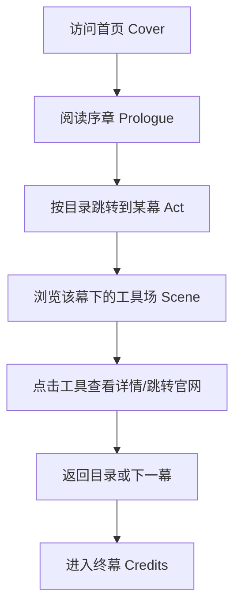

# AI 工具剧本 · 产品需求文档 (PRD)

## 1. 产品概述

「AI 工具剧本」是一部以电影剧本美学为载体的 AI 工具百科全书：把零散的 AI 工具概念，按照"幕 / 场 / 镜头"的剧本结构模块化呈现。

- 主要用途：以可阅读、可浏览的剧本形式，系统化整理 80+ 主流 AI 工具
- 目标用户：产品经理、设计师、独立创作者、AI 工具爱好者、研究者
- 价值：相比传统目录，将"工具集合"转化为有起承转合的"叙事体验"

## 2. 核心功能

### 2.1 用户角色
本项目为单角色公开浏览型产品，无需登录。

| 角色 | 入口 | 核心权限 |
|------|------|----------|
| 访客 | 直接访问 | 浏览剧本、筛选工具、跳转官方链接、切换主题 |

### 2.2 功能模块

1. **首页 / 封面 (COVER)**：剧名、出品方、放映信息
2. **序章 (PROLOGUE)**：创作缘起与阅读指南
3. **第一幕：文字 (ACT I · WORD)**：大语言模型、长文写作、对话 AI
4. **第二幕：图像 (ACT II · IMAGE)**：文生图、图生图、图像编辑、品牌资产
5. **第三幕：动态影像 (ACT III · MOTION)**：文生视频、视频编辑、动作捕捉
6. **第四幕：声场 (ACT IV · SOUND)**：TTS、音乐生成、音频分离、播客
7. **第五幕：代码 (ACT V · CODE)**：代码补全、AI Agent IDE、自动化
8. **第六幕：空间 (ACT VI · SPACE)**：3D 生成、点云、神经辐射场
9. **第七幕：副驾 (ACT VII · COPILOT)**：通用助手、办公 Copilot、操作系统级 AI
10. **第八幕：探员 (ACT VIII · AGENTS)**：自主代理、研究员、多智能体协同
11. **终幕 (FIN · CREDITS)**：推荐索引、鸣谢、版本号

### 2.3 页面详情

| 页面 | 模块 | 功能描述 |
|------|------|----------|
| Cover | Hero | 大幅剧名、年份、出品、幕列表 |
| Cover | Table of Contents | 跳转各幕锚点 |
| Act | 幕标题 | 当前幕的体例说明、镜头数量、风格标签 |
| Act | 工具场 (Scene) | 单个 AI 工具：厂牌、口号、定位、能力、定价、官方链接 |
| Act | 工具对比 | 同幕内工具的横向指标 |
| Fin | Credits | 设计/数据来源、版本号、鸣谢 |
| 全局 | 顶部胶片条 | 滚动进度条模拟胶片过片 |
| 全局 | 侧边剧本编号 | 左侧固定当前幕/场编号 |
| 全局 | 检索与筛选 | 按类别、是否免费、是否中文友好筛选 |

## 3. 核心流程

## 4. 用户界面设计

### 4.1 设计风格

- **主色**：#0E0B08 炭黑（剧本封皮色）
- **辅色**：#E8DCC4 羊皮纸米白（正文色）
- **强调色**：#C8341B 场记板红（CTA、当前激活）
- **次强调**：#6B5C3E 烫金古铜（边线、装饰）
- **字体**：
  - 标题：DM Serif Display（剧名 / 幕名）
  - 正文：EB Garamond（编辑感、剧本正文）
  - 等宽：JetBrains Mono（场记编号、URL、键盘字）
- **布局**：单列剧本版心，宽度 720px，两侧留白（页边距），仿剧本纸
- **按钮**：方角硬边（1px 实线 + hover 反白），无圆角，体现剧本质感
- **图标**：使用 lucide-react，保持线条克制

### 4.2 页面设计概览

| 页面 | 模块 | UI 元素 |
|------|------|----------|
| Cover | Hero | DM Serif Display 巨幅剧名、烟熏背景、场记板装饰、滚动指示 |
| Cover | TOC | 罗马数字 I-VIII，场次列表，hover 出现台词预览 |
| Act | 幕头 | 居中幕名 + 英文副标 + 体例说明 + 镜头数 |
| Act | Scene | 左侧厂牌（粗体大写）、右侧口号 / 能力 / 价格 / 链接 |
| Fin | Credits | 等宽字号、滚动字幕动效 |
| 全局 | 进度条 | 顶部 1px 实线，宽度跟随滚动百分比 |

### 4.3 响应式
- 桌面优先（1280+）：完整剧本版心
- 平板（768-1280）：版心缩窄至 600px
- 移动（<768）：版心 92%，目录折叠为下拉

### 4.4 动效与质感
- 进场：幕名由居中向上 12px 淡入，工具场 stagger 80ms
- 滚动：顶部胶片条线性跟随
- hover：场次行背景从透明渐变为 8% 烫金古铜
- 装饰：羊皮纸颗粒噪点叠加、卷边阴影、装订线虚线
