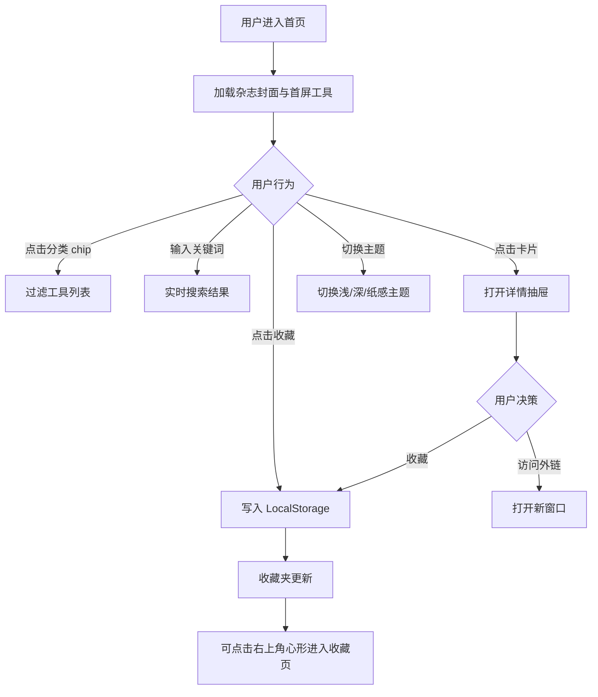

# AI工具宇宙 · 产品需求文档 (PRD)

## 1. 产品概述

**AI工具宇宙 (AI Toolverse)** 是一个面向探索者、创作者与开发者的"杂志风"AI工具检索与灵感平台。它以编辑设计 (Editorial Design) 风格的版面，将全球范围内热门的 AI 工具按照 20+ 类别铺陈成一张可滚动、可筛选、可深入阅读的"大卡片网格"，让用户在浏览中产生灵感、发现新工具、形成自己的 AI 工作流。

- **核心问题**：AI 工具数量爆炸，用户难以建立全景认知与系统化索引。
- **目标用户**：产品经理、设计师、研发、内容创作者、效率工具爱好者。
- **目标价值**：以"杂志"阅读体验，把 200+ AI 工具概念压缩成一页可消化的灵感宇宙。

## 2. 核心功能

### 2.1 用户角色
本产品为内容浏览型，不设置登录态。所有功能对所有访客开放。

### 2.2 功能模块

1. **首页 / 主网格页**：杂志风封面、分类导航、工具卡片瀑布流。
2. **工具详情**：弹窗式详情卡，含简介、典型场景、相关链接。
3. **分类筛选**：20+ 类目横向 chip + 标签云组合筛选。
4. **关键词搜索**：实时模糊搜索工具名、标签、描述。
5. **主题切换**：浅色 / 深色 / 杂志纸 (Cream) 三套主题。
6. **收藏夹 (本地)**：基于 LocalStorage 的"已收藏"集合。

### 2.3 页面详情

| 页面名称 | 模块名称 | 功能描述 |
|---------|---------|---------|
| 首页 | 杂志封面 Hero | 巨型刊名+期号感，标题"SHOOTING STARS OF AI"，副标题当前收录工具数 |
| 首页 | 分类导航条 | 横向滚动 chip：全部 / 聊天 / 绘画 / 编程 / 办公 / 视频 / 音频 / 3D / 设计 / 搜索 / 翻译 / 语音 / 教育 / 医疗 / 法律 / 金融 / 营销 / 数据 / 机器人 / 自动化 / Agent / 开源 等 |
| 首页 | 大图卡片网格 | 不规则 masonry 网格，部分卡片跨 2 列，hover 时图片轻动效 |
| 首页 | 工具详情弹窗 | 点击卡片打开右侧抽屉，含标题、副标题、简介、典型用例、标签、外链按钮 |
| 首页 | 顶部工具栏 | 搜索框、主题切换、收藏夹入口 |
| 收藏页 | 收藏集合 | 用户收藏的工具以相同卡片样式再展示，可一键移除 |

## 3. 核心流程

## 4. 用户界面设计

### 4.1 设计风格

- **设计哲学**：编辑设计 (Editorial) × 大图卡片网格 × 杂志刊物感。
- **主色调**：
  - 浅色 (Light)：纸白 `#F7F4EE` + 墨黑 `#111111` + 高饱和红 `#E63946` 点缀。
  - 深色 (Dark)：墨黑 `#0B0B0B` + 米白 `#F2EFE7` + 霓虹绿 `#9BFF6B` 点缀。
  - 杂志纸 (Cream)：奶油色 `#F1E8D6` + 棕褐 `#3A2A1A` + 砖红 `#B0413E` 点缀。
- **按钮风格**：方角、1px 描边、hover 反色填充；主按钮用全填充黑色。
- **字体**：
  - 标题：`Fraunces` (衬线、Display、强烈对比)
  - 副标题：`Bricolage Grotesque`
  - 正文：`Inter` 备用兜底为 `system-ui`
  - 标签/数据：`JetBrains Mono`
- **布局**：12 列网格，卡片采用 CSS Grid + `grid-auto-rows: 12px` 实现杂志不规则感。
- **图标**：`lucide-vue-next`。
- **图片策略**：所有工具配图均使用 `https://trae-api-cn.mchost.guru/api/ide/v1/text_to_image` 实时生成，prompt 强调"杂志感、未来感、抽象、超现实"。

### 4.2 页面设计概览

| 页面名称 | 模块名称 | UI 元素 |
|---------|---------|---------|
| 首页 | 杂志封面 Hero | 顶部固定大刊名 logo；副刊号式日期条；本期收录数 / 类别数等数字大字数据 |
| 首页 | 分类导航条 | 横向滚动 chip，激活态反白 + 1px 描边，悬浮微动效 |
| 首页 | 大图卡片网格 | 不规则高度、跨列卡片，hover 时图片 1.05 缩放 + 标题下划线动画 |
| 首页 | 工具详情抽屉 | 右侧滑入 540px 抽屉，顶部大图，下方文字分层，底部"访问 ↗"按钮 |
| 首页 | 顶部工具栏 | 左侧刊名；中间搜索框 (无边框，下划线式)；右侧主题切换、收藏 |

### 4.3 响应式

- Desktop-first：宽屏 12 列，1920+ 显示 4 列，1280 显示 3 列。
- Tablet (768-1279)：2 列网格，分类导航条变为可拖动。
- Mobile (<768)：单列流式，Hero 字号降级，抽屉全屏化。

### 4.4 3D 场景引导

- 不使用 3D；以大图 + 字体排版 + 动效营造视觉冲击。
- 动效重点：滚动渐显 (IntersectionObserver)、卡片 hover 缩放、抽屉滑入、数字滚动统计。
