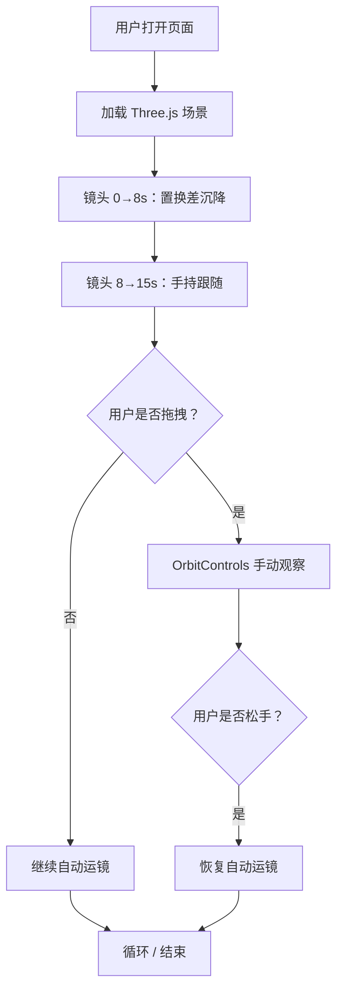

# PRD：数学天穹 · 朔行 — 分镜可视化单页

## 1. 产品概述

将用户提供的两段分镜脚本（第01镜、02镜）转化为一张可交互的电影感可视化单页，使用 WebGL / Three.js 实时呈现"数学天球仪 + 黎曼山脉 + 斐波那契银河 + 晶体平原 + 渺小的校服学生 朔"的开场意境。

- 主要用途：把抽象的 anime 分镜提示词（prompt）变成可看的、可持续调参的视觉概念稿
- 目标用户：分镜作者 / AI 视频提示词工程师 / 视觉导演
- 价值：让"宏大场景与极小人物"的比例关系、镜头运动（置换差沉降、手持跟随）、光色（新海诚紫金调）在浏览器里先验

## 2. 核心功能

### 2.1 用户角色
不分角色，单页工具型展示。

### 2.2 功能模块
1. **主舞台（Hero Scene）**：占据 100% 视口的 Three.js 3D 场景
   - 数学天穹（巨型天球仪，黎曼曲面起伏作为"山脉"）
   - 斐波那契螺旋银河（粒子 + 曲线）
   - 晶体平原（半透明晶面、纹理化的地面）
   - 角色：极小校服人影（占画面 < 1/50）
   - 倾倒的巨型公式石碑（表面覆盖"晶体苔藓"）
2. **分镜文字层（Overlay HUD）**：
   - 左上：镜号 / 时码 / 景别 / 运镜
   - 底部：中文动作描述 + 英文 prompt
   - 中下：内心独白（淡入淡出）
3. **运镜控制（Director Panel）**：
   - 播放/暂停 自动运镜（"置换差沉降" 0→8s + "手持跟随" 8→15s）
   - 拖拽轨道环手动观察（OrbitControls 限定）
   - 进度时间轴，可点击跳转到任意时刻
4. **氛围开关（Atmosphere Toggles）**：
   - 低频嗡鸣（音频可视化波形，无声时显示滚动频谱）
   - 颗粒噪点 / 色差 / 暗角（电影感后处理）
   - 黎曼曲面透明度、银河粒子密度

### 2.3 页面详情
| 页面 | 模块 | 功能描述 |
|------|------|----------|
| 单页 | Hero Scene | 3D 沉浸主舞台 |
| 单页 | Director Panel | 运镜控制台（半透明，位于右下） |
| 单页 | Storyboard HUD | 分镜信息层（位于左上 + 底部） |
| 单页 | Title | 顶部细字标题 + 副标题 |

## 3. 核心流程

1. 页面加载 → 资源预加载 → 镜头从极高空开始
2. 0–8s：相机沿 Y 轴高速下潜（置换差沉降，无 cut）至地面
3. 8–15s：相机切到朔身后 3 米，手持微晃跟随行走
4. 用户可随时拖拽 / 暂停 / 跳转
5. 旁白内心独白在 8s 后以打字机方式逐字出现

## 4. 用户界面设计

### 4.1 设计风格
- 主色：紫金渐变（新海诚调色） `#1a0b2e → #4a1d6e → #c9a86a`
- 辅色：晶体冷白 `#e6e1ff`，银河暖白 `#fff3c4`
- 字体：
  - 标题：Cormorant Garamond（细衬线，古典数学意味）
  - 正文 / HUD：JetBrains Mono（等宽，提示词工程感）
  - 中文：Noto Serif SC（衬线，对应电影片名字幕）
- 布局：全屏 3D 舞台 + 四个角的信息层（细线框，半透明面板）
- 图标：lucide-react（仅在控制台按钮使用；3D 场景内不出现 UI 图标）
- 氛围：颗粒噪点 + 径向暗角 + 轻微色差（CSS + 后处理）

### 4.2 页面设计
| 模块 | UI 元素 |
|------|---------|
| Title 顶栏 | 12px 字距 0.3em 细字标题 + 1px 紫金分隔线 |
| Storyboard HUD 左上 | 镜号徽章（圆角矩形，紫金描边）+ 时码进度条 |
| Bottom 旁白条 | 黑底 30% 透明，居中打字机文本 |
| Director Panel 右下 | 圆形播放按钮 + 时间轴 + 三氛围开关 |

### 4.3 响应式
桌面优先（1920×1080 起），向下兼容 1280。移动端弱化 3D 复杂度、保留 HUD。

### 4.4 3D 场景指南
- **HDRI / 氛围**：自建程序化环境光 + 紫金方向光 + 冷白补光
- **灯光**：DirectionalLight（紫金主光，从天顶略偏） + HemisphereLight（紫→冷白渐变）
- **相机**：PerspectiveCamera，fov 35（远摄压缩感），近 0.1 远 5000
- **运镜**：
  - 0–8s：position.y 从 800 缓动至 1.6（自定义 easeInOutCubic 模拟"置换差"）
  - 8–15s：跟随朔（target.lookAt 朔的位置 + 手持 noise offset）
- **构图**：
  - 远景：天球仪 + 黎曼山脉 + 银河占画面 90%
  - 中景：倾倒石碑（45° 倾角）
  - 近景：朔（画面 1/50）
- **交互**：
  - 自动播放 / 暂停
  - 鼠标拖拽（OrbitControls，限制 polar 30°–80°）
  - 滚轮：Fov 微调（30–50）
- **后处理**：
  - UnrealBloom（threshold 0.6, strength 0.8, radius 0.5）
  - 颗粒 / 暗角 / 轻微色差（CSS overlay 实现）
- **资产**：
  - 全程序化生成：无外部模型、无外部贴图（确保 0 依赖 + 0 加载时间）
  - 字体：Google Fonts 链接
  - 库：Three.js r160（CDN ESM）

## 5. 非功能性需求
- 首屏可交互 < 1.5s（CDN 缓存后）
- 60fps（中端笔电 / M1 核显）
- 仅一个 HTML 文件，可双击打开
