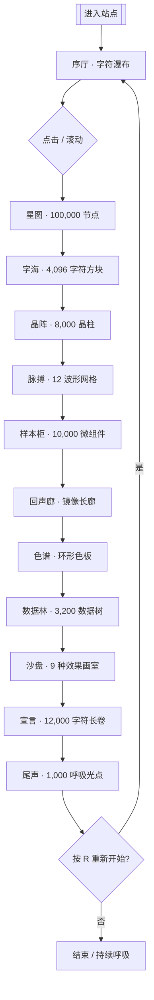

# 万象天文台 · STELLARIS — 产品需求文档

## 1. 产品概述

万象天文台（STELLARIS）是一个单页独立网站，整站以程序化方式生成 100,000+ 个独立 UI 微元素（徽章、晶片、字符、刻度、星点、波形格、几何拼片等），并通过 12 个"展厅"将它们编排为一组具有强烈艺术性、强烈仪式感的可交互装置。

- 主要面向：设计师、创意开发者、艺术爱好者、数字游民。
- 解决问题：把"海量 UI 元素 + 现代强化交互 + 艺术化编排"这三件事以单页体验呈现，作为一个可以"逛、玩、凝视、聆听"的数字艺术馆。
- 价值主张：用户进入站点后，每一帧都是一幅可被鼠标引力、键盘节奏、麦克风音浪所重塑的活体图腾。

## 2. 核心功能

### 2.1 用户角色
本作品为单页艺术展，无注册系统。唯一角色为"访客"。

| 角色 | 进入方式 | 核心权限 |
|------|----------|----------|
| 访客 | 直接访问 | 浏览全站、与所有 100,000+ 元素交互、调节呈现参数 |

### 2.2 功能模块

整站为 12 个连续展厅，滚动即穿越。访客可始终停留在任一展厅内部自由探索：

1. **序厅 / Overture**：滚动触发的入场仪式，巨型字符矩阵自上而下倾泻。
2. **星图 / Stellar Map**：100,000 颗数据点构成可缩放的星图，悬停出现元素档案卡。
3. **字海 / Glyph Sea**：64×64 = 4,096 个可独立拖拽的字符方块，构成可重排的诗阵。
4. **晶阵 / Crystal Lattice**：WebGL 渲染的 8,000 个晶柱，鼠标引力场使其偏移。
5. **脉搏 / Pulse**：12 条同步音频波形网格，麦克风驱动振幅。
6. **样本柜 / Specimen**：10,000 个微型 UI 组件（按钮 / 卡片 / 开关 / 滑块）以博物馆陈列方式呈展。
7. **回声廊 / Echo Hall**：无限镜像的镜面长廊，滚动即无限推进。
8. **色谱 / Chroma**：360° 环形色相展厅，色板可被鼠标"刮"出纹理。
9. **数据林 / Data Forest**：3,200 棵由 KPI 数字生长出的发光树。
10. **沙盘 / Sandbox**：可自由叠加遮罩、噪点、错位、错帧效果的"画室"。
11. **宣言 / Manifesto**：缓慢滚动的可朗读长卷文字，字符随光标逐字点亮。
12. **尾声 / Coda**：以 1,000 个呼吸光点构成的"落幕"，并致谢。

### 2.3 页面细节

| 展厅 | 模块 | 功能描述 |
|------|------|----------|
| 序厅 | 字符瀑布 | 检测滚动距离，按帧生成字符（汉 / 英 / 数 / 符号），并淡出 |
| 序厅 | 进入按钮 | 巨型圆形按钮，按下时整屏震动并跳到星图 |
| 星图 | 微元素网格 | 100,000 个 SVG `<circle>` 节点，使用 InstancedMesh 思想以 Canvas 绘制 |
| 星图 | 元素档案卡 | 悬停时显示"编号 / 坐标 / 随机字符 / 创建时间" |
| 星图 | 缩放器 | 滚轮缩放、拖拽平移、点击聚焦 |
| 字海 | 字符方块 | 4,096 个 64px 字符块，drag-and-drop 重新排序 |
| 字海 | 重置按钮 | 一键回到初始排序 |
| 晶阵 | WebGL 舞台 | 8,000 个细长晶柱，顶点着色器驱动的引力偏移 |
| 晶阵 | 调色面板 | 切换"晨雾 / 夜焰 / 极光 / 极夜"四种调色 |
| 脉搏 | 波形网格 | 12×80 = 960 个条形实时音频电平 |
| 脉搏 | 麦克风开关 | 用户授权后可接入环境音，否则播放内置低频音 |
| 样本柜 | 微组件陈列 | 10,000 个 64×64 UI 缩略图（按钮 / 卡片 / 开关 / 标签 / 进度 / 输入框） |
| 样本柜 | 标签过滤器 | 顶部分类标签可即时过滤（10 类） |
| 回声廊 | 镜像长廊 | CSS `transform: translateZ` 营造无限走廊 |
| 回声廊 | 速度器 | 鼠标 X 坐标控制推进速度 |
| 色谱 | 环形色板 | 360° HSL 渐变环，可拖拽"刮刀"显出底层图样 |
| 色谱 | 图案库 | 6 套底层图案：噪点 / 网格 / 螺旋 / 折线 / 像素 / 文字 |
| 数据林 | KPI 树 | 每棵树高度 = KPI 数值，3,200 棵等距森林 |
| 数据林 | 数据源 | 顶部下拉切换 8 套数据（GDP / 心率 / 股价 / 步数 / …） |
| 沙盘 | 效果面板 | 9 种视觉效果（位移 / 噪点 / RGB 错位 / 像素化 / 浮雕 / …）自由叠加 |
| 沙盘 | 抓拍按钮 | 一键导出当前画面为 PNG |
| 宣言 | 长卷字符 | 12,000 字符，悬停时字符以打字机方式点亮 |
| 宣言 | 朗读开关 | 接入 Web Speech API 可朗读段落 |
| 尾声 | 呼吸点 | 1,000 个缓动光点，吸气和呼气时亮度变化 |
| 尾声 | 重新开始 | 顶部隐藏的 "R" 键可一键回到序厅 |

### 2.4 全局能力
- 顶栏（固定）：当前展厅名 / 进度条 / 元素计数器 / 静音 / 全屏。
- 左侧抽屉：12 展厅快速跳转（编号 + 中英名）。
- 鼠标：自定义磁性光圈，进入不同展厅有不同形态。
- 键盘：`↑ / ↓` 切换展厅，`1–9 / 0` 跳转，`R` 回到序厅，`M` 静音，`F` 全屏。
- 触摸：移动端保留 4 个核心展厅（序厅 / 星图 / 脉搏 / 沙盘）。

## 3. 核心流程

访客进入 → 看到序厅字符瀑布 → 滚动 / 点击 → 进入星图缩放浏览 → 在字海 / 晶阵 / 脉搏 / 样本柜之间自由切换 → 体验回声廊、色谱、数据林 → 进入沙盘自由创作 → 抵达宣言长卷 → 在尾声呼吸光点中落幕 → 可按 R 重新开始。

## 4. 用户界面设计

### 4.1 设计风格

- **主色**：深空墨 `#0A0B12`（背景） + 灰白 `#E8E4D8`（正文） + 浮金 `#D4AF37`（强调）。
- **次色**：电光蓝 `#5BC0EB`、洋红 `#EF476F`、嫩芽绿 `#06D6A0`、暮紫 `#7B2CBF`（用于不同展厅的氛围色）。
- **按钮**：细描边 + 圆角 999px（胶囊），悬停时描边扩张并发出细光。
- **字体**：
  - 标题：Fraunces（衬线，可变字体，强调仪式感与古典感）。
  - 正文：Inter Tight（无衬线，紧致清晰）。
  - 数字 / 坐标：JetBrains Mono（等宽，带可变字重）。
  - 中文回退：Noto Serif SC / Noto Sans SC。
- **布局**：12 列非对称栅格、大量负空间、章节之间使用 1px 浮金细线分隔。
- **图标**：1px 描边线性图标 + 少量手写体点缀，绝不使用 emoji。
- **动效原则**：进入展厅时"先静默 600ms，再展开"，所有过渡使用 `cubic-bezier(.2,.8,.2,1)`。

### 4.2 页面设计概览

| 展厅 | 视觉元素 |
|------|----------|
| 序厅 | 巨型衬线字符自上而下 60fps 倾泻，背景缓慢漂移的星尘 |
| 星图 | 100,000 颗 SVG 微点，悬停出现 240×140 的"档案卡"浮窗 |
| 字海 | 4,096 块 64px 字符方块悬浮，每块有 1px 浮金边框 |
| 晶阵 | 8,000 根晶柱在 WebGL 舞台折射出 4 套主题色 |
| 脉搏 | 12×80 波形条状网格，整体呈现为同心圆环 |
| 样本柜 | 10,000 个 64×64 缩略卡，1px 边框 + 微阴影 |
| 回声廊 | 无限镜像走廊，两侧壁面映射访客剪影 |
| 色谱 | 360° 环形色板 + 6 套可切换底层图案 |
| 数据林 | 3,200 棵等距分布的发光树，地面有倒影 |
| 沙盘 | 9 种可视化效果自由叠加在画面上 |
| 宣言 | 12,000 字符长卷，字符逐字点亮（打字机） |
| 尾声 | 1,000 个缓动光点，吸气和呼气时明暗变化 |

### 4.3 响应式

- Desktop-first：主目标 1440×900，向上至 2560，向下至 1024。
- 平板（≥ 768）：保留全部展厅，但 100,000 星图降为 20,000，4,096 字海降为 1,024。
- 移动端（< 768）：仅保留序厅 / 星图 / 脉搏 / 沙盘 4 个核心展厅，元素数量降至 5,000 / 1,000 / 480 / 1,024。
- 触摸：所有 drag 改为单指拖动，禁用 hover-only 交互。

### 4.4 3D 场景指导

- **环境 / HDRI**：使用三套内置 HDRI（晨雾 / 夜焰 / 极光），由 `RoomEnvironment` + `PMREMGenerator` 合成。
- **光照**：主光 DirectionalLight（key）+ 冷色补光 + 浮金环境光。
- **相机**：透视相机 50° FOV，开启 `OrbitControls` 但限制到 60° 范围。
- **构图**：晶柱群形成对称山谷，访客位于山谷中央。
- **交互**：鼠标位置驱动统一引力场，晶柱朝向鼠标弯折。
- **后期**：Bloom（强度 0.6，半径 0.4，阈值 0.7）+ ChromaticAberration（微弱）+ Vignette。
- **性能预算**：8,000 晶柱，目标稳定 60fps，最低 30fps。
- **资产**：晶柱用 InstancedMesh，无外部模型，色彩与贴图由着色器程序生成。
