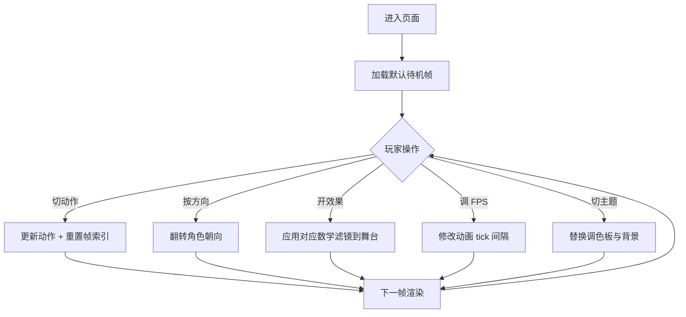

# 像素风角色动画实验场 - 产品需求文档 (PRD)

## 1. 产品概述
像素风角色动画实验场是一款单页 Web 互动小游戏，把"角色动画"和"图形数学效果"结合：玩家在一个 8-bit 街机风格的画面里操控像素英雄，并通过多种数学滤镜（像素化、波形扰动、贝叶抖动）实时改变游戏画面的渲染方式，同时还能调节动画帧率观察帧率对动作流畅度的影响。

- 主要用途：体验像素艺术的角色动画；理解/可视化常见的图形数学效果；通过可调 FPS 学习动画原理。
- 目标用户：像素艺术爱好者、独立游戏开发者、图形学/动画学习者、复古游戏玩家。

## 2. 核心功能

### 2.1 用户角色
不需要账号体系，单一"玩家"角色即可：

| 角色 | 进入方式 | 核心权限 |
|------|----------|----------|
| 玩家 | 直接打开页面 | 浏览动画、切换动作、调节效果与帧率、操作角色 |

### 2.2 功能模块
1. **主舞台（Stage）**：渲染当前角色帧、背景、滤镜效果输出。
2. **角色控制台**：选择角色动作（待机 / 走路 / 攻击 / 胜利）、方向、是否在地面。
3. **效果调节面板**：开关与参数化四种数学效果：
   - 图像转像素（Pixelation）：控制像素块大小。
   - 波形扰动（Wave）：控制振幅、频率、方向（横向/纵向）。
   - 贝叶抖动（Bayes Dither / Bayer Matrix）：控制抖动强度与色阶。
   - 扫描线（Scanline，可选附加）：控制强度。
4. **帧率控制台**：FPS 滑块（1–60）、播放/暂停、慢动作倍率、显示实际 FPS。
5. **场景主题切换**：日间/夜间/赛博 三套调色板。

### 2.3 页面细节
| 页面/区域 | 模块 | 功能说明 |
|-----------|------|----------|
| 舞台 | 角色层 | 渲染当前帧（基于精灵图 + 帧索引） |
| 舞台 | 背景层 | 视差滚动云朵、山、地板（可按帧率更新） |
| 舞台 | 滤镜层 | 实时对合成画面应用选中的数学效果 |
| 控制台 | 动作选择 | 4 个动作按钮 + 左右方向 |
| 控制台 | 效果面板 | 每个效果一个折叠卡片，含开关 + 参数滑块 |
| 控制台 | 帧率面板 | FPS 滑块、播放/暂停、慢动作、实测 FPS 显示 |
| 控制台 | 主题切换 | 3 个色板切换按钮 |
| 状态栏 | 角色名、当前动作、当前帧、FPS | 文字状态显示 |

## 3. 核心流程
1. 玩家进入页面，默认展示"待机"动作与日间主题，滤镜全关，FPS=12。
2. 玩家通过"动作"按钮切换角色动画；按方向键或 A/D 控制朝向。
3. 玩家在"效果"面板打开需要的数学效果，并调节参数，舞台画面实时变化。
4. 玩家拖动 FPS 滑块，可观察同一动作在不同帧率下的流畅度差异；按空格可暂停/播放。
5. 玩家可切换主题，背景调色板与角色描边颜色相应变化。

## 4. 用户界面设计

### 4.1 设计风格
- 主色：深紫黑 `#0e0b1f`（背景）、霓虹粉 `#ff3ea5`、电子青 `#3ee7ff`、警示黄 `#ffd23f`、薄荷绿 `#7cffb2`。
- 按钮：3D 凸起方块风格（顶部高光 2px、底部阴影 2px），圆角 0，模拟街机按钮。
- 字体：标题用 `Press Start 2P`（Google Fonts，像素游戏经典）；正文用 `VT323`（终端像素风）。
- 布局：左侧舞台（占 70% 宽），右侧控制台（30% 宽），整体网格化、对齐到 8px。
- 图标：纯像素 emoji / 自绘 16×16 像素 SVG，禁用拟物化图标。

### 4.2 页面设计概述
| 区域 | 模块 | UI 元素 |
|------|------|---------|
| 舞台 | 角色层 | 居中绘制，pixel-perfect（image-rendering: pixelated），脚下阴影 |
| 舞台 | 背景层 | 三层视差：远山 / 云 / 地面，按帧率滚动 |
| 舞台 | 滤镜层 | 全屏 Canvas 后处理，覆盖在 DOM 元素之上 |
| 状态栏 | 顶部条 | 半透明黑底，像素字体显示当前动作、FPS、效果名 |
| 控制台 | 动作卡片 | 4 个等宽按钮，当前激活的按钮发光描边 |
| 控制台 | 效果卡片 | 每个卡片含：标题、开关（toggle 像素滑块）、参数滑块（带刻度文字） |
| 控制台 | 帧率卡片 | 大号数字显示实测 FPS、FPS 滑块、播放/暂停按钮 |
| 控制台 | 主题卡片 | 3 个色板缩略图，悬停显示名称 |

### 4.3 响应式
- 桌面优先（1280×800 起步）。
- 屏幕宽度 < 900px 时，控制台折叠到舞台下方的抽屉；舞台与控制台均保持 4:3 像素比例，避免拉伸失真。
- 移动端：触摸按钮替代键盘 A/D；滑块增加 ±1 步进小按钮。

### 4.4 像素渲染指导
- 所有图像使用 `image-rendering: pixelated` 关闭抗锯齿。
- Canvas 后处理渲染时关闭 `imageSmoothingEnabled`。
- 角色精灵图按 1× 渲染（不缩放），通过 CSS 缩放保证像素清晰。
