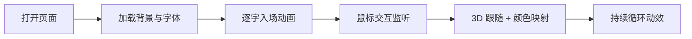

# 工业仙境 · 文字动画HTML  PRD

## 1. 产品概述

一个具有工业现代风格、伪3D视觉与广角镜头感知的单页文字动画展示页面，通过黑体大字、边缘光感、鼠标随行变色、立体透视与逐步完善的入场动效，营造"工业仙境"的沉浸式视觉体验。
- 目标用户：设计师、前端开发者、品牌创意方
- 价值：作为高端品牌官网首屏 / 创意 landing 的视觉样本

## 2. 核心功能

### 2.1 功能模块
1. **Hero 立体文字**：超大字号黑体主标题，分层 z 轴错位形成伪 3D
2. **鼠标随行变色**：鼠标位置驱动文字主色 + 边缘光晕
3. **广角镜头**：CSS perspective 视差让标题随鼠标做轻量 rotateX/rotateY
4. **逐步完善入场**：标题按字符/单词分批 stagger 出现（仙境感）
5. **工业质感背景**：金属网格 + 扫描线 + 边缘光雾

### 2.2 页面细节
| 页面 | 模块 | 功能描述 |
|------|------|----------|
| 主页 | Hero 立体标题 | 主标 + 副标 + 装饰文案；多层 z 轴错位 |
| 主页 | 工业背景 | 网格 + 噪声 + 扫描线 + 径向光斑 |
| 主页 | HUD 装饰 | 四角刻度、坐标、状态条，强化工业感 |
| 主页 | 鼠标光晕 | 跟随指针的彩色光球，影响主色与光晕 |

## 3. 核心流程

1. 页面打开 → 加载金属工业背景与噪声纹理
2. 标题分批 fade-up + 错位入场（逐步完善）
3. 用户移动鼠标 → 标题做轻微 3D 跟随 + 边缘光晕变色
4. 持续播放扫描线、呼吸光斑等循环动效

## 4. 用户界面设计

### 4.1 设计风格
- 主色：`#0a0a0c`（深空黑底） / `#f5f5f0`（黑体主字）
- 强调色：`#ff5b1f`（工业橙） / `#3aa9ff`（电气蓝） / `#a8ff5b`（霓虹绿）
- 字体：思源黑体 / Inter Display / Space Grotesk（标题大字）+ JetBrains Mono（数据/刻度）
- 按钮 / 交互：薄描边 + 高反差发光
- 图标：HUD 风格细线刻度

### 4.2 页面设计概览
| 页面 | 模块 | UI 元素 |
|------|------|----------|
| 主页 | Hero | 120~180px 黑体标题，3 层 z 轴错位，边缘 stroke 描边发光 |
| 主页 | 背景 | 透视网格 + 扫描线 + 噪声 + 径向橙蓝光雾 |
| 主页 | HUD | 四角坐标、运行参数、状态条（纯装饰） |

### 4.3 响应式
- 桌面优先（≥1280px）：最大化 3D 透视效果
- 平板（768~1279px）：缩小字号，保留核心动效
- 移动端：禁用 3D 跟随，保留入场与变色

### 4.4 3D 场景指引
- 模拟镜头：perspective 1400px，rotateX/Y 跟随鼠标（±8°）
- 光照：边缘 stroke + 文字投影模拟金属边光
- 相机运动：鼠标移动产生视差层错位
- 后期：CSS filter 噪点 + mix-blend-mode 叠加
