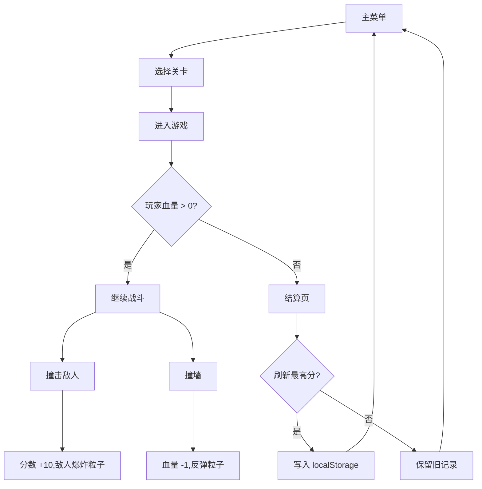

# 球球大冒险 - 产品需求文档（PRD）

## 1. 产品概述

**球球大冒险** 是一款单人物理动作小游戏。玩家操控一颗发光的小球，在一个由程序化生成的持续关卡中穿行,撞击敌人获得分数,撞击墙壁会被反弹。每一关都基于关卡序号被「持久化」到 localStorage,可重新进入。游戏以 Canvas 粒子系统为核心视觉语言,提供霓虹光感、拖尾轨迹与爆炸粒子。

- **核心问题**:给玩家一段短平快、视觉华丽的休闲体验,关卡有持续进度感。
- **目标用户**:喜欢休闲动作 / 反应类游戏的玩家。
- **市场价值**:可作为浏览器小游戏的演示项目,展示 Canvas 粒子 + 状态持久化的最佳实践。

## 2. 核心功能

### 2.1 用户角色
本游戏为单机游戏,无需注册或登录。玩家身份在本地维护。

### 2.2 功能模块
1. **主菜单页**:开始游戏、关卡选择、清空存档、玩法说明
2. **游戏页**:玩家球、敌人、关卡、粒子效果、HUD
3. **结算页**:本局得分、最高分、返回菜单

### 2.3 页面细节
| 页面名称 | 模块名称 | 功能描述 |
|---------|---------|----------|
| 主菜单页 | 标题区 | 显示「球球大冒险」字样,带霓虹辉光与粒子背景 |
| 主菜单页 | 关卡列表 | 横向卡片,展示已解锁的关卡(最多 10 关),未解锁的关卡呈灰色 |
| 主菜单页 | 玩法说明 | 简短 3 条:方向键/WASD 移动、撞击敌人得分、撞墙扣血 |
| 主菜单页 | 清空存档 | 二次确认后清除 localStorage 中所有关卡数据 |
| 游戏页 | HUD | 左上角显示关卡名 / 血量 / 分数,右上角显示已用时间 |
| 游戏页 | 玩家球 | 始终位于视口中央,WASD/方向键控制,带尾迹粒子 |
| 游戏页 | 敌人 | 圆形/多边形,有自己的 AI 巡逻与追击逻辑 |
| 游戏页 | 关卡场景 | 矩形碰撞墙 + 装饰性方块,不同关卡使用不同主题色 |
| 游戏页 | 粒子层 | 移动尾迹、撞击爆炸、收集光点三种粒子效果 |
| 结算页 | 结算卡 | 显示本局得分、最高分、血量,以及「再来一关」「返回菜单」 |

## 3. 核心流程



## 4. 用户界面设计

### 4.1 设计风格
- **主色调**:深空黑 `#0A0A14` 为底,搭配霓虹紫 `#A855F7`、电子青 `#22D3EE`、警示红 `#F43F5E`。
- **按钮**:圆角矩形 (8px 圆角),1px 描边 + 外发光,悬浮时背景提亮 10%。
- **字体**:标题使用 `Orbitron` 700,正文使用 `Rajdhani` 500,数字使用等宽字。
- **布局**:主菜单采用居中三段式(标题 / 关卡卡片 / 说明),游戏页采用全屏 Canvas + 顶部 HUD。
- **图标风格**:使用 lucide-react 提供的线性图标(play、trophy、trash-2、rotate-ccw)。

### 4.2 页面设计概览
| 页面 | 模块 | UI 元素 |
|------|------|---------|
| 主菜单 | 标题 | Orbitron 72px,紫青渐变文字,投射出 20px 模糊外发光 |
| 主菜单 | 关卡卡 | 96×96 圆角矩形,描边 1px,内容为关卡序号 + 最高分 |
| 主菜单 | 说明 | 三个胶囊标签,逐条显示,带 0.2s 错位进入动画 |
| 游戏页 | HUD | 半透明黑底胶囊,左对齐,数字使用等宽字体 |
| 游戏页 | 玩家球 | 渐变填充 + 8px 外发光 + 8 帧尾迹 |
| 结算页 | 结算卡 | 480×280 居中卡片,带 0.3s 弹性进入动画 |

### 4.3 响应式
- 桌面优先 (1280×800 设计基准)
- 移动端:Canvas 居中并保持 1:1 比例,触摸时在屏幕底部显示一个虚拟摇杆组件

### 4.4 Canvas 场景指引
- **背景**:`#0A0A14` + 60×60 网格的细线 `#1E1B4B` 描边
- **粒子**:最多 600 个并发,使用 `globalCompositeOperation = 'lighter'` 叠加
- **后期**:玩家球半径随血量从 16 缩小到 8
- **资产**:全部使用 Canvas 原生绘制,无外部图片资源
- **性能预算**:目标 60 FPS,粒子池复用避免 GC

## 5. 持久化关卡说明

- localStorage key: `ball-game-save-v1`
- 数据结构:
  ```ts
  {
    levels: Array<{
      id: number,
      unlocked: boolean,
      bestScore: number,
      bestTimeMs: number
    }>
  }
  ```
- 默认初始状态:仅第 1 关解锁,最高分 0
- 通关条件:击破本关所有敌人(初始为 3+关卡序号,最多 10 个)
