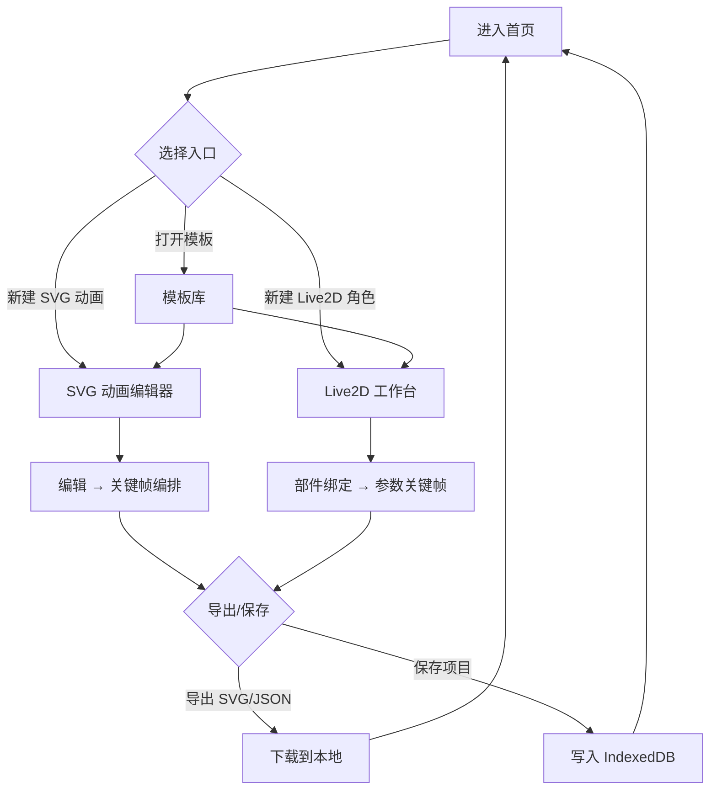

# AniForge — SVG 动画 & Live2D 创作平台 产品需求文档

## 1. 产品概述

**AniForge** 是一款面向设计师、独立开发者、虚拟主播、互动内容创作者的**一站式 Web 端动画创作平台**,集成 **SVG 关键帧动画编辑** 与 **Live2D 风格角色绑定** 两大核心模块,提供时间线、图层、参数面板、实时预览与一键导出,无需安装、打开浏览器即可从零开始创造可上线的动画资产。

- 核心定位:浏览器即用的「轻量 After Effects + Live2D Cubism」综合工作台。
- 目标用户:前端工程师、独立设计师、虚拟形象作者、UP 主 / VTuber。
- 核心价值:零门槛、可导出代码/标准资源 (SVG/JSON/Live2D 兼容 JSON)、实时预览。

## 2. 核心功能

### 2.1 用户角色
| 角色 | 注册方式 | 核心权限 |
|------|----------|----------|
| 访客 (Guest) | 无需注册 | 浏览模板、本地保存项目、试用编辑器 |
| 创作者 (Creator) | 邮箱注册 / 本地账户 | 保存云端项目、分享画廊、导出资源 |

> 注:本期不强制接入云后端,默认以**本地存储 (IndexedDB)** 为项目持久层,提供导出/导入 JSON 实现「云端等价」能力。

### 2.2 功能模块
1. **首页 / 控制台 (Home / Dashboard)**:项目卡片、新建项目、模板市场、最近编辑、灵感画廊。
2. **SVG 动画编辑器 (SVG Animator)**:画布、图层树、属性面板、时间线、关键帧、缓动、SMIL/CSS/JS 三种导出。
3. **Live2D 创作工作台 (Live2D Studio)**:画板、分层网格、网格形变 (Warp Mesh)、关键参数 (Param XY)、表情/动作预设、物理模拟、呼吸/眨眼自动动画、导出 Cubism 兼容 JSON。
4. **模板库 (Templates)**:分类筛选、预览、点击「Use Template」进入编辑器。
5. **画廊 / 社区 (Gallery)**:动效展示、点赞、复制项目。
6. **设置 (Settings)**:主题、快捷键、默认参数、导入/导出账户数据。

### 2.3 页面详细说明
| 页面 | 模块 | 功能描述 |
|------|------|----------|
| 首页 | Hero 区 | 巨型 SVG 角色 + 现场动画演示,标语 + CTA「新建项目 / 浏览模板」 |
| 首页 | 项目网格 | 本地 IndexedDB 项目列表,显示缩略图、名称、更新时间、标签 |
| 首页 | 模板精选 | 横向滚动卡片,支持筛选 SVG / Live2D 类别 |
| SVG 编辑器 | 顶部工具栏 | 撤销/重做、缩放、对齐、播放/暂停、导出 |
| SVG 编辑器 | 左侧图层 | 图层树 (显隐 / 锁定 / 重命名 / 排序 / 编组) |
| SVG 编辑器 | 中央画布 | 网格背景、标尺、SVG 节点直接编辑、变形控件 |
| SVG 编辑器 | 右侧属性 | 几何、填充、描边、滤镜、变换 (位置/旋转/缩放/不透明度) |
| SVG 编辑器 | 底部时间线 | 多轨道、关键帧拖拽、缓动曲线选择、时间标尺 |
| Live2D 工作台 | 画板主区域 | 角色预览窗口、网格形变可视化编辑 |
| Live2D 工作台 | 部件面板 | 头/眼/口/发/身体/服装图层 |
| Live2D 工作台 | 参数面板 | 参数表 (ParamAngleX、ParamEyeLOpen 等) 关键帧与表达式 |
| Live2D 工作台 | 动作预设 | Idle / Tap / Flick / 表情 预设绑定 |
| 模板库 | 分类筛选 | 类别、风格、难度、关键字 |
| 画廊 | 卡片瀑布 | 动效预览、点击进入编辑副本 |
| 设置 | 偏好 | 主题、默认网格、缓动默认曲线、快捷键说明 |

## 3. 核心流程

### 3.1 自然语言描述
- 用户进入首页 → 选择「新建 SVG 动画 / 新建 Live2D 角色 / 打开模板」→ 跳转至对应编辑器。
- 在编辑器中,用户从左侧部件库拖入元素,在中央画布调整位置/形变,在右侧面板绑定关键帧参数,底部时间线完成编排。
- 实时预览生效后,用户可选择「导出 SVG / 导出 JSON / 导出 GIF / 导出 Cubism 兼容 JSON」,或保存到本地。
- 用户返回首页可见更新后的项目卡片,继续编辑或发布到画廊。

### 3.2 Mermaid 流程图

## 4. 用户界面设计

### 4.1 设计风格
- **主色调**:深夜墨黑 `#0B0B12` + 霓虹青 `#7CF9FF` + 火星橙 `#FF6A3D` (强调关键帧 / 播放头)。
- **辅助色**:雾灰 `#A6A6B3`、柔白 `#F5F5F7`、状态色 (成功 `#4ADE80`、警告 `#FACC15`、错误 `#F87171`)。
- **字体**:
  - 标题与品牌: `Space Grotesk` (现代几何 + 工程师气质)
  - 中文显示: `Noto Sans SC`
  - 等宽 (代码/参数): `JetBrains Mono`
- **按钮风格**:细描边 (1px) + 圆角 `8px`、按下时微缩 (`scale 0.98`) + 短促发光 (box-shadow 0.4s)。
- **布局风格**:左中右三栏 + 底部时间线,所有面板可拖拽折叠;整体栅格 8px 基线。
- **图标**:`lucide-react`,线性 1.5px 描边,主操作图标配合文字标签。
- **视觉细节**:
  - 背景叠加细网格 (40×40px,`#FFFFFF0A`)
  - 关键帧菱形节点 (◆) 使用火星橙发光
  - 缓动曲线实时绘制于贝塞尔面板

### 4.2 页面设计概览
| 页面 | 模块 | UI 元素 |
|------|------|---------|
| 首页 | Hero | 巨型可动 SVG 角色 (Live2D 风格简化形象),左右分栏:左文字 CTA,右实时动画演示 |
| 首页 | 项目网格 | 卡片悬停上浮 4px,边框由 `#1F1F2A` 渐变到 `#7CF9FF` |
| SVG 编辑器 | 时间线 | 深色基底轨道,菱形关键帧节点,贝塞尔曲线小图 (easing pill) |
| SVG 编辑器 | 画布 | 黑色舞台 + 1px 虚线网格,选中态使用青色描边 + 控制手柄 |
| Live2D 工作台 | 画板 | 角色始终居中,网格形变用橙色 wireframe 覆盖预览 |
| Live2D 工作台 | 参数面板 | 滑块 + 数值输入,关联表达式可在文本框编辑 |
| 模板库 | 卡片 | 顶部 16:9 动效预览 (循环播放),底部标签 chip |
| 画廊 | 瀑布 | masonry 布局,卡片悬浮显示作者与「编辑副本」按钮 |
| 设置 | 偏好 | 单列列表,开关 / 选择器 / 滑块 |

### 4.3 响应式
- 桌面优先 (≥1280px),三栏布局。
- 平板 (768–1279px) 折叠右侧属性为浮层。
- 移动端 (≤767px) 切换为「上下面板」单列模式,适合预览和参数调整;复杂编辑提示用户切换到桌面。

### 4.4 3D / 2.5D 场景指引
- 编辑器中央画布使用 2.5D 透视:`perspective(1200px) rotateX(6deg)` 增强深度。
- Hero 区域 SVG 角色持续运行 (呼吸 + 眨眼 + 头摆) 三种循环动画,体现产品能力。
- 背景使用极轻量 WebGL 粒子 (canvas 2D fallback),跟随鼠标轻微偏移,营造工作台氛围。
