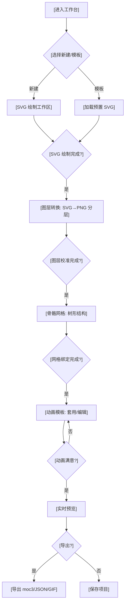

# Live2D 动画模板工具 - 产品需求文档 (PRD)

## 1. 产品概述

**Mochi Live Studio** —— 一款基于浏览器的 Live2D 动画模板式制作工具，让创作者通过 SVG 绘制 → 自动分图层 → 自动生成树形骨骼网格 → 一键套用动画模板，四步快速产出可实时播放的 Live2D 风格角色动画。
- 主要用途：解决传统 Live2D Cubism 软件学习成本高、流程繁琐的问题，降低创作者门槛。
- 目标用户：VTuber 出道者、独立游戏开发者、短视频创作者、动画爱好者。
- 市场价值：填补"轻量级 Live2D 模板工具"的市场空白，让用户在 10 分钟内完成从草图到动画的完整流程。

## 2. 核心功能

### 2.1 用户角色
| 角色 | 注册方式 | 核心权限 |
|------|----------|----------|
| 创作者 | 邮箱注册 | 创作、编辑、保存、导出动画 |
| 访客 | 无需注册 | 浏览模板库、试用预设角色 |

### 2.2 功能模块
1. **首页 / 工作台**：项目列表、模板库入口、最近编辑
2. **SVG 绘图工作区**：矢量绘制工具、画布、图层面板
3. **图层转换工作区**：SVG 转 PNG 分层预览、吸附网格、命名
4. **树形骨骼工作区**：拖拽生成父子关系、绑定网格点
5. **动画模板工作区**：选择模板、参数轨道编辑、实时预览
6. **导出工作区**：导出为 moc3 / JSON / GIF / WebM

### 2.3 页面详情
| 页面名称 | 模块名称 | 功能描述 |
|---------|---------|---------|
| 首页 | Hero 区 | 动态展示 3D Live2D 预览头部，CTA 按钮"开始创作" |
| 首页 | 模板库 | 卡片网格展示 8+ 预设角色模板（兽耳娘、机甲、Q 版等） |
| 首页 | 创作流程图 | 4 步骤可视化流程（绘制→分层→网格→动画） |
| SVG 绘图 | 工具栏 | 矩形、椭圆、钢笔、画笔、橡皮、颜色拾取、撤销/重做 |
| SVG 绘图 | 画布 | 600×800 矢量画布、缩放/平移、参考线、对称辅助 |
| SVG 绘图 | 图层 | 分组管理、可见性、锁定、重命名、删除 |
| 图层转换 | 切片器 | 颜色阈值/边界吸附分图、缩略图预览、命名规则 |
| 图层转换 | 校准 | 调整切分层、合并/拆分、自动居中对齐 |
| 骨骼网格 | 树形视图 | 拖拽节点建立父子关系、节点重命名、权重刷 |
| 骨骼网格 | 画布绑定 | 拖动节点到图层对应位置、网格密度调整 |
| 动画模板 | 模板选择 | 模板库（眨眼/呼吸/转头/说话）、自定义参数曲线 |
| 动画模板 | 时间轴 | 多轨道关键帧、缓动函数、循环设置 |
| 动画模板 | 预览 | 实时播放、速度调节、背景音乐 |
| 导出 | 格式选择 | moc3 / JSON / GIF / WebM、尺寸与帧率 |
| 导出 | 元数据 | 项目名、作者、FPS、版本号填写 |

## 3. 核心流程

用户进入工作台后，可选择"新建空白项目"或"使用模板创建"。空白项目从 SVG 绘制开始；模板项目会预置示例 SVG，用户可继续编辑。核心流程为：绘制 SVG → 转换并分图层 → 生成树形骨骼网格 → 套用动画模板 → 实时预览 → 导出。

## 4. 用户界面设计

### 4.1 设计风格
- **主色调**：深空黑 `#0B0F1A` + 樱花粉 `#FF7AB6` + 樱草黄 `#FFD66B`（点缀）
- **辅助色**：墨蓝 `#1A2236`、雾白 `#E6E9F2`
- **按钮风格**：3D 拟物化 + 软阴影（多层 box-shadow），圆角 12px，悬浮时上移 2px
- **字体**：标题用 `Zen Maru Gothic`（圆润有手绘感），正文用 `Noto Sans SC`（中文清晰）
- **布局风格**：顶部导航 + 左侧工具栏 + 中央画布 + 右侧属性面板，模块化卡片
- **图标风格**：统一使用 lucide-react 线性图标，描边 1.5px，圆角端点

### 4.2 页面设计概述
| 页面 | 模块 | UI 元素 |
|------|------|---------|
| 首页 | Hero | 全屏渐变背景 + 浮动预览卡片 + 大标题 + 樱花按钮 |
| 首页 | 模板库 | 卡片 4 列网格，悬停上浮 + 樱花粉描边 |
| SVG 绘图 | 工具栏 | 顶部胶囊工具栏，半透明磨砂玻璃背景 |
| SVG 绘图 | 画布 | 深色网格背景，画布 600×800 居中，缩放控件右下 |
| 图层转换 | 切片器 | 左侧分图列表，右侧分图预览，缩略图 120×160 |
| 骨骼网格 | 树形视图 | 左侧节点树（可折叠），右侧画布绑定 |
| 动画模板 | 时间轴 | 底部时间轴，多轨道，节拍刻度，关键帧菱形 |
| 动画模板 | 预览 | 居中画布，背景柔光，悬浮控制条 |
| 导出 | 格式选择 | 大尺寸卡片 2×2 网格，每个图标 + 名称 + 描述 |

### 4.3 响应式
- **Desktop-first**：主战场 ≥1280px，所有功能完整可见
- **平板适配**（≥768px）：工具栏折叠为侧边抽屉
- **移动端**（≥375px）：仅保留预览与查看功能，编辑功能提示"请使用桌面端"

### 4.4 动效与质感
- 进入页面使用 stagger 动画，元素逐个浮入
- 按钮悬停：上移 2px + 樱花粉光晕
- 画布元素选中：虚线控制框 + 角点
- 时间轴关键帧：菱形 + 缓动曲线预览
- 全局添加细噪点纹理（`background-image: url(noise.png)`）增加质感
