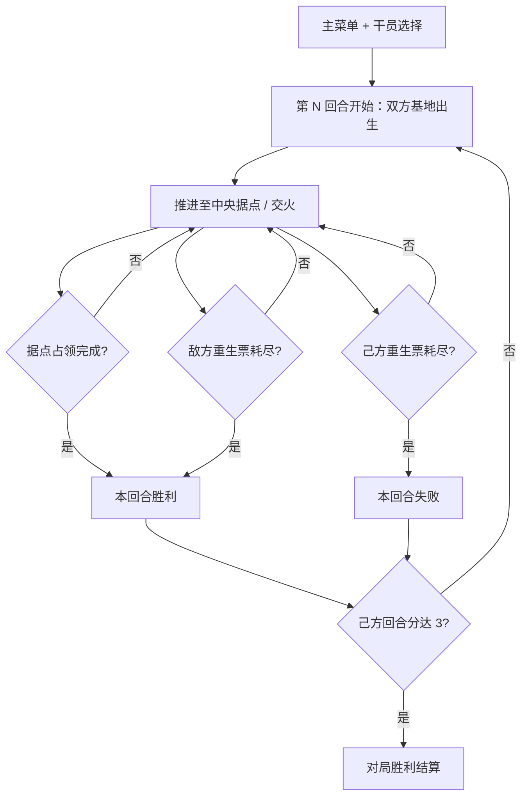

## 1. 产品概述

「裂界行动 · DELTA PROTOCOL」是一款以「像素 2 渲 3」美学为核心的网页端战术小队第一人称射击独立游戏，玩法对标《三角洲行动》。玩家扮演特种干员，带领 3 名 AI 队友组成 4 人小队，在大型战术地图上与敌方 AI 阵营（6+ 名 bot）交战，通过「据点占领」或「全歼敌军」赢下回合，先夺 N 回合者赢得整场对局。

- 核心目标：用浏览器即可体验一段紧凑、有战术深度的 5–8 分钟小队交战，呈现独立游戏级的「2D 像素 sprite + 3D 透视战场」质感与「多人平台」式的大规模 Agent 战场感
- 目标用户：战术射击爱好者、Delta Force / 闪电战队 / 像素艺术玩家
- 市场价值：验证「低分辨率 3D + 像素 sprite + 大规模 AI Agent loop」在 Web 端的可玩性，为后续扩展真实多人/更多干员/地图奠基

## 2. 核心功能

### 2.1 用户角色
| 角色 | 注册方式 | 核心权限 |
|------|---------|---------|
| 玩家（干员） | 无需注册（本地存档） | 游玩、选择干员、查看战绩、调整画面与控制 |

### 2.2 功能模块
1. **主菜单**：标题、干员选择、开始行动、设置、操作说明、战绩
2. **战术战场**：大型地图（双方基地 + 中央据点 + 建筑/掩体）、玩家小队、敌方阵营
3. **战斗系统**：第一人称射击、命中判定、友军/敌军识别、武器后坐与弹药
4. **AI Agent 系统**：队友与敌方 bot 的状态机（巡逻/交战/寻掩体/重生），大规模并行更新
5. **回合/对局 loop**：据点占领、重生票、回合胜负、对局计分
6. **战术 HUD**：血量/护甲、弹药、队友状态、据点进度、双方票数、回合计分、小地图、命中标记

### 2.3 页面详情
| 页面名称 | 模块名称 | 功能描述 |
|---------|---------|---------|
| 主菜单 | 标题与导航 | 像素 LOGO 动画、开始行动、干员选择、设置、操作说明 |
| 主菜单 | 干员选择 | 突击/侦察/支援三职业，不同血量/速度/武器，像素立绘 |
| 战术战场 | 第一人称视角 | WASD 移动、Shift 冲刺、鼠标转向、左键开火、R 装弹、指针锁定 |
| 战术战场 | AI 小队 | 3 名友军 bot 跟随/协战，状态显示在 HUD |
| 战术战场 | 敌方阵营 | 6+ 名敌军 bot 巡逻/进攻据点 |
| 战术战场 | 中央据点 | 占领区，站内人数多的一方持续占领，进度满即赢回合 |
| 战术战场 | 重生系统 | 死亡后重生票 -1，倒计时重生在己方基地 |
| HUD | 战术信息 | 左下血量/护甲、右下弹药、顶部双方票数+据点进度、左上队友、右上回合分、右下小地图 |
| 结算界面 | 对局结算 | 回合胜负、击杀/死亡、重玩/返回菜单 |

## 3. 核心流程

**对局流程**：主菜单选干员 → 进入战场第 1 回合 → 双方从基地出生 → 争夺中央据点 / 交火歼敌 → 占领据点 或 敌方重生票耗尽 → 赢下回合 → 进入下一回合 → 先夺 3 回合者赢得对局 → 结算。

## 4. 用户界面设计

### 4.1 设计风格
- **主色调**：战术墨绿 `#0d1410` + 指令青 `#4fd6c2` + 警示橙 `#ff8a3d` + 敌方红 `#ff3b5c` + 友军蓝 `#3a8cff`
- **次色调**：据点金 `#ffd86b`、夜空黑 `#070a08`
- **按钮风格**：像素描边矩形，无圆角，1px 高光 + 2px 暗边，军用 HUD 质感
- **字体**：标题 `Press Start 2P`，正文/数据 `VT323`
- **布局**：游戏内全屏 3D 画布 + 半透明战术 HUD 叠层；菜单居中竖排 + 动态战场背景
- **后处理**：低分辨率离屏渲染 → 最近邻放大；扫描线 + 噪点 + 暗角；战场雾化 + 远景隐入

### 4.2 页面设计概览
| 页面 | 模块 | UI 元素 |
|------|------|---------|
| 主菜单 | 标题区 | 像素 LOGO「DELTA PROTOCOL」、副标题「裂界行动」 |
| 主菜单 | 干员选择 | 三职业卡片（突击/侦察/支援），血量/速度/武器参数 |
| 战场 | 3D 视口 | 低分辨率渲染的大型战术战场、建筑、掩体、像素士兵 sprite |
| HUD | 生命/护甲 | 左下条形血量 + 护甲分段，受击红屏 |
| HUD | 弹药 | 右下弹药数 + 备弹，装弹提示 |
| HUD | 队友 | 左上 3 名队友头像/血量状态 |
| HUD | 据点/票数 | 顶部中央据点占领进度条 + 双方重生票数 |
| HUD | 回合计分 | 顶部右上回合胜负点（最佳 5 局 3 胜）|
| HUD | 小地图 | 右下俯视小地图，显示据点/队友/可见敌人 |
| HUD | 命中标记 | 准星金色 X，命中确认 |
| 结算 | 数据 | 击杀/死亡/回合分、重玩/菜单 |

### 4.3 响应式
- 桌面优先（≥1024px）：完整战场 + 战术 HUD，键鼠
- 平板（768–1023px）：HUD 缩放，提示桌面体验
- 移动端（<768px）：提示「请使用桌面浏览器」

### 4.4 3D 场景指引
- **环境/氛围**：大型战术战场，墨绿底色 + 战场浓雾（FogExp2），破败城市/工业感
- **灯光**：冷色环境光 + 天顶方向光（日光感）+ 玩家头顶辅助光，建筑投下暗影区作掩体
- **相机**：第一人称 PerspectiveCamera（FOV 75°），指针锁定，冲刺 FOV 拉宽，受击震动
- **构图**：双方基地分居地图两端，中央据点为视觉与战术焦点，建筑/掩体错落引导交火线
- **模型**：士兵为面向相机的 billboard sprite（像素侧视/正视）；建筑/掩体为低多边形 Box + 像素纹理；地面大平面 + 网格纹理
- **交互/动画**：sprite 走/跑 bob、受击闪烁、倒地粒子；据点光柱呼吸；开火枪口火光 + 拖尾
- **性能**：墙体/建筑合并几何或 InstancedMesh；bot 共享 sprite 材质；目标 60fps 支持 10+ Agent
