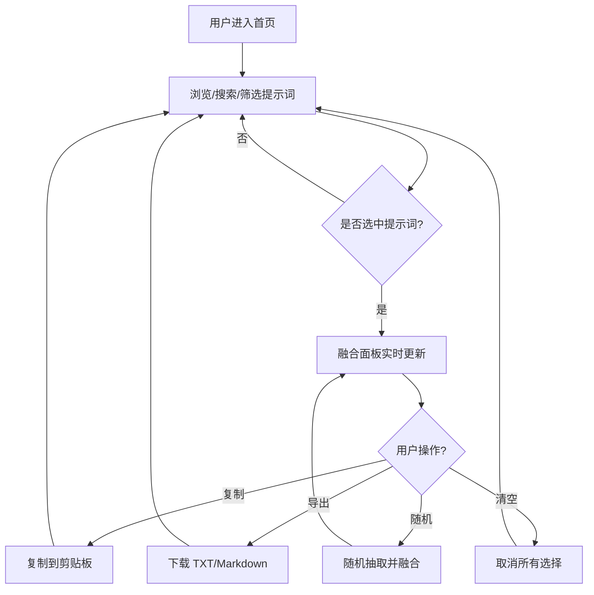

## 1. 产品概述

画风提示词库是一个单页 HTML 工具，用于汇集、管理、筛选和融合 120 组二次元 3D 渲染风格的生成提示词。目标用户为 AI 绘画/视频创作者，解决提示词碎片化、难以组合复用的问题，提升创作效率。

## 2. 核心功能

### 2.1 用户角色
| 角色 | 注册方式 | 核心权限 |
|------|----------|----------|
| 普通用户 | 无需注册 | 浏览、筛选、选择、融合、复制提示词 |

### 2.2 功能模块
1. **提示词展示**：以主题卡片形式展示 12 个主题、共 120 组提示词。
2. **筛选与搜索**：按主题筛选，按关键词实时搜索。
3. **选择与融合**：单选/多选提示词，一键融合为一段完整提示词。
4. **随机组合**：随机抽取 N 组提示词并自动融合。
5. **复制与导出**：复制融合结果到剪贴板，导出为 TXT/Markdown。
6. **偏好设置**：切换明暗主题、调整卡片密度。

### 2.3 页面详情
| 页面名称 | 模块名称 | 功能描述 |
|----------|----------|----------|
| 首页 | 顶部控制栏 | 搜索框、主题筛选、随机按钮、融合计数、清空按钮 |
| 首页 | 提示词网格 | 主题分组卡片，支持选择与取消选择 |
| 首页 | 融合面板 | 悬浮/固定面板，实时显示已选提示词与融合结果 |
| 首页 | 底部信息 | 使用说明、快捷键、版本信息 |

## 3. 核心流程

用户进入首页后，可通过搜索框输入关键词，或通过主题标签快速过滤提示词。点击卡片即可选中/取消选中。选中后，融合面板实时更新融合结果。用户可点击“复制”将结果存入剪贴板，或点击“导出”保存为文件。点击“随机组合”可从当前筛选结果中抽取 3-5 组提示词并自动融合。

## 4. 用户界面设计

### 4.1 设计风格
- **主色调**：深灰黑背景 (#0a0a0f) 营造沉浸式暗调氛围，匹配提示词的“画面整体偏暗”特征。
- **强调色**：金黄 (#f6c344)、紫罗兰 (#a855f7)、粉红 (#ec4899)、赤红 (#ef4444) 四色渐变点缀，呼应提示词中的高光与情绪色。
- **按钮风格**：微圆角 (8px)、半透明玻璃态 (glassmorphism)、悬停时发光与位移。
- **字体**：中文标题使用思源宋体或站酷高端黑风格字体，正文使用无衬线字体；英文/数字使用等宽字体显示技术感。
- **布局风格**：顶部固定控制栏 + 可滚动卡片网格 + 右侧/底部固定融合面板；桌面端优先，移动端自适应为单列。
- **图标风格**：线性图标，配合霓虹发光效果。

### 4.2 页面设计概览
| 页面名称 | 模块名称 | UI 元素 |
|----------|----------|---------|
| 首页 | 顶部控制栏 | 搜索输入框、主题标签 pills、随机按钮、已选计数、清空按钮 |
| 首页 | 提示词网格 | 主题标题、卡片（序号+内容）、悬停高亮、选中态边框发光 |
| 首页 | 融合面板 | 已选列表、融合结果文本框、复制按钮、导出下拉、字符计数 |
| 首页 | 底部信息 | 快捷键提示、版本号、使用说明折叠区 |

### 4.3 响应式适配
- **桌面端 (>1024px)**：三列网格，右侧固定融合面板。
- **平板端 (768px-1024px)**：两列网格，底部抽屉式融合面板。
- **移动端 (<768px)**：单列网格，底部固定融合面板，可展开/收起。

### 4.4 动效与交互
- 页面加载：标题与卡片 staggered fade-in。
- 卡片悬停：轻微上浮 (translateY -4px)、边框发光、阴影扩散。
- 选中态：边框变为渐变金紫粉、左上角勾选标记滑入。
- 融合面板：内容变化时文字淡入，复制成功显示 Toast。
- 主题切换：明暗色之间 0.3s 平滑过渡。
