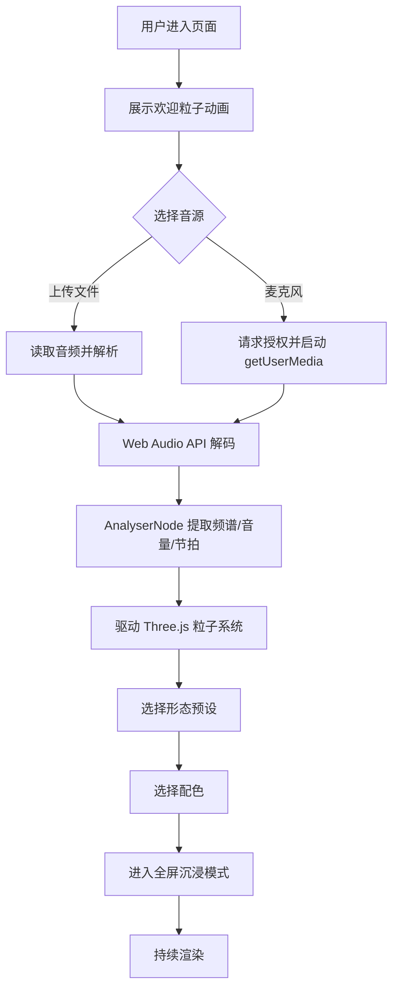

# PRD - 音乐粒子 / 3D 生成式音频可视化

## 1. 产品概述

音乐粒子是一个基于 Web 的 3D 生成式音频可视化应用，将声音实时转化为流动的几何粒子形态。用户上传本地音频文件或调用麦克风后，系统通过 Web Audio API 提取频谱与节拍特征，驱动 Three.js 场景中上万颗粒子在三维空间内做形态重塑、色彩漂移与运动编排。目标用户是电子音乐爱好者、视觉艺术创作者以及派对/演出中需要动态背景的设计师。

- 主要用途：将听觉感受升级为沉浸式视觉体验
- 解决的问题：传统音乐播放器缺乏视觉冲击；现有可视化多为 2D 频谱柱
- 目标价值：成为浏览器内最精致、反应最灵敏的实时音频视觉装置

## 2. 核心功能

### 2.1 用户角色

| 角色 | 进入方式 | 核心权限 |
|------|----------|----------|
| 访客用户 | 直接打开页面 | 上传音频、切换预设、调节参数 |
| 现场观众 | 共享屏幕/全屏模式 | 沉浸式观看（隐藏控件） |

### 2.2 功能模块

1. **主舞台（Stage）**：全屏 Three.js 3D 粒子画布，承载所有粒子效果
2. **音频接入面板（Audio Source）**：文件拖拽上传 + 麦克风采集
3. **形态预设库（Preset Library）**：5 种生成式粒子形态（银河、漩涡、网格、烟花、低多边形）
4. **参数控制台（Console）**：粒子密度、运动速度、辉光强度、镜头景深等
5. **主题色板（Palette）**：5 套配色（极光、赛博、暮光、纯白、烈焰）
6. **全屏沉浸（Immersive）**：一键 F 进入全屏，隐藏所有 UI

### 2.3 页面详情

| 页面名称 | 模块名称 | 功能描述 |
|---------|---------|---------|
| 主舞台 | 粒子画布 | 60 FPS 渲染 20000+ 粒子，实时响应音频 |
| 主舞台 | 频谱分析器 | 抽取 32 段 FFT 频段映射到粒子半径/速度/颜色 |
| 主舞台 | 后处理链 | Bloom + Chromatic Aberration + 胶片颗粒 |
| 音频接入 | 拖拽区 | 接受 mp3 / wav / flac / ogg，超大文件给出提示 |
| 音频接入 | 麦克风 | 实时采集浏览器内声音，无录音文件落盘 |
| 预设库 | 形态按钮组 | 点击瞬时切换，使用平滑插值避免突变 |
| 控制台 | 滑块组 | 5 项核心参数实时生效，HUD 风格滑块 |
| 控制台 | 播放控制 | 播放/暂停/进度条/音量 |
| 主题色板 | 颜色点 | 切换全局配色，所有粒子颜色平滑过渡 |
| 全屏沉浸 | 沉浸层 | 全屏后 UI 自动隐藏，鼠标静止 3 秒后彻底消失 |

## 3. 核心流程

## 4. 用户界面设计

### 4.1 设计风格

- **主色调**：深空黑 `#06070C` 作为底色，搭配高饱和度渐变（极光绿青、赛博品红、暮光紫金）
- **字体**：标题用 `Space Grotesk`（未来感几何无衬线），正文/HUD 用 `JetBrains Mono`（技术控制台质感）
- **按钮**：玻璃拟态（半透明 + 1px 高光描边 + 投影），hover 时边缘光晕呼吸
- **布局**：3D 画布占满全屏，HUD 控件浮动在右下与左下，左上为标题元数据
- **图标**：使用 `lucide-react` 图标库，线条 1.5px，圆角
- **微动效**：进入页面标题由模糊到清晰（0.8s ease-out），HUD 滑块拖动时数值 200ms 数字滚动

### 4.2 页面设计概述

| 页面名称 | 模块名称 | UI 元素 |
|---------|---------|---------|
| 主舞台 | 顶部标题 | 16px 大写字母 + 当前曲目名等宽字体滚动 |
| 主舞台 | 右下控制台 | 圆形玻璃按钮 + 垂直滑块 + 播放进度条 |
| 主舞台 | 左下预设 | 五个方形预设卡片，hover 时内部 3D 粒子预览缩略 |
| 主舞台 | 右上色板 | 五个色点，激活态有外发光环 |
| 主舞台 | 中心提示 | 首次进入时半透明引导文本（"拖入音乐"），5 秒后渐隐 |

### 4.3 响应式

- Desktop-first，1920×1080 为基准分辨率
- 平板（≥768px）：HUD 控件缩放 0.85，位置不变
- 移动端（<768px）：HUD 折叠为底部抽屉，预设改为左右滑动
- 触摸支持：滑块改为可拖动圆形滑柄，预设支持左右滑动切换

### 4.4 3D 场景指引

- **环境与氛围**：使用纯黑背景 + 极弱环境光，让 Bloom 效果主导画面
- **灯光设置**：单一方向光（暖白）+ 粒子自身发光（emissive），不依赖阴影
- **相机设置**：PerspectiveCamera FOV 55，初始位置 `(0, 0, 8)`，随音频低频做 0.3 单位的缓慢摆动
- **构图与焦点**：粒子整体居中，相机略向下俯视 5°，让粒子云占据屏幕 70%
- **交互与动画**：
  - 鼠标移动时，相机围绕中心做 ±0.5 单位的视差
  - 节拍命中时，全场粒子向外爆发再回弹
  - 5 种形态使用参数化函数（球面、螺旋、立方网格、烟花放射、噪声场）
- **后处理**：`@react-three/postprocessing` 启用 Bloom（intensity 0.8, threshold 0.1）+ Vignette（暗角 0.6）+ Noise（0.05）
- **资源与性能**：
  - 粒子上限 30000，使用 InstancedMesh + BufferGeometry
  - 像素比 `Math.min(window.devicePixelRatio, 2)`
  - 使用 `useFrame` 在 60 FPS 下更新粒子属性
