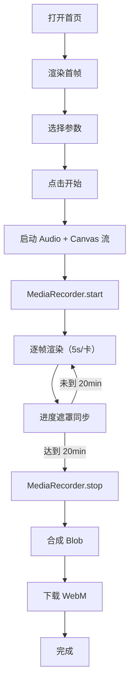

# PRD：2025 热梗大爆炸 · React 20 分钟自动出片

## 1. 产品概述
- 一个 React 18 + Vite + TypeScript 单页应用，浏览器内自动生成并下载一段 **20 分钟**（默认）的"2025 热门网络梗图鉴"长视频。
- 内置 425+ 张自动化模板（中文热梗 / 国际梗 / AI 抽象 / 视觉趋势 / 官方榜单 / 情绪标签 / 二次元 / 机器人 / 标语金句），通过 Canvas + MediaRecorder 在浏览器内本地渲染导出 WebM。
- 默认时长 20 分钟，可切 10/30/40/60；分辨率 720p/1080p；语速 0.5/1/1.5/2×；BGM 0-100%。
- 目标用户：内容创作者、二创作者、社媒运营、需要"年终盘点向"短视频的任何人；零上传、零安装、桌面浏览器即可。

## 2. 核心功能

### 2.1 用户角色
无角色区分，本工具为单用户使用。

### 2.2 功能模块
1. **首页 `/`（唯一页）**：标题 + 控制台 + 实时预览 + 梗库统计 + 日志 + 进度遮罩。
2. **数据层 `src/data/memes.ts`**：10 大分类、425+ 条目，类型化导出。
3. **渲染层 `src/lib/canvas.ts`**：纯函数式帧渲染器，与 React 解耦。
4. **录制层 `src/lib/recorder.ts`**：MediaRecorder + Web Audio BGM 合成 + 时间轴调度。
5. **Hooks `src/hooks/useRenderer.ts`**：把帧循环封装为可复用 hook。
6. **UI 组件**：`Header`、`ControlPanel`、`StagePreview`、`StatsPanel`、`LogBox`、`ProgressOverlay`。
7. **可调参数**：时长（10/20/30/40/60 分）、分辨率、语速、BGM 音量、风格预设、附加项（水印/粒子/字幕）。

### 2.3 页面细节
| 页面 | 模块 | 功能描述 |
|------|------|----------|
| 首页 | Header | 渐变 Bungee 标题、副标、库 KPI |
| 首页 | ControlPanel | 时长/分辨率/语速/音量/风格/附加项 + 开始按钮 |
| 首页 | StagePreview | 16:9 黄黑胶带边 Canvas + 实时帧 |
| 首页 | StatsPanel | 10 个分类统计卡，斜切设计 |
| 首页 | LogBox | 运行日志（3 色） |
| 首页 | ProgressOverlay | 全屏遮罩，倒计时 + 当前梗卡 + 进度条 + emoji 雨 |

## 3. 核心流程
打开站点 → 渲染首帧 → 选择参数 → 点击"开始生成 20 分钟视频" → 启动 MediaRecorder → 帧循环逐张渲染并写流 → 倒计时结束 → 合成 Blob → 触发下载 WebM。

## 4. 用户界面设计
- **主色**：`#00E0FF` × `#F5FF00` × `#FF2E93` × `#0A0A12`
- **字体**：`Bungee` / `Big Shoulders Display` / `Space Grotesk` / `Noto Sans SC` / `JetBrains Mono`
- **按钮**：3D 浮起 + 渐变 + 斜向高光
- **布局**：左控制 / 中预览 / 右统计；≥1180px 三栏，<1180px 单列
- **动效**：标题入场、按钮 hover、卡片闪烁、鼠标光斑
- **图标**：纯 emoji + 噪点

## 5. 响应式
桌面优先（≥1280px 完整三栏）；≥768px 单列；移动端保留基础功能并提示"建议桌面端获得最佳录制效果"。
