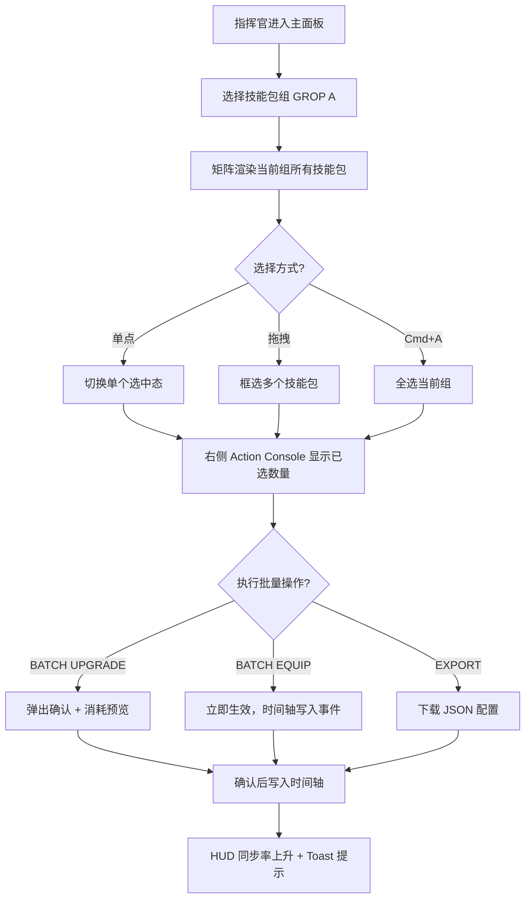

# 明日方舟风格 — 批量技能包组管理界面 PRD

## 1. 产品概述

「批量技能包组」是面向战术操作员/博士的中央调度面板，用于集中管理多组技能包 (Skill Pack Group) 的选择、编队、批量升级与一键配置。界面完全模仿《明日方舟》终端的硬核工业 + 战术 HUD 风格，融合六边形蜂窝骨架、扫描线、琥珀警示与冷蓝辉光，让操作员以最少的点击完成"对一组技能包"批量生效的操作。

- 主要用户：模拟训练中的指挥官 / 战术推演者 / 自动化脚本测试员
- 核心价值：在保持《明日方舟》原生视觉氛围的前提下，把"逐个点击"操作压缩为"一次多选 + 一次确认"的两步式工作流

## 2. 核心功能

### 2.1 用户角色
| 角色 | 进入方式 | 核心权限 |
|------|----------|----------|
| 指挥官 (Operator) | 默认登录 | 浏览、选择、编队、批量升级、导出配置 |
| 观察员 (Observer) | 通过 ?mode=observe 进入 | 只读浏览，不可执行批量动作 |

### 2.2 功能模块
1. **顶部 HUD 状态栏**：网络状态 / 操作员 ID / 同步率 / 时间轴
2. **左侧技能包组侧栏 (Group Roster)**：所有已保存的技能包组（GROP A ~ GROP G），可一键切换激活组
3. **中央批量技能包矩阵 (Matrix)**：以 6 列蜂窝网格展示当前组下的技能包 (Skill Pack)，支持框选 / 反选 / 全选
4. **右侧批量操作面板 (Action Console)**：批量升级 / 批量装配 / 批量写入配置 / 锁定 / 释放
5. **底部时间轴 (Timeline)**：以辉光时间轴展示本次批量操作的事件流
6. **详情浮层 (Inspector)**：点击技能包后右侧弹出，展示等级、词条、稀有度、消耗

### 2.3 页面与模块详情
| 页面 | 模块 | 功能描述 |
|------|------|----------|
| 主面板 | HUD 状态栏 | 顶部黄色线条进度条 + 系统代码 + 当前 UTC 同步时钟 |
| 主面板 | 技能包组侧栏 | 7 个可命名组别 (GROP A..G)，激活态有流动光带 |
| 主面板 | 技能包矩阵 | 30+ 技能包蜂窝卡片，可鼠标拖拽框选 |
| 主面板 | 批量操作面板 | "BATCH UPGRADE" "BATCH EQUIP" "BATCH UNLOCK" 等指令按钮 |
| 主面板 | 时间轴 | 操作记录以琥珀色脉冲方式向左滚动 |
| 详情浮层 | Skill Inspector | 显示技能名/消耗/词条/材料/稀有度，含"APPLY TO ALL" |

## 3. 核心流程

## 4. 用户界面设计

### 4.1 设计风格
- **主色**：背景 `#0a0d12`（夜幕黑） / 表面 `#141a22`（金属板） / 边框 `#2a3441`（冷铁灰）
- **强调色**：
  - 琥珀警示 `#ffb547`（明日方舟标志色）
  - 冷蓝辉光 `#4dd0ff`（HUD 与激活态）
  - 危险红 `#ff4d5e`（消耗警示 / 锁定）
  - 翠绿 `#7cffb2`（成功 / 同步完成）
- **字体**：
  - 标题/代号：`Rajdhani` (700) + `Orbitron` (800, 数字)
  - 正文：`Noto Sans SC` (中文) / `Inter` (英文 fallback)
  - 数据 / 状态：`JetBrains Mono`
- **按钮**：2px 冷蓝边框 + 琥珀填色，悬浮时边框外延 4px 辉光，棱角切角 (clip-path)
- **布局**：左右分栏 (260px / 主区 / 320px) + 顶部 HUD (64px) + 底部时间轴 (88px)
- **图标**：线性 SVG + 角标 (棱角风)，禁止 emoji

### 4.2 页面设计概述
| 页面 | 模块 | UI 元素 |
|------|------|---------|
| 主面板 | HUD 状态栏 | 顶部 1px 琥珀渐变线 + 左侧操作员代号 + 右侧 UTC 时钟 + 中部同步率条 |
| 主面板 | 技能包组侧栏 | 每组一行：组代号 / 容量条 / 激活环；激活态左侧出现 2px 琥珀光带 |
| 主面板 | 技能包矩阵 | 6 列 hex grid，每张卡片显示代号 / 等级 / 稀有度棱角条 / 选中时覆盖冷蓝描边 |
| 主面板 | 批量操作面板 | 顶部"SELECTED: 12 / 30"；4 个大按钮切角 + 倒角；底部"COST 预估" |
| 主面板 | 时间轴 | 横向滚动胶囊 + 琥珀脉冲圆点 + 事件代码 (EVT-001) |
| 详情浮层 | Inspector | 右抽屉 360px，顶部代号 + 等级大数字 + 词条列表 + APPLY TO ALL 大按钮 |

### 4.3 响应式
- 桌面优先 ≥1280px
- 1024~1280 折叠右抽屉为浮层
- <1024 提示"请使用指挥终端"（保持硬核调性）

### 4.4 3D / 动效引导
- 不使用 3D，使用 CSS 透视 + 2D 错位 transform 制造层次
- 加载：六边形网格从中心向四周 60ms staggered 淡入
- 选中：卡片外环 200ms ease-out 辉光扩张
- 批量操作：HUD 同步率条 1.2s 增长 + Toast 顶部滑入
- 时间轴事件：胶囊入场 400ms 弹性回弹 (cubic-bezier(0.34, 1.56, 0.64, 1))
- 持续氛围：背景细扫描线 8s 线性循环 + 角部噪点
