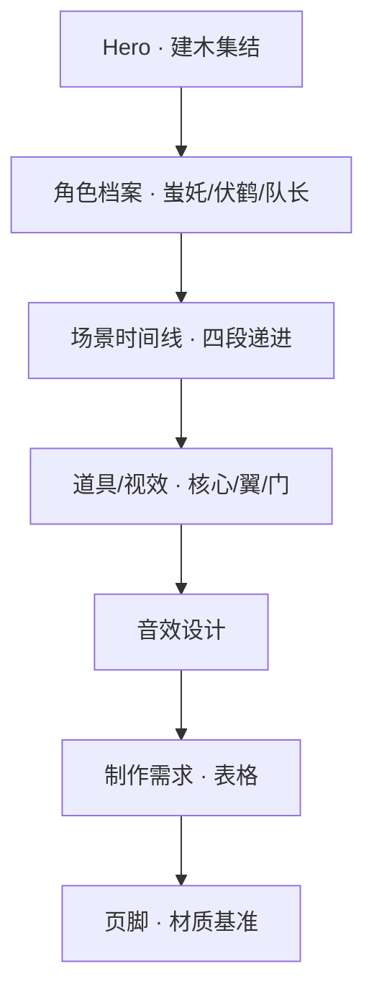

# PRD · 建木→长安 影视世界观展示页

## 1. 产品概述
将《世界观设定卡.md》中的"建木之巅→长安俯冲转场"内容，以电影级单页应用（SPA）形式呈现给制作团队与对外提案方。目标是用视觉语言重述分镜：让访问者"沉浸"在建木集结、穿界门穿越、朱雀门出画三段节奏中，并可查阅角色档案、场景、道具、视效、音效与制作清单。

- 主要问题：分镜描述是纯文字，难以让非作者快速建立空间/情绪/技术预期
- 目标用户：动画/特效制作团队、监修/制片、对外提案对象
- 价值：单页即可"看完一段转场的世界观与制作规格"

## 2. 核心功能

### 2.1 角色划分
本产品无需账号体系，单角色（访问者）。

### 2.2 功能模块
1. **首屏 Hero**：建木之巅集结画面 + 标题"建木→长安" + 滚动引导
2. **角色档案区**：蚩奼(9) / 伏鹤(10) / 队长(1) 三张角色卡
3. **场景时间线区**：建木→紊流海→穿界门→朱雀门 四段递进
4. **道具/视效区**：能量核心、机关翼、穿界门的参数化展示
5. **音效设计区**：频率/时长/事件对照表
6. **制作需求区**：交付物、Shot List、验收标准
7. **页脚**：图 1 材质基准说明 + 变更记录

### 2.3 页面详情
| 页面名称 | 模块名称 | 功能描述 |
|---|---|---|
| Home | Hero | 全屏视频感/海报式构图，含楔形站位剪影 |
| Home | 角色档案 | 三张可悬停放大的角色卡，显示 ID/状态/道具 |
| Home | 场景时间线 | 横向四段卡片 + 进度指示，色温从冷紫→暖金 |
| Home | 道具/视效 | 三件关键道具的参数卡（呼吸节律、2Hz、0.3s 等）|
| Home | 音效设计 | 事件→声音频率对照卡片 |
| Home | 制作需求 | 表格区：交付物 / Shot List / 验收 |
| Home | 页脚 | 图 1 材质基准 + 版本变更 |

## 3. 核心流程
访问者从顶部 Hero 区域开始，向下滚动，依次经过"集结→俯冲→穿越→出画"的剧情节奏。每一段在视觉上对应分镜的一拍（建木→紊流海→穿界门→朱雀门）。滚动到不同区域时，触发交错淡入、轻微视差、色温递进，最终在制作需求处收束为可查阅的表格。

## 4. 用户界面设计

### 4.1 设计风格
- **主题色**：冷紫 `#3A2A6B` → 暖金 `#D4A24C`（对应分镜色温曲线）
- **强调色**：青铜 `#7A5C2E`（穿界门回纹）、蓝 `#4FA8FF`（能量核心）
- **按钮风格**：细线边框 + 内发光（呼应能量核心/光柱）
- **字体**：标题用衬线感强、带有"古卷/碑刻"气质的字体（如 `Noto Serif SC` + `Cormorant Garamond`），正文用现代人文无衬线（`Noto Sans SC`）
- **布局**：编辑/杂志感长滚动页 + 不对称网格 + 大段负空间
- **图标/装饰**：青铜回纹作为分隔符；体积云/光柱以 CSS 渐变模拟

### 4.2 页面设计概览
| 页面名称 | 模块名称 | UI 元素 |
|---|---|---|
| Home | Hero | 全屏海报、楔形站位剪影 SVG、主标题"建木→长安"、副标题、五人站位描述 |
| Home | 角色档案 | 三列卡片，悬停时高亮 + 蓝光描边，底部 ID 编号（金色印章感）|
| Home | 场景时间线 | 横向滚动四段卡片，进度条同步，色温从冷紫到暖金过渡 |
| Home | 道具/视效 | 三栏卡 + 关键参数芯片（如 `0.3s` / `2Hz` / `50Hz`）|
| Home | 音效设计 | 波形/频段示意图（CSS 绘制） + 事件列表 |
| Home | 制作需求 | 表格样式，斑马纹 + 金色表头 |
| Home | 页脚 | 居中文字 + 青铜回纹分隔线 |

### 4.3 响应式
- **桌面优先**（1440px 设计基准）
- 平板（≥768px）：三列降为两列
- 移动端（<768px）：单列堆叠，时间线改为竖向

### 4.4 3D 场景指导（不适用，本期为纯视觉表达）
- 不引入 three.js / WebGL
- 用 CSS 渐变 + SVG 模拟体积云、光柱、青铜回纹
- 性能预算：首屏 LCP < 2.5s（4G 模拟），无外部大体积素材
