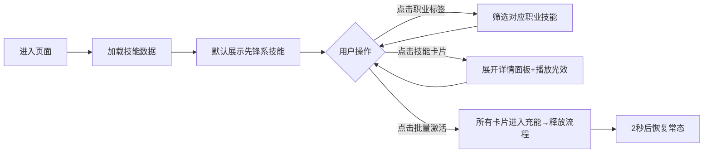

# 明日方舟风格批量技能包组 - 产品需求文档

## 1. 产品概述

以《明日方舟》技能页"光效释放"为视觉母版，构建一组可批量浏览/筛选/激活的干员技能卡片组。目标用户为游戏数据整理者、二创内容创作者与视觉设计参考者。
- 解决问题：在不打开游戏的情况下，以高还原度展示一组技能的图标、描述、SP消耗与光效氛围，便于截屏归档与设计借鉴。
- 价值：将游戏内"静默 → 充能 → 释放"的视觉节律搬到网页，让静态素材具备"可被点亮"的可交互感。

## 2. 核心功能

### 2.1 用户角色
无需注册登录，本作品为单页交互式视觉展示。

### 2.2 功能模块
1. **顶部状态栏**：显示当前选中职业标签、干员数量统计、批量操作入口（全部激活/全部重置）。
2. **职业筛选条**：以横向标签组（先锋/近卫/重装/狙击/术师/医疗/辅助/特种）切换技能列表。
3. **技能包组网格**：4 列响应式网格，每张卡片为一只干员的一个技能。
4. **技能详情面板**：点击卡片后，右侧或下方展开"释放态"光效展示与文字描述。
5. **光效控制台**：背景辉光、扫描线、粒子、激活动画等独立开关。

### 2.3 页面详情
| 页面名称 | 模块名称 | 功能描述 |
|---------|---------|---------|
| 主页面 | 顶部状态栏 | 显示「RHODES ISLAND TERMINAL」风格标题、当前筛选标签、批量按钮 |
| 主页面 | 职业筛选条 | 8 个职业标签，单选高亮，悬停发光描边 |
| 主页面 | 技能网格 | 4 列卡片，含图标、技能名、SP 条、干员名、稀有度底色 |
| 主页面 | 详情面板 | 显示完整技能描述、触发条件、持续时间、冷却，带光效环绕 |
| 主页面 | 光效控制台 | 浮动抽屉：辉光强度、扫描线速度、粒子密度、激活/重置 |

## 3. 核心流程

## 4. 用户界面设计

### 4.1 设计风格
- **主色**：深空黑 `#0A0E1A`、近黑蓝 `#111A2E`、冷灰金属 `#3A4458`、高亮蓝青 `#5EE3FF`、警示橙 `#FF8A3D`、高纯白 `#F2F5FA`。
- **强调色**：稀有的 6★ 卡片使用暖金描边 `#E8C477` 与紫红光晕 `#C15BFF`；5★ 使用青蓝 `#5EE3FF`；4★ 使用银白 `#D6DEE9`。
- **按钮**：直角切角矩形（clip-path 切 8px 斜角），常态带 1px 冷光描边，悬停时描边加粗并外发光，按下时短暂闪白。
- **字体**：标题用 `Orbitron`（等宽科技感），正文用 `Rajdhani`，中文兜底 `Noto Sans SC`，代码/数字用 `JetBrains Mono`。
- **布局**：顶部 64px 状态栏 + 56px 筛选条 + 主体 4 列网格 + 右侧 380px 详情面板（折叠态隐藏）。
- **图标**：基于 lucide-react 的线性图标 + 自定义 SVG 多边形/六边形描边图标。

### 4.2 页面设计概览
| 页面名称 | 模块名称 | UI 元素 |
|---------|---------|--------|
| 主页面 | 顶部状态栏 | 直角切角，1px 冷光描边背景，左侧标题 + 右侧批量按钮（激活/重置） |
| 主页面 | 职业筛选条 | 横向 8 标签，选中态切角亮蓝描边 + 内部 12% 蓝色填充，悬停有 0.4s 描边扫光 |
| 主页面 | 技能卡片 | 直角切角 192×240，顶部 64px 图标区（六边形底），中部 2 行技能名，下部 SP 条 + 干员名 + 稀有度条 |
| 主页面 | 详情面板 | 右侧抽屉，宽 380px，背景叠加六边形网格 + 径向光晕，文字说明 + 完整参数表 |
| 主页面 | 光效控制台 | 浮动按钮（左下），点击展开 280×260 抽屉，含 4 个滑杆与 2 个开关 |

### 4.3 响应性
桌面端（≥1280px）展示 4 列 + 详情面板；平板（768–1279px）切换为 3 列，详情面板改为底部抽屉；移动端（<768px）2 列，详情面板为全屏 Modal。

### 4.4 视觉效果（光效设计）
- **背景**：径向渐变 `#0A0E1A → #050810`，叠加 0.06 透明度等距六边形网格 + 1px 扫描线循环动画。
- **卡片常态**：1px 冷灰描边 + 4px 角部高亮 + 0.6s 入场逐卡延迟（每张 +60ms）。
- **悬停**：卡片上浮 4px，描边变冷光蓝，外阴影 0 0 24px `#5EE3FF` 0.35。
- **激活态**：SP 条从 0 充能到满（1.2s），之后卡片中央放出一束 1.2s 圆形辉光（径向 + 旋转 90° 的锥形光）。
- **全局粒子**：15 颗慢速上升的微粒，仅在背景层，不抢主视觉。
