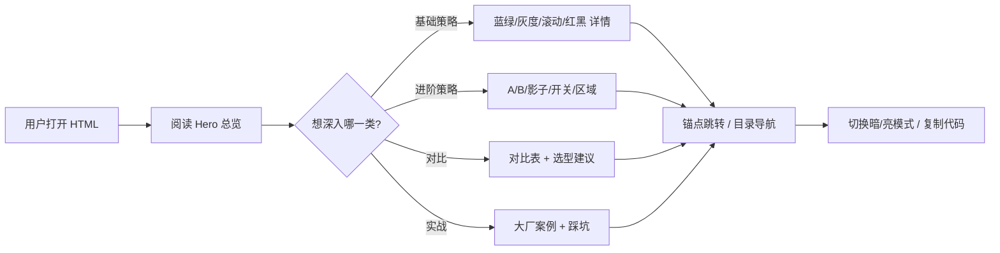

# PRD：线上平台上线手段全景文档

## 1. 产品概述

一份高可读性、可交互的单页 HTML 文档，整理并可视化"线上平台主流上线（发布）手段"的全景知识，包括策略分类、原理图解、对比表、大厂实践与选型建议。

- 目标用户：后端 / SRE / 架构师 / 面试候选人
- 产品价值：把碎片化的发布策略知识结构化呈现，便于查阅、对比和决策

## 2. 核心功能

### 2.1 用户角色
无需登录，纯静态文档浏览。

### 2.2 功能模块（单页内分章节）
1. **Hero / 总览**：标题、导语、12 大策略速览卡片
2. **基础核心策略**：蓝绿 / 灰度 / 滚动 / 红黑 详解 + 架构示意
3. **进阶优化策略**：A/B、影子、功能开关、区域发布、热部署、CD
4. **全链路灰度**：原理、对比、落地步骤
5. **策略对比表**：交互式多维度对比
6. **大厂案例**：阿里 / 字节 / 美团 / 腾讯 / 青团社
7. **监控体系 & 踩坑案例**
8. **落地演进路线 & 选型建议**
9. **页脚 / 引用来源**

### 2.3 页面细节
| 模块 | 功能描述 |
|------|---------|
| Hero | 大标题、副标题、12 张策略卡片网格（点击锚点跳转） |
| 策略详情卡片 | 折叠/展开原理、优点、缺点、适用场景、示意 SVG |
| 对比表 | 多维度表格，hover 高亮、列排序 |
| 大厂案例 | 时间线 + 标签云 |
| 落地路线 | 8 阶段步骤条 |
| 导航 | 右侧悬浮目录（TOC），滚动联动高亮 |
| 交互 | 平滑滚动、暗色 / 亮色模式切换、代码块一键复制 |

## 3. 核心流程

## 4. 用户界面设计

### 4.1 设计风格
- **主题**：深色科技感（Terminal × Cyberpunk），呼应"发布/部署"主题
- **主色**：`#0a0e1a`（深空蓝黑）背景；强调色 `#00ff9c`（荧光绿，象征"Go Live"信号灯）
- **辅助色**：`#ff6b6b`（红 - 回滚）、`#4ecdc4`（青 - 灰度）、`#ffd93d`（黄 - 警告）
- **字体**：
  - 标题：`Space Grotesk` 或 `JetBrains Mono`（科技感）
  - 正文：`Inter`（清晰阅读）
  - 代码：`Fira Code`
- **按钮 / 卡片**：玻璃拟态（backdrop-filter: blur）+ 1px 渐变描边
- **布局**：左侧主体 + 右侧悬浮目录，桌面优先，移动端单列
- **动效**：入场 staggered 渐显、scroll-triggered 揭示、卡片 hover 抬升

### 4.2 页面设计概览
| 模块 | UI 元素 |
|------|---------|
| Hero | 全屏视高、巨型发光标题、动态网格背景、12 张策略 chip |
| 策略卡片 | 玻璃卡 + 图标 + 标题 + 一句话描述 + 标签 |
| 对比表 | 深色表头，hover 行高亮，sticky 表头 |
| 演进路线 | 横向时间线，节点发光，连接线渐变 |
| 踩坑案例 | 警示色边框，code 块 monospace |

### 4.3 响应式
- Desktop ≥ 1280px：双列布局
- Tablet 768-1279px：单列，TOC 折叠为顶部按钮
- Mobile < 768px：单列、字号缩小、卡片纵向排列

### 4.4 3D 场景
不需要。
