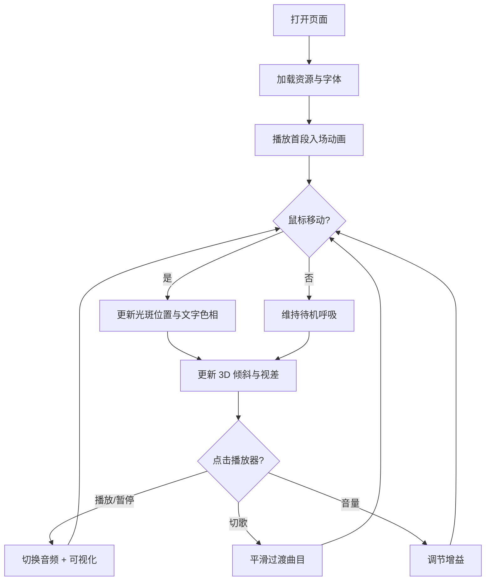

# 工业陷阱 · 文字动画界面 - 产品需求文档

## 1. 产品概述

打造一个**单页沉浸式**文字动画界面，融合现代工业、Trap 音乐与赛博美学，以「广角镜头 + 伪 3D + 跳动脉冲」为核心视觉语言。中央持续变化的巨型黑体文字作为视觉主轴，配合光线条纹、网格与粒子层，营造一种"被机械注视"的临场感。
- 目标用户：电子音乐、独立设计师、视觉艺术家、品牌方宣传页
- 核心价值：用一段极简的代码呈现一个高密度、强氛围的视觉作品，替代传统 banner/landing page

## 2. 核心功能

### 2.1 角色定义
本作品为单页视觉体验，**无角色系统**。

### 2.2 功能模块
1. **首屏（Hero）**：广角式伪 3D 中央巨幅文字 + 多层视差背景 + 工业风格 HUD
2. **文字层（TextStage）**：黑体字呼吸/抖动/扫描线/逐字染色动效
3. **背景层（Backdrop）**：条纹 + 网格 + 跳动脉冲粒子 + 体积光
4. **交互层（Interaction）**：鼠标随行光斑、近距文字色变、倾斜视差
5. **播放器（PlayerBar）**：单排、贴底、含曲目/进度/音量/可视化

### 2.3 页面/模块细节
| 模块 | 子模块 | 功能描述 |
|------|--------|----------|
| Hero | 中央文字 | 巨型"INDUSTRIAL TRAP"标题，循环切换多组副标题；逐字符位移 + 染色 |
| Hero | 边缘 HUD | 工业感坐标、时间码、状态字符 |
| 背景 | 条纹层 | 倾斜条纹带，沿鼠标方向流动 |
| 背景 | 网格层 | 透视网格 + 远端消失点 |
| 背景 | 粒子层 | Canvas 绘制脉冲粒子，触底反弹 |
| 背景 | 光线层 | 体积光斜射 + 镜头光晕 |
| 交互 | 鼠标随行 | 自定义光斑、牵引文字上色 |
| 交互 | 视差 | 文字与背景按鼠标深度错位 |
| 播放器 | 单排 Bar | 曲目信息 / 进度 / 控制 / 音量 / 简易波形 |
| 播放器 | 播放列表 | 抽屉式，可展开选择曲目 |

## 3. 核心流程

## 4. 用户界面设计

### 4.1 设计风格
- **主色**：深空黑 `#0A0B0F`、冷灰 `#1B1F26`、危险红 `#FF2A2A`、霓虹青 `#7CF6FF`、警示橙 `#FF8A2A`
- **强调色**：危险红 + 霓虹青（互补双强调）
- **字体**：
  - 标题：`Anton` / `Bebas Neue`（高对比压缩无衬线，体现工业感）
  - 中文标题：`Noto Sans SC 900`（黑体）
  - 副文字：`JetBrains Mono`（带 HUD/技术感）
- **按钮样式**：硬边角矩形 + 1px 高亮描边 + 按下 1px 偏移（无圆角，体现"金属"）
- **布局**：满屏 Hero + 底部单排 Player，整体不滚动（信息密度通过 HUD 散布）
- **图标风格**：1px 线性硬边图标（来自 lucide-react）

### 4.2 页面设计概览
| 模块 | UI 元素 |
|------|----------|
| 中央文字 | 字号 clamp(120px, 22vw, 480px)、字重 900、字距 -0.05em、伪 3D 阴影叠 8 层 |
| 边缘 HUD | 等宽小字、闪烁光标、坐标 0.0.0.0 形式、当前时间 |
| 条纹背景 | 倾斜 15°、每 14% 间距一档、透明度 0.04–0.10 |
| 网格背景 | 单点透视、亮线宽 1px、交点脉冲 2s |
| 粒子层 | 60–120 颗、白色光点带红/青闪烁、触底反弹 |
| 光线层 | 对角光束、CSS conic + 渐变模糊、慢速旋转 60s |
| 播放器 | 高 56px、玻璃磨砂底、毛边 1px 描边、底栏通栏 |

### 4.3 响应式
- 桌面优先（1440px 起步）
- 平板（≥768px）：中央字号缩小到 16vw，HUD 简化为四向
- 移动（<768px）：中央字号 22vw、播放器可上下滑动、粒子数量减半

### 4.4 3D 场景指导
- **环境/情绪**：深夜工业现场、被聚光照射的金属地面
- **光照**：单点强光自右上 30° 斜射 + 暗色补光自左下
- **相机**：等效 16mm 广角 + 轻微倾斜俯视
- **构图**：中心文字占据画面 70% 宽
- **交互**：鼠标水平移动驱动 ±10° 的偏航、垂直驱动 ±5° 的俯仰
- **后期**：扫描线 overlay、色差（chromatic aberration）边缘 ±2px、暗角 0.4
- **素材**：仅使用 CSS 与 Canvas 生成，不依赖外部 3D 资产
- **性能预算**：首屏绘制 < 2s，60fps（桌面），> 30fps（移动）

## 5. 验收标准
1. 首屏打开后，3 秒内完成入场动画
2. 鼠标移动时文字与背景视差响应无明显抖动
3. 播放器可正常播放/暂停/切歌，进度条可拖动
4. 移动端布局不破版，粒子不卡顿
5. 整体风格与"工业陷阱"主题强相关，**不使用**通用 AI 美学（紫色渐变白底、Inter 字体等）
