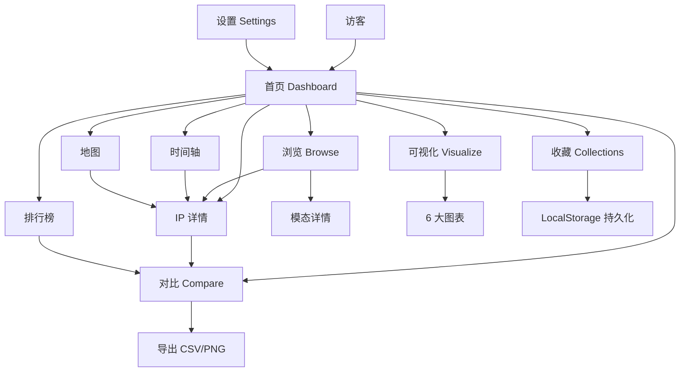

# GameIP Derivative Universe · 聚合平台 PRD

## 1. 产品概述

「游戏 IP 衍生宇宙」是一个**现代化游戏 IP 衍生作品聚合浏览与可视化平台**，将原本仅支持浏览与可视化的单页工具，升级为多视图、多入口、多分析维度的综合资料库平台。

- **核心目标**：在 207,583+ 条衍生作品数据上，提供 8+ 种浏览/分析/对比入口，覆盖研究人员、内容创作者、ACG 爱好者、游戏从业者、IP 商业分析师等用户群体。
- **核心价值**：从"查找"升级为"发现 → 比较 → 洞察"，让用户能用 5 分钟回答诸如"近 5 年《原神》衍生出了哪些类型作品？"或"宝可梦 vs 东方 Project 衍生生态对比"这类跨维度问题。
- **市场定位**：独立的资料库 + 数据可视化作品，定位类似 MyAnimeList + Google Trends + Gephi 的轻量化融合体。

## 2. 核心功能

### 2.1 用户角色
| 角色 | 进入方式 | 核心权限 |
|------|----------|----------|
| 访客 | 直接进入 | 浏览所有数据、查看可视化、使用收藏/对比（本地存储） |
| 资深用户 | 浏览器 LocalStorage 累计访问 ≥ 3 次解锁"专家模式" | 高级筛选、导出 CSV/JSON、自定义视图 |

> 本期不引入账号系统；所有个性化数据均存于浏览器本地。

### 2.2 功能模块
1. **首页 Dashboard**：概览数据 + 入口卡片 + 推荐
2. **浏览 (Browse)**：卡片网格 + 筛选 + 排序 + 分页 + 详情
3. **可视化 (Visualize)**：6 种 ECharts 图表 + 区域/规模过滤
4. **IP 详情 (IP Detail)**：单 IP 全景（衍生谱系、年度、类型占比、代表作品）
5. **排行榜 (Rankings)**：多维度榜单（IP/作品/作者/类型/地区）
6. **对比 (Compare)**：多 IP 横向比较（最多 4 个）
7. **时间轴 (Timeline)**：跨年度"今年发生了什么"
8. **地图 (Map)**：全球地区分布（飞线 + 国旗 + 数量）
9. **收藏 (Collections)**：本地收藏夹、标签管理、分享导出
10. **设置 (Settings)**：主题切换、视图密度、动画开关、单位偏好

### 2.3 页面细节
| 页面 | 模块 | 功能描述 |
|------|------|----------|
| 首页 | Hero 介绍区 | 全屏渐变 hero + 实时统计数字滚动 |
| 首页 | 入口卡片网格 | 9 个入口卡片（Browse/Visualize/IP/Compare/...） |
| 首页 | "今日精选" | 按时间+流行度抽 6 个作品 |
| 首页 | 数据快照条 | 5 个数字：总数/IP/类型/地区/年份跨度 |
| 浏览 | 筛选侧栏 | 类型/地区/年代/IP 多选 + 搜索 |
| 浏览 | 网格视图 | 卡片 48/页，可切"紧凑/标准" |
| 浏览 | 模态详情 | 作品全字段 + 相关作品（同 IP/同类型） |
| 可视化 | 6 大图表 | 时间线/IP/类型/地区/热力图/网络 |
| IP 详情 | 概览卡 | IP 名、衍生总数、Top 类型、活跃年份 |
| IP 详情 | 衍生谱系 | 同 IP 作品的时间线 + 类型堆叠 |
| IP 详情 | 排行榜 | 同 IP 作品按关注度/年份排序 |
| 排行榜 | 维度切换 | IP/作品/作者/类型 4 维，每维 Top 100 |
| 对比 | 多选 IP | 最多选 4 个 IP，雷达图对比 6 维度 |
| 时间轴 | 年份定位 | 拖动年份滑块 + 关键事件高亮 |
| 地图 | 世界地图 | ECharts 地图 + 数量气泡 + 飞线 |
| 收藏 | 列表 | 本地保存的收藏，可标签化 |
| 设置 | 偏好 | 主题（暗/亮/赛博）、密度、动画、单位 |

## 3. 核心流程

### 3.1 主流程
访客进入 → 首页 Dashboard（看到数据规模与 9 个入口）→ 选择"浏览"（看具体作品）→ 切换"可视化"（看宏观）→ 点击某 IP 进入"IP 详情"（看中观）→ "对比"模式挑选 2-4 个 IP → 导出对比结果。

### 3.2 流程图

## 4. 用户界面设计

### 4.1 设计风格
- **主色板**：深空紫 `#0c0c20` + 霓虹紫 `#7c5cff` + 电青 `#22d3ee` + 樱粉 `#ff5d8f` + 暖黄 `#ffd166`
- **辅助**：玻璃拟态（`backdrop-filter: blur(20px)`）+ 网格底纹 + 多层径向渐变
- **按钮**：圆角 14px + 渐变填充 + hover 投影增强
- **字体**：标题用 **Space Grotesk**（或 **Outfit**），正文 **Inter**，数字 **JetBrains Mono**
- **布局**：12 列响应式网格；侧栏 + 主内容 + 浮动操作
- **图标**：Lucide 图标库，统一 stroke-width: 1.5
- **动画**：CSS-only，进入用 staggered reveal；hover 用 transform + shadow
- **暗色为默认** + 提供 2 套主题（亮色 / 赛博朋克）

### 4.2 页面设计概览
| 页面 | UI 元素 |
|------|---------|
| 首页 | 全屏 hero + 滚动统计 + 9 入口卡片 + 今日精选 |
| 浏览 | 左侧筛选（玻璃面板） + 顶部搜索 + 排序 + 卡片网格 + 分页 |
| 可视化 | 4 指标卡 + 6 玻璃图表卡片（12 列网格布局） |
| IP 详情 | 顶部 banner + 4 指标 + 谱系 + 排行榜 + 相关 IP |
| 排行榜 | 维度 chip + 100 行排行榜（虚拟滚动） |
| 对比 | IP 选择器 + 雷达图 + 6 维度对比表 |
| 时间轴 | 大滑块 + 时间线 + 事件浮窗 |
| 地图 | 全屏地图 + 数量气泡 + 国旗 chip |
| 收藏 | 网格视图 + 标签筛选 + 导入导出 |
| 设置 | 分组选项 + 即时预览 |

### 4.3 响应式
- **断点**：1440 / 1100 / 768 / 480
- **桌面优先**：≥1100 显示完整侧栏 + 多列网格
- **平板**：768-1100，侧栏折叠为顶部下拉
- **手机**：<768，单列 + 浮动操作按钮 + 滑动切换标签

### 4.4 3D 场景指导
本期**不涉及 3D 场景**；可视化为 2D 图表 + 玻璃拟态。

## 5. 数据策略

- **数据规模**：207,583 条（data.js，91MB）
- **加载方式**：外部 `<script src="data.js">` 异步加载 + 三阶段加载屏
- **预处理**：进入应用时一次性 `buildWorks()` 与 `buildAggregates()`，缓存为内存对象
- **二次过滤**：在内存中用 Set/Map 实现毫秒级筛选
- **持久化**：LocalStorage 存收藏/主题/设置（≤1MB）
- **导出**：纯前端 Blob + a.download，零后端依赖

## 6. 非功能需求

- **性能**：筛选 200K 数据 < 200ms；图表渲染 < 1s
- **可访问性**：键盘导航 + 焦点环 + ARIA
- **可分享**：URL 哈希同步当前视图/筛选条件
- **离线友好**：data.js 一旦加载即可离线使用（除 ECharts CDN 首次需联网）
- **向后兼容**：保留原 Browse + Visualize 两个标签页，扩展为 9+ 个

## 7. 范围与非目标

- ✅ 在内：9 个视图、LocalStorage 收藏、主题切换、CSV/PNG 导出
- ❌ 不在内：账号系统、服务端 API、实时协作、移动端原生 App、支付/订阅
