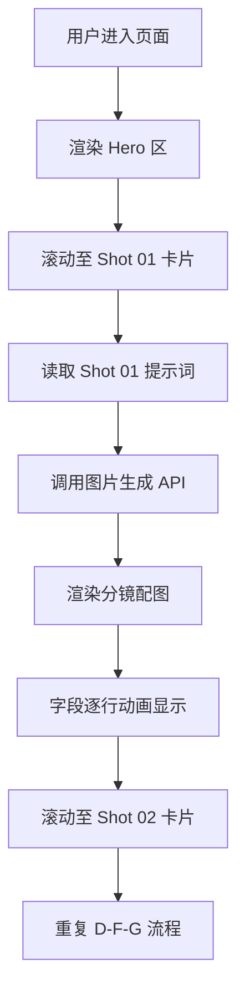

# PRD 产品需求文档 — 分镜脚本展示页

## 1. 产品概述
一个单页静态 HTML 站点，用于以电影分镜表的视觉语言展示两段动画分镜脚本（Shot 01、Shot 02），并为每段分镜自动生成对应氛围的 AI 配图。整体气质是"幻想末世 + 新海诚式神圣几何"。

- 主要用途：将导演/编剧的中文分镜脚本（镜号、时长、景别、运动、视觉描述、台词、音效、AI 提示词）以高保真可视化方式呈现给团队。
- 目标用户：动画/影视创作者、分镜师、视觉总监、需要快速评估脚本氛围的合作方。
- 项目价值：相比纯文本表格，沉浸式分镜表能减少对脚本的二次想象成本，便于直接评估 AI 视频生成提示词的有效性。

## 2. 核心功能

### 2.1 用户角色
无登录、无角色区分。属于纯展示型单页应用。

### 2.2 功能模块
1. **顶部 Hero 区**：项目标题、副标题、悬停/滚动入场动效。
2. **分镜表（Storyboard Grid）**：以卡片网格或纵向剧本格式并列展示 2 段分镜。
3. **分镜详情卡**：每张卡包含 8 个固定字段（镜号 / 时长 / 景别&运动 / 视觉描述 / 台词 / 音效 / AI 提示词 / 配图占位）。
4. **AI 配图生成**：每段分镜根据其 AI 提示词字段调用图片生成接口，输出对应氛围的静态图。
5. **滚动/时间轴联动**：滚动时左侧时间轴高亮当前镜头，强调"时间"维度。

### 2.3 页面详情
| 页面名称 | 模块名称 | 功能描述 |
|---------|---------|----------|
| 主页 | Hero 区 | 显示项目标题与一行简介，背景使用 Shot 01 提示词生成的主图 |
| 主页 | 分镜表 | 2 段分镜按时间顺序纵向排列，每段含全部 8 字段 |
| 主页 | 时间轴侧栏 | 左侧固定时间轴 0:00 – 0:15，按当前滚动位置高亮 |
| 主页 | 音效波形条 | 在视觉描述下方用低饱和度波形占位，强化"分镜"电影感 |

## 3. 核心流程
用户打开页面 → 首屏看到 Hero 与项目标题 → 向下滚动 → 依次看到 Shot 01（0:00–0:08）与 Shot 02（0:08–0:15）两张分镜卡 → 每张卡片在进入视口时触发：AI 提示词自动调用图片生成接口渲染左半部分配图 → 右侧文字字段以 staggered 动画逐行显示。 

## 4. 用户界面设计

### 4.1 设计风格
- **整体气质**：Fantasy apocalyptic anime，神圣几何 + 末世冷寂。配色以深夜紫金、晶体冷白、低频蓝色调为主，接近新海诚 + 吉卜力黄昏滤镜。
- **主色**：深空靛蓝 `#0B0B1F`、黎曼金 `#D4A24C`、晶体霜白 `#E8EEF6`、警示紫 `#6A3FB3`。
- **强调色**：黎曼金 `#D4A24C` 用于高亮当前镜头与提示词标签。
- **按钮/卡片样式**：玻璃拟态卡片（`backdrop-filter: blur`）+ 1px 极细金色描边 + 大圆角（24px），无 3D 阴影。
- **字体**：
  - 标题（Display）：`"Cormorant Garamond"` 或 `"Cinzel"`（衬线、神圣、几何感）。
  - 正文（Body）：`"Noto Serif SC"`（中文衬线，匹配中世感）。
  - 数据/时间码：`"JetBrains Mono"`（等宽，强化"场记"感）。
- **布局**：左侧固定 80px 时间轴 + 右侧主内容流；分镜卡为左右分栏（左 50% 配图，右 50% 字段），桌面 1200px+ 居中。
- **图标**：使用 `lucide-react` 或纯 CSS SVG 图标（camera、waveform、clock、sparkles），克制不喧宾夺主。

### 4.2 页面设计概览
| 页面名称 | 模块名称 | UI 元素 |
|---------|---------|----------|
| 主页 | Hero 区 | 全屏背景配图（Shot 01 提示词渲染）、衬线大标题"Crystal Plain – Storyboard Vol.01"、副标题一行、向下滚动指示 |
| 主页 | 分镜表卡片 | 左配图 + 右字段；8 字段以小标题 + 等宽内容呈现；卡片入场使用 translateY + opacity 动画 |
| 主页 | 时间轴侧栏 | 左侧 80px 固定列，每 4 秒一刻度，当前刻度金色发光 |
| 主页 | 音效波形条 | 视觉描述下方 60px 高的纯 CSS 波形占位（伪随机 bar） |

### 4.3 响应式
桌面优先（1200px+），向下兼容 768px（平板：分镜卡上下堆叠）、480px（手机：时间轴侧栏变为顶部进度条）。

### 4.4 3D 场景指导（不适用）
本项目为静态分镜展示，不涉及 3D 场景。
