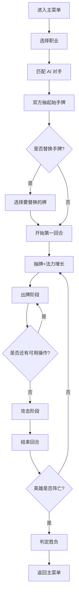

# 暗影编年史 - 卡牌对战游戏 PRD

## 1. 产品概述

**暗影编年史（Shadow Chronicle）** 是一款以黑暗奇幻为背景的回合制卡牌对战网页游戏，灵感源自经典炉石传说玩法。游戏采用纯前端单 HTML 实现，所有卡牌、英雄、场景元素均为精细手绘 SVG，提供高质感的视觉体验与流畅的回合制策略对战玩法。

- **核心玩法**:回合制、随从上场、法术施放、英雄技能、资源管理（法力水晶）
- **目标用户**:策略游戏爱好者、卡牌游戏玩家、奇幻美学追求者
- **市场价值**:无需下载安装、纯网页可玩、零依赖、零资源外链，开箱即玩

## 2. 核心功能

### 2.1 用户角色

| 角色 | 入口方式 | 核心权限 |
|------|----------|----------|
| 玩家 | 单机对战 | 选择职业、操控手牌、调度法力、攻击对方 |
| AI对手 | 内置 AI | 自动决策出牌与攻击 |

### 2.2 功能模块

1. **主菜单**:游戏入口、英雄选择、玩法说明
2. **战斗场景**:对战棋盘、手牌区、法力水晶、英雄状态
3. **职业系统**:4 大职业（圣骑士、术士、德鲁伊、法师），每个职业有专属卡牌与英雄技能
4. **卡牌系统**:随从牌（带攻击/血量/特效）、法术牌（直伤、AOE、增益、减益）、武器牌
5. **回合系统**:抽牌、法力增长、出牌阶段、攻击阶段、结束回合
6. **结算系统**:胜负判定、英雄死亡、墓地回收

### 2.3 页面详情

| 页面名称 | 模块名称 | 功能描述 |
|----------|----------|----------|
| 主菜单 | Logo 与标题 | 巨大的奇幻风格 SVG 标题与装饰 |
| 主菜单 | 职业选择 | 4 个职业立绘，点击进入对战 |
| 战斗场景 | 棋盘 | 7×2 棋格，木质纹理 SVG 桌面 |
| 战斗场景 | 手牌 | 玩家回合内显示，可拖拽上场 |
| 战斗场景 | 英雄区 | 双方英雄血量、法力水晶、英雄技能按钮 |
| 战斗场景 | 信息日志 | 战斗记录滚动显示 |
| 战斗结算 | 结果弹窗 | 胜利/失败画面，再来一局按钮 |

## 3. 核心流程

### 3.1 主流程

1. 玩家在主菜单选择职业 → 进入对战
2. 系统洗牌并抽取起始手牌（4 张）→ 双方各获得 1 张免费替换机会
3. 每回合开始：当前回合方抽 1 张牌、法力水晶 +1（上限 10）
4. 出牌阶段：消耗法力打出随从 / 法术
5. 攻击阶段：选择己方随从攻击对方随从或英雄
6. 结束回合 → 切换对方回合
7. 任一方英雄血量归零 → 战斗结束

### 3.2 流程图

## 4. 用户界面设计

### 4.1 设计风格

- **主色调**:深紫黑 (#0c0a1f)、暗金 (#d4af37)、血红 (#a51c2e)、冰蓝 (#5fd1ff)
- **次色调**:羊皮纸黄 (#e8d4a2)、翠绿 (#2d6e4e)
- **按钮风格**:石质浮雕 + 金色描边，悬停时金色光晕扩散
- **字体**:Cinzel（标题，奇幻感）、Crimson Text（正文，羊皮纸感）
- **布局风格**:全屏沉浸式木质棋盘 + 周边装饰
- **图标风格**:全 SVG 绘制，金色描边、深色填充

### 4.2 页面设计概览

| 页面名称 | 模块名称 | UI 元素 |
|----------|----------|----------|
| 主菜单 | 标题 | 巨型发光 SVG Logo，粒子流光特效 |
| 主菜单 | 职业卡 | 4 个全屏职业立绘（圣光、虚空、自然、奥术），悬浮上浮 |
| 战斗场景 | 棋盘 | 7×2 木质格子，桌布边缘雕花 |
| 战斗场景 | 随从卡 | 蓝宝石边框矩形卡，攻防水晶镶嵌，SVG 角色肖像 |
| 战斗场景 | 法术卡 | 红宝石边框矩形卡，符文漩涡装饰 |
| 战斗场景 | 英雄区 | 圆形盾形头像 + 血条 + 法力水晶链 |
| 战斗场景 | 日志 | 半透明羊皮纸卷轴，斜体字滚动 |
| 战斗结算 | 弹窗 | 巨型 SVG 胜利/失败图标 + 火花粒子 |

### 4.3 响应式

- **桌面优先**:1280×800 起，向上扩展
- **响应式断点**:≥1024px 全功能，768-1024px 简化卡牌尺寸，<768px 提示横屏游玩
- **触控**:支持拖拽出牌（移动端）

### 4.4 3D 场景指导（不适用）

本项目为 2D SVG 界面，无 3D 场景。
