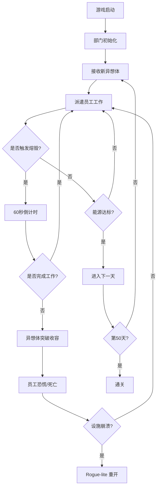

# 脑叶公司：异想体收容管理 (Lobotomy Corporation: Containment Management)

## 1. 产品概述

一款以《脑叶公司》游戏机制为蓝本的 2D 像素风 Web 端管理模拟游戏。玩家扮演"主管"，在监控屏幕视角下运营一家收容超自然生物（异想体）的能源公司，通过派遣员工对异想体执行工作来收集能源 PE-BOX，同时管理逆卡巴拉熔毁、随机考验、员工恐慌等多重压力，在 50 个游戏日内达成能量收集目标。

- **目标用户**：喜爱硬核策略管理、独立游戏、SCP/怪谈美学的玩家
- **核心价值**：以游戏机制本身完成对"恐惧"命题的哲学化表达——规则丛生、风险累积、规则与失控的边界体验

## 2. 核心功能

### 2.1 玩家角色
- **主管（玩家）**：上帝视角管理者，调度员工、应对事件
- **员工（Agent）**：可自定义姓名与头像色调；可消耗的人力资产
- **文职 NPC**：自动生成，灾难发生时承担"装饰性牺牲品"角色

### 2.2 功能模块

1. **主界面（监控室）**：固定视角，俯瞰整个部门；左上为状态信息条，右上为警报/事件栏，底部为时间推进条
2. **收容单元管理**：5 个部门（控制部、情报部、安保部、培训部、中央本部），每个部门 4 个收容槽 + 5 名员工位
3. **异想体图鉴**：每次工作后解锁部分信息（外观、危险等级、恐惧等级、最佳工作类型）
4. **员工面板**：展示勇气/谨慎/自律/正义四维属性、当前状态（正常/恐慌/死亡）、已装备 E.G.O
5. **E.G.O 装备工坊**：消耗研究点数从已研究异想体中锻造武器/防具
6. **核心抑制剧情**：部门 5 天一循环的部长剧情线
7. **考验与事件系统**：黎明/正午/黄昏/午夜四时段随机触发
8. **结算与重开**：50 天通关 / 设施崩溃，保留研究进度

### 2.3 页面/界面详情

| 界面名称 | 模块名称 | 功能描述 |
|---------|---------|---------|
| 主监控室 | 部门视图 | 监视器视角，渲染 4 收容单元 + 5 员工位 |
| 主监控室 | 信息条 HUD | 能源进度 / 已用天数 / 研究点数 / 警报等级 |
| 主监控室 | 事件栏 | 实时显示熔毁倒计时、考验触发、员工死亡 |
| 异想体收容 | 工作面板 | 6 种工作类型（本能/洞察/沟通/压迫/抑制/收容）按钮 |
| 异想体收容 | 信息解锁面板 | 通过研究点逐项揭示异想体行为 |
| 员工面板 | 员工卡 | 头像 + 4 维属性雷达图 + 装备槽 + 状态 |
| 员工面板 | 分配面板 | 拖拽员工到收容单元或工作按钮 |
| E.G.O 工坊 | 锻造界面 | 列出已研究异想体及可锻造装备 |
| 剧情界面 | 部长对白 | 像素立绘 + 文字气泡 + 选项 |
| 结算界面 | 终局画面 | 50 天通关 / 设施崩溃原因回顾 |

## 3. 核心流程

### 3.1 单日游戏循环
1. **黎明**：随机考验"红色黎明"（走廊出现小丑，镇压失败减少异想体计数器），奖励 10% 能源
2. **正午**：绿色/紫色考验，奖励 15% 能源
3. **黄昏**：琥珀色考验，奖励 20% 能源
4. **午夜**：最高级考验，奖励 25% 能源
5. **每 6 秒**：可选对异想体进行一次工作（产出 PE-BOX，累积逆卡巴拉计数）
6. **熔毁触发**：当异想体工作计数满 → 60 秒倒计时 → 未工作则突破收容
7. **能源达标**：提前结束当日

### 3.2 失败/通关机制
- 设施崩溃 → 永久死亡员工保留，记录展示 → Rogue-lite 重开
- 50 天能源全部达标 → 通关

## 4. 用户界面设计

### 4.1 设计风格

- **主色调**：冷色基调（#0a0a0a 黑色基底 / #1a1a1a 深灰面板 / #f5f5f0 米白文字）
- **强调色**：荧光黄 #ffe600（UI 高亮 / 能源进度）+ 警报红 #ff0033（收容失效 / 紧急事件）
- **辅助色**：脑啡肽绿 #4dff88（能源物质）+ 监视器青 #00ffd5（扫描线）
- **字体方案**：
  - 标题：自定义无衬线（高比例、锐利几何，模拟 Norwester 风格），用于"脑叶公司"Logo、状态数字
  - 正文：等宽字体（IBM Plex Mono / JetBrains Mono），模拟监控终端
  - 剧情对白：人文衬线（Noto Serif SC），制造"光鲜印刷体与隐藏恐怖"的反差
- **按钮样式**：平面矩形、1px 锐利边角、hover 时荧光黄描边发光
- **布局风格**：非对称仪表盘风格，固定 viewport 1200×800，左侧部门导航、中部监控画布、右侧事件流
- **图标/视觉元素**：像素艺术 32×32 异想体立绘；Lucide 图标用于管理 UI（警报/暂停/设置）

### 4.2 界面设计概览

| 界面名称 | 模块名称 | UI 元素 |
|---------|---------|---------|
| 主监控室 | 监视器画布 | 4 收容单元网格 + 5 员工位 + 走廊通道，像素 sprite，扫描线覆盖层 |
| 主监控室 | HUD 状态条 | 顶部固定，左：能源条 / 中：天数 / 右：研究点数 + 警报等级 |
| 主监控室 | 事件流 | 右侧滚动列表，警报红高亮，时间戳 + 简短描述 |
| 异想体收容 | 工作按钮 | 6 个矩形按钮呈 2×3 排列，hover 显示类型对应属性图标 |
| 异想体收容 | 信息解锁 | 雾化覆盖层，已解锁部分变清晰，悬停查看详情 |
| 员工面板 | 属性雷达图 | SVG 4 维雷达，警戒值用荧光黄描边 |
| 员工面板 | 拖拽分配 | HTML5 拖放，员工头像在收容单元上方显示 |
| E.G.O 工坊 | 装备列表 | 异想体缩略图 + 武器/防具双卡片，可锻造状态高亮 |
| 剧情界面 | 部长对白 | 像素立绘 + 渐变对白框 + 选项按钮列表 |
| 结算界面 | 通关/失败画面 | 全屏黑底，居中大号无衬线标题，统计数据网格 |

### 4.3 响应性
- **桌面优先**：1280×800 为基准分辨率
- **平板适配**：1024×768 自动切换侧边栏为抽屉式
- **不支持移动端**：游戏以精准点击为前提

### 4.4 像素美术与动画指导
- **异想体 sprite**：32×32 像素手绘，4 帧 idle 动画，6 帧工作动画
- **员工 sprite**：16×16 像素，统一 T-pose + 8 方向行走 + 4 帧恐慌动画
- **扫描线效果**：CSS `repeating-linear-gradient` 叠加，0.15 透明度
- **CRT 显示器畸变**：边缘 `box-shadow inset` 暗角
- **警报闪烁**：关键帧动画，红色边框 0.5s 间隔 pulse
- **鼠标光标**：自定义十字准星 SVG

## 5. 音频设计

- **背景乐**：工业噪音 + 暗黑合成器 + 偶尔管弦，由 Web Audio API 程序化生成
- **环境音**：低频嗡鸣（设施）/ 心跳（高压状态）/ 键盘敲击（员工工作）
- **警报音**：800Hz 锯齿波 + 200ms 间隔脉冲
- **白夜出逃**：神圣合唱（正弦波叠加琶音）+ 工业金属碰撞
