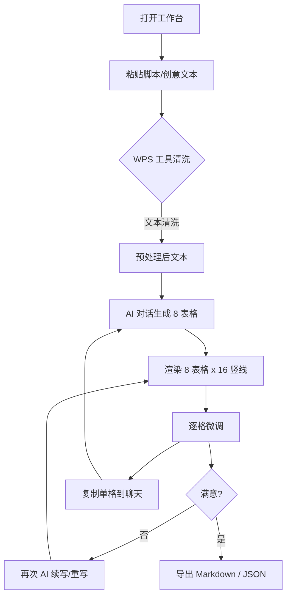

# 分镜表生成器 · PRD 产品需求文档

## 1. 产品概述

**分镜表生成器（Storyboard Forge）** 是一款专为影视导演、剪辑师和分镜师设计的 Web 端 AI 辅助工具，能将自然语言脚本、创意描述或概念设计文本，一键转换为「8 表格 × 16 竖线」专业分镜时间表，并内置 WPS 风格的文字处理能力与可持续扩展的 AI 对话框架。

- **核心价值**：把 25 秒的高潮段落精确拆解为 8 个镜头、每个镜头 16 个等分时间刻度的可视化分镜表，直接对接剪辑、摄影、特效三个工种。
- **目标用户**：影视剧组（导演/摄影指导/剪辑师/特效总监）、广告创意团队、短视频内容创作者、分镜教学场景。
- **市场定位**：解决业内"概念-分镜-剪辑"链路中分镜环节缺乏标准化时间刻度表格的痛点。

## 2. 核心功能

### 2.1 用户角色
本工具无强账户体系，以本地化与单页 SPA 为主，支持轻度本地存档。

| 角色 | 入口方式 | 核心权限 |
|------|----------|----------|
| 访客 | 直接打开站点 | 使用全部生成、编辑、导出功能，本地 LocalStorage 存档 |
| 高级用户（可选） | 输入自有 API Key | 解锁自定义 AI 模型接入 |

### 2.2 功能模块
1. **首页 / 工作台**：三栏布局，左侧文本输入 + WPS 工具栏，中部 8 表格渲染，右侧 AI 对话面板。
2. **分镜表生成器（核心页）**：8 表格 × 16 竖线时间刻度渲染，单格可编辑、可标注状态色。
3. **WPS 文字处理侧栏**：字数统计、段落拆分、繁简转换、全角半角、空行清理、Markdown↔纯文本转换、时间码格式化。
4. **AI 对话面板**：流式响应、内置提示词模板（分镜师/摄影指导/剪辑师/特效师）、多轮上下文、可注入到分镜表。
5. **导入/导出**：支持粘贴长文本、`.txt`/`.md` 文件上传、Markdown 表格导出、JSON 全量备份。

### 2.3 页面详情
| 页面名称 | 模块名称 | 功能描述 |
|---------|---------|---------|
| 工作台 | 文本输入区 | 大段粘贴框、自动识别时间码与场号、支持拖入 .txt/.md 文件 |
| 工作台 | WPS 工具栏 | 一键字数统计、段落清洗、时间码提取、繁简转换、Markdown↔纯文本 |
| 工作台 | 8 表格 × 16 竖线渲染 | 8 张分镜表，每张 16 行竖线时间刻度，悬浮显示秒数，点击单元格可编辑 |
| 工作台 | 单元格编辑器 | 单格支持：画面内容 / 动作 / 运镜 / 音效 / 设计要点 五字段切换 |
| 工作台 | 顶部状态栏 | 显示总时长、平均镜长、表格数、覆盖度（已填/总格数）、快捷键提示 |
| 工作台 | AI 对话面板 | 流式输出、内置 4 类提示词模板、可一键注入到选中表格 |
| 工作台 | 导入/导出栏 | 复制 Markdown、下载 .md/.json、清空全部、加载示例脚本 |

## 3. 核心流程

主要用户流：
1. 粘贴长文 → 一键 WPS 清洗 → AI 描述分镜意图 → 自动生成 8 表格
2. 直接在 8 表格上手动填写，每格 5 字段
3. AI 多轮对话微调单格内容
4. 复制整张表到剪辑软件备注 / 下载 .md

## 4. 用户界面设计

### 4.1 设计风格
- **整体调性**：电影级暗色系（参考剪辑软件 DaVinci Resolve），深色金属面板 + 琥珀色高亮，复古放映机质感
- **主色板**：
  - 背景：`#0A0A0B`（放映室黑）
  - 面板：`#15151A`（胶片刻度灰）
  - 边框：`#2A2A33`（暗银）
  - 主文：`#E8E4D8`（仿羊皮纸米白）
  - 强调色：`#D4A24C`（放映机琥珀）+ `#9A2A2A`（危险血红，用于"嘶吼/爆点"标识）
- **字体**：
  - 标题：`Noto Serif SC`（中文衬线，仿古籍）
  - 数字/时间码：`JetBrains Mono`（等宽，便于时间对齐）
  - 正文：`Noto Sans SC`
- **按钮**：1px 细描边 + 琥珀色高亮，hover 时出现胶片孔洞装饰
- **布局**：左中右三栏 24px 间距，工作台采用 grid 1fr-1.2fr-1fr 比例
- **图标**：lucide-react，相机/卷轴/时钟/对话气泡等线性图标
- **动画**：
  - 页面进入时 8 张分镜表依次 fadeInUp，stagger 80ms
  - AI 流式输出时光标琥珀闪烁
  - 单元格 hover 时出现 1px 琥珀色边框 + 微弱胶片噪点纹理

### 4.2 页面设计概览
| 页面名称 | 模块名称 | UI 元素 |
|---------|---------|---------|
| 工作台 | 顶部状态栏 | 高度 48px，背景 #15151A，显示总时长/镜数/覆盖度/导出按钮 |
| 工作台 | 左栏文本输入 | 高度撑满，含 placeholder 提示、暗色 textarea、底部 WPS 工具栏 |
| 工作台 | WPS 工具栏 | 6-8 个胶囊按钮，水平排列，hover 时显示工具说明气泡 |
| 工作台 | 中栏 8 表格区 | 垂直滚动容器，每张表高约 220px，16 行竖线等距分布 |
| 工作台 | 表格卡片 | 圆角 6px、暗银边框、标题栏含镜号与时长、底部 5 字段标签 |
| 工作台 | 右栏 AI 对话 | 仿聊天界面，消息气泡用米白+琥珀双色，底部固定输入框 + 模板下拉 |

### 4.3 响应式
- **桌面优先**：≥1280px 三栏布局
- **平板**：≥768px 折叠为双栏，AI 对话改为悬浮抽屉
- **移动端**：单列堆叠，分镜表卡片可全屏编辑

### 4.4 3D / 视觉效果
- 背景：CSS 径向渐变 + 胶片噪点 SVG 滤镜，模拟老式放映机光晕
- 单元格选中：内描边 + 微弱 inset shadow，模拟取景器对焦环
- AI 生成中：表格卡顶部出现琥珀色进度光条（1px 渐变动画）
- 导出成功：右下角弹出"已复制到剪贴板"吐司，仿胶片冲印单据样式
