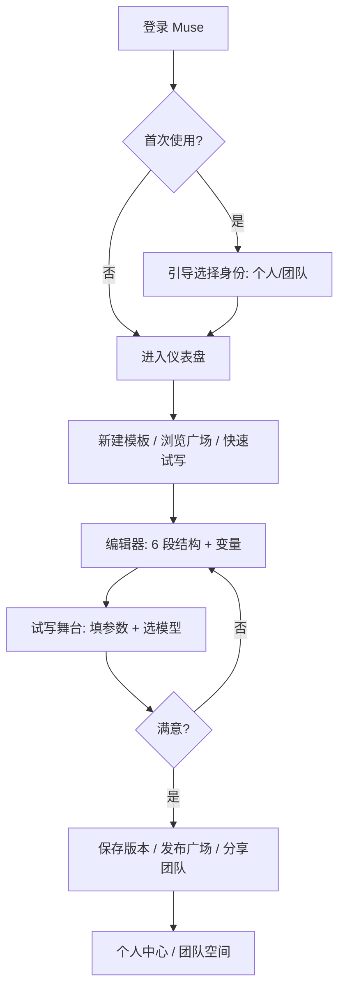

# 幕启 Muse · AI 剧本提示词模板器 PRD

## 1. 产品概述

**幕启 Muse** 是一款面向内容创作者（短剧编剧、短视频脚本、广告创意、动画编剧）的云端 AI 剧本提示词工程工具。它把零散、一次性的 Prompt 升级为可复用、可参数化、可协作的结构化模板，让"写好提示词"像写剧本一样专业。

- 解决 AI 剧本生成时"提示词靠灵感、无法沉淀、无法协作、效果不稳"的痛点
- 目标用户：编剧、创意总监、短视频团队、广告公司、自媒体创作者
- 核心价值：用模板化、变量化、可视化的工作流，把 AI 提示词变成可复用的剧组资产

## 2. 核心功能

### 2.1 用户角色
| 角色 | 注册方式 | 核心权限 |
|------|----------|----------|
| 访客 | 无需注册 | 浏览公开模板广场、使用"快速试写"沙盒（不保存） |
| 创作者 | 邮箱 / 魔法链接 | 创建 / 编辑 / 私有模板、生成快照、复制他人模板后二次创作 |
| 团队管理员 | 邀请制 | 创建团队空间、共享模板库、设置成员权限、查看用量统计 |

### 2.2 功能模块
1. **首页 / 仪表盘**：灵感位 + 我的剧本模板 + 团队动态 + AI 模型快速试写入口
2. **模板广场**：公开模板瀑布流、分类筛选、一键克隆
3. **剧本模板编辑器**：分段结构、变量插值、风格预设、版本快照
4. **变量工作室**：可视化编辑变量（角色、场景、风格、镜头语言、情绪强度等）
5. **试写舞台**：参数填表 → 一键生成 → 实时对比多模型输出 → 历史回放
6. **团队空间**（占位）：成员管理、共享库、用量统计
7. **个人中心**：账户、订阅、API Key 接入、主题切换

### 2.3 页面详情
| 页面 | 模块 | 功能描述 |
|------|------|----------|
| 首页 | 灵感位 | 大字号品牌口号 + 滚动"金句"提示词示例 + 一键"开写" |
| 首页 | 我的模板 | 最近编辑的 6 个模板卡片 + 新建空白模板按钮 |
| 首页 | 模型试写 | 选模板 / 选模型 / 立即生成（含免费配额提示） |
| 模板广场 | 筛选器 | 类型（短剧/短视频/广告/MV/动漫/游戏）、风格、字数、变量数量 |
| 模板广场 | 卡片网格 | 模板封面、标题、作者、克隆数、评分；hover 显示简介 |
| 编辑器 | 分段编辑 | "前置设定 / 角色档案 / 场景描述 / 镜头语言 / 风格基调 / 输出约束" 6 段 |
| 编辑器 | 变量面板 | 左侧抽屉，列出所有 {{}} 变量，可点击定位到正文 |
| 编辑器 | 顶部工具栏 | 保存、另存为版本、试写、分享、导出 Markdown |
| 试写舞台 | 参数表单 | 渲染所有变量为表单输入框，附"随机灵感"按钮 |
| 试写舞台 | 输出对比 | 并排展示 2-3 个模型输出，可评分、可复制、可收藏 |
| 团队空间 | 成员列表 | 成员头像、角色、最近活动 |
| 团队空间 | 共享库 | 团队模板树状视图，支持文件夹 |

## 3. 核心流程

### 3.1 创作者从 0 到 1 产出一个剧本 Prompt
1. 登录后进入首页，点击"新建空白模板"
2. 进入编辑器，填写 6 段结构化提示词，使用 `{{变量}}` 标记动态内容
3. 右侧变量面板自动识别变量，点击跳转
4. 点击"试写"进入试写舞台，填写参数（如"角色：沈墨；场景：雨夜废弃工厂"）
5. 选择模型生成，对比结果，满意后回编辑器保存
6. 在编辑器中"另存为版本"留档，或"发布到广场"分享

### 3.2 团队协作流程
1. 管理员在团队空间邀请成员
2. 创作者将模板"移动到团队库"
3. 其他成员克隆团队模板到自己的工作区二次创作
4. 管理员在用量统计查看生成次数、活跃度

## 4. 用户界面设计

### 4.1 设计风格
- **主题**：暗色优先（"夜场放映厅"），辅以琥珀金高光与一抹幕布红
- **配色变量**：
  - 主背景 `#0B0B0E`（近黑墨色）
  - 卡片背景 `#15151A`
  - 边框 `#26262E`
  - 琥珀金主色 `#E8A85C`（放映机灯泡）
  - 幕布红强调 `#D14B5C`
  - 文本主色 `#F2EEDF`（米白胶片）
  - 文本次色 `#8B8A85`
- **字体**：
  - 品牌字 / 标题：`"Cormorant Garamond"` 衬线（电影海报感）
  - 正文 / UI：`"JetBrains Mono"` 等宽（代码片场工作台感）
  - 中文 fallback：`"Noto Serif SC"` + `"Noto Sans SC"`
- **形状**：锐利圆角（4-8px），无大面积圆角胶囊；按钮采用"灯位"高光描边
- **图标**：线性 1.5px，自带细微光晕；选 `Lucide` + 自绘胶片孔、场记板图标
- **纹理**：背景叠加 4% 颗粒噪点；卡片边缘 1px 内描边模拟胶片边孔
- **动效**：
  - 进入页面：标题字符级 stagger 渐入（80ms / 字）
  - 按钮 hover：内描边光带从左扫到右（300ms）
  - 试写舞台：生成时背景出现"光圈"光晕呼吸

### 4.2 页面设计概览
| 页面 | 模块 | UI 元素 |
|------|------|---------|
| 首页 | 灵感位 | 顶部 80vh 大字号衬线标题 + 副标题 + "开写" 灯位按钮，背景层叠胶片孔纹理 |
| 首页 | 我的模板 | 6 列网格卡，卡片含 16:9 封面（首段文字排版生成）+ 标题 + 状态徽标 |
| 模板广场 | 筛选器 | 左侧 sticky 抽屉，多选 chip + 滑块（变量数量 / 字数） |
| 模板广场 | 卡片 | 3 列瀑布，卡片左下角显示作者 + 克隆数，hover 上浮 4px + 描边发光 |
| 编辑器 | 分段区 | 中央双栏：左侧 6 段分章节折叠卡片，右侧变量抽屉可隐藏 |
| 编辑器 | 工具栏 | 顶部毛玻璃 + 琥珀金边框，分段标题使用衬线大字 |
| 试写舞台 | 参数表单 | 暗色卡片 + 琥珀金聚焦描边，placeholder 文案带"？"提示 |
| 试写舞台 | 输出对比 | 多个模型输出并排，顶部 tab 切换"并排 / 串行"视图 |

### 4.3 响应式
- 桌面优先（≥1280px 完整布局）
- 平板（768-1280px）：编辑器改为上下布局，变量抽屉可点开浮层
- 移动端（<768px）：模板卡 1 列，编辑器分段折叠为手风琴；试写舞台只展示单模型结果

### 4.4 视觉场景引导
- **氛围**：暗色放映厅 + 微微光晕，营造"创作专注时刻"
- **构图**：首页使用 12 栏网格 + 大量留白，主标题居于黄金分割位
- **动效**：页面切换使用 240ms 缓动 + 透明度 + 4px 上移；进入仪表盘时模板卡错位浮起（stagger 60ms）
- **品牌符号**：左上角"幕启 MUSE" logo 含一个"开场场记板"图形；加载动画为场记板合板
