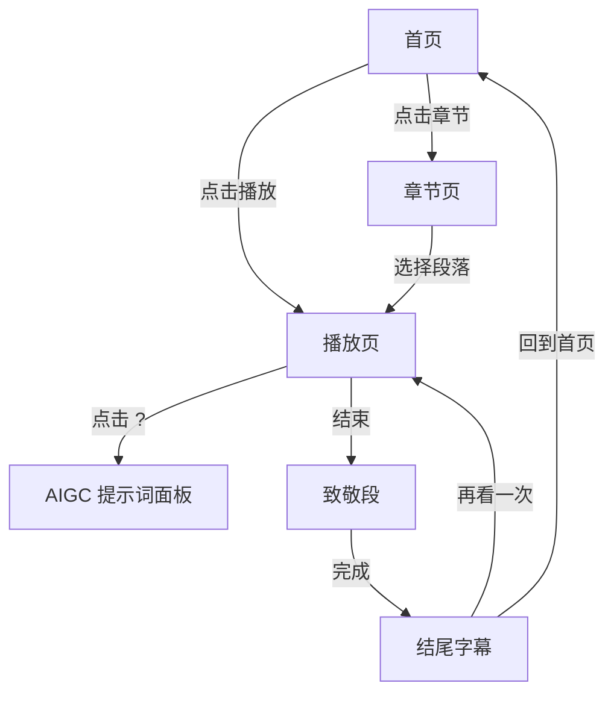

# PRD：哥窑开片 · 分镜视觉化产品需求文档

## 1. 产品概述

将用户提供的 74 镜 / 8 段 / 致敬 1 段《哥窑开片》分镜脚本，转化为可在浏览器中播放的 4 分钟交互式 React 视频体验。观众通过点阵（像素化墨点）与光弧（窑火余晖）两大视觉母题，感受宋代龙泉窑火、北迁碎裂、东渡重生的诗意叙事。

- 目标用户：影视 / 文学 / 工艺美术爱好者、品牌宣传主理人、设计院校学生
- 价值主张：以"会动的分镜本"形态把 AIGC 提示词、声音、对白、转场、视觉风格一次性呈现，可作创意提案 / 教学样片 / 文化宣传

## 2. 核心功能

### 2.1 用户角色
| 角色 | 进入方式 | 核心权限 |
|------|----------|----------|
| 访客 | 直接访问 | 播放、暂停、跳转章节、调节音量、切换字幕、查看 AIGC 提示词 |
| 制作者 | URL 参数 `?direct=true` | 额外显示镜号、子镜、时长的分镜表盘 |

### 2.2 功能模块
1. **首页 (Landing)**
   - 沉浸式 Hero（窑火 + 点阵动效 + 标题"哥窑开片"）
   - 倒计时自动播放按钮
   - 8 段章节卡片导航
2. **播放页 (Player)**
   - 74 镜按段落循环播放，4 分 30 秒内完成
   - 自动转场、字幕、声音指示、AIGC 提示词浮现
   - 章节进度条 / 镜号 / 暂停 / 静音 / 字幕开关
3. **章节页 (Chapter)**
   - 8 段（初生 / 问 / 裂 / 别 / 迁 / 燃 / 渡 / 绊）+ 致敬 1 段
   - 段落摘要、关键意象、代表镜预览
4. **关于页 (About)**
   - 创作背景、视觉母题说明、致谢

### 2.3 页面详细
| 页面 | 模块 | 功能描述 |
|------|------|----------|
| 首页 | Hero | 黑色背景 + 点阵汇聚成"哥窑开片"四字 + 光弧环绕 |
| 首页 | 章节卡片 | 8 张卡片，每张封面用代表该段意象（火焰 / 裂纹 / 雪 / 海浪 / 金钉）的点阵图案 |
| 播放页 | 视频画布 | 16:9 画布，根据当前镜自动切换视觉模版（黑场 / 远景 / 中景 / 近景 / 特写 / 闪回） |
| 播放页 | HUD | 顶部段名、中部对白、底部镜号 + 进度条 |
| 播放页 | 转场 | 叠化 / 白闪 / 慢动作 / 闪白 / 静帧 |
| 章节页 | 段落摘要 | 段落标题、引言、镜数、总时长、关键意象 |
| 关于页 | 创作笔记 | 关于"点阵 = 裂纹 / 光弧 = 火焰"的视觉解释 |

## 3. 核心流程

1. 访客进入首页 → 5 秒自动播放或点击"开始"按钮
2. 进入播放页 → 段落一 9 镜依次播放 → 段落八结束后进入致敬段
3. 播放过程中：用户可暂停 / 拖动进度条 / 切换字幕 / 查看 AIGC 提示词面板
4. 播放结束 → 弹出"再看一次"或"回到首页"
5. 任意时刻点击侧边栏 → 跳转章节页选择具体段落

## 4. 用户界面设计

### 4.1 设计风格
- **概念母题**：
  - 点阵 (Dot Matrix) ── 瓷器裂纹、像素化记忆
  - 光弧 (Light Arc) ── 窑火余晖、时间流动
- **主色**：
  - 玄青 #0E1116 (主背景)
  - 霁青 #6FA39B (青瓷)
  - 窑红 #C2502A (火焰)
  - 金线 #C9A972 (金钉)
  - 素纸 #EFE7D6 (字幕)
- **字体**：
  - 标题 / 引言：'Noto Serif SC', 'STKaiti', '楷体' ── 衬线、毛笔意
  - 正文：'Noto Sans SC', sans-serif
  - 数据 / 镜号：'JetBrains Mono', monospace
- **按钮**：1px 金线描边 + 窑红 hover 发光
- **布局**：16:9 居中画布 + 底部 HUD 灯条 + 右侧章节抽屉

### 4.2 页面设计
| 页面 | 模块 | UI 元素 |
|------|------|---------|
| 首页 | Hero | 全屏点阵爆裂 → 收敛为标题 → 光弧掠过 |
| 首页 | 章节卡片 | 8 张纵向滚动卡片，封面带点阵裂纹 |
| 播放页 | 画布 | 黑底 + 当前镜的视觉模板（点阵图、光弧、字幕） |
| 播放页 | HUD | 半透明黑条 + 等宽字体镜号 + 进度条用窑红光弧 |
| 章节页 | 段落摘要 | 段落标题 + 引言 + 时间轴 + 关键镜 |
| 关于页 | 创作笔记 | 双栏布局，文字 + 点阵动态图 |

### 4.3 响应式
- 桌面优先，1280px 起主舞台
- ≥ 1024px 显示完整 HUD
- 768-1024px 折叠抽屉，HUD 简化
- < 768px 转为竖屏 9:16，但仍保持 16:9 内嵌画布，下方说明

### 4.4 3D / 视觉场景指引
- **氛围**：暗调、墨色、窑火明灭、青瓷冷光
- **光源**：单一暖光（窑红）从画面侧上方倾斜
- **动效**：点阵用 Canvas / SVG 渲染，密度随时间变化；光弧用 SVG path + filter
- **后期**：噪点 + 暗角 + 慢动作 0.4×、闪白 0.1s
- **资产**：全部用程序化生成（点阵 / 光弧 / 渐变），不依赖外部图片
- **性能预算**：60fps，< 2MB 资源，初始加载 < 3s
